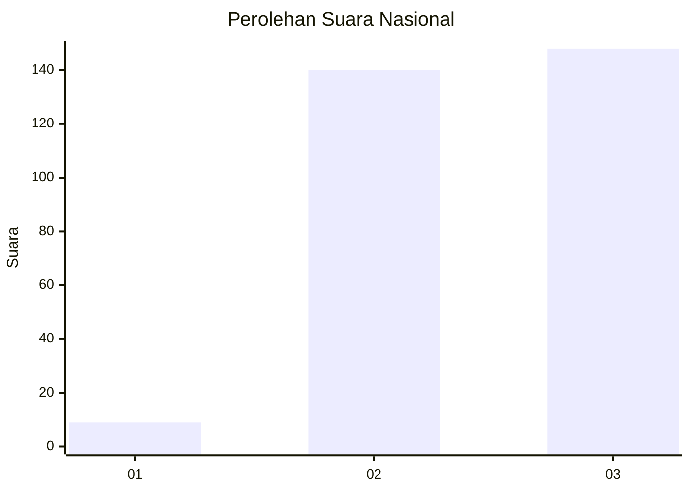
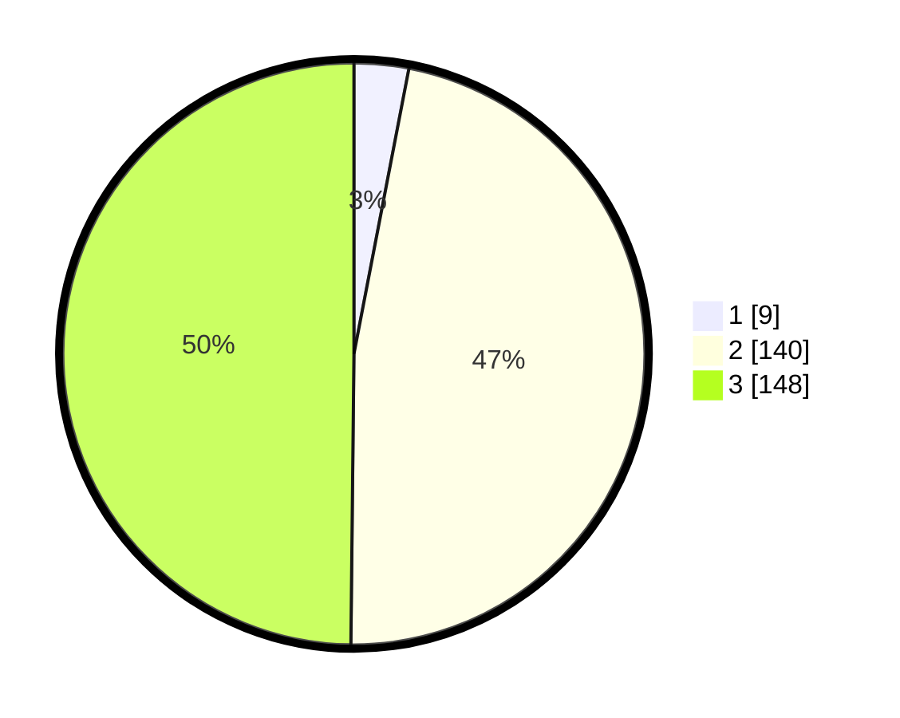

# Hasil

## Grafik

## Tabel

| No. | Nama Paslon    | Suara | Suara (raw) | Persentase |
|:--- |:-------------- | -----:| -----------:| ----------:|
| 1   | ANIES MUHAIMIN | 9     | [9][p-1]    | 3,03       |
| 2   | PRABOWO GIBRAN | 140   | [140][p-2]  | 47,14      |
| 3   | GANJAR MAHFUD  | 148   | [148][p-3]  | 49,83      |

[p-1]: https://github.com/gigit-pemilu/pemilu-2024/blob/main/pilpres/hitung-suara/sub/51-bali/sub/03-badung/sub/05-kuta-selatan/sub/1004-benoa/sub/087-tps/sub/paslon-1.txt
[p-2]: https://github.com/gigit-pemilu/pemilu-2024/blob/main/pilpres/hitung-suara/sub/51-bali/sub/03-badung/sub/05-kuta-selatan/sub/1004-benoa/sub/087-tps/sub/paslon-2.txt
[p-3]: https://github.com/gigit-pemilu/pemilu-2024/blob/main/pilpres/hitung-suara/sub/51-bali/sub/03-badung/sub/05-kuta-selatan/sub/1004-benoa/sub/087-tps/sub/paslon-3.txt

## Foto C Plano

https://sirekap-obj-formc.kpu.go.id/c708/pemilu/ppwp/51/03/05/10/04/5103051004087-20240214-194825--10872df7-c3c6-463b-946d-421456bcbf21.jpg

https://sirekap-obj-formc.kpu.go.id/c708/pemilu/ppwp/51/03/05/10/04/5103051004087-20240214-200953--5f53c3ed-edf3-47b2-bbbc-d48327cafdf9.jpg

https://sirekap-obj-formc.kpu.go.id/c708/pemilu/ppwp/51/03/05/10/04/5103051004087-20240214-201045--e547ff75-82aa-4002-946c-c3f3e80a394b.jpg

## Metadata

| Key        | Value               |
| ---------- | ------------------- |
| Time Stamp | 2024-02-14 21:46:01 |

## DATA PEMILIH TETAP

Jumlah pemilih dalam DPT: **298**.
 * L: **146**.
 * P: **152**.

## DATA PENGGUNA HAK PILIH

Jumlah pengguna hak pilih dalam DPT: **287**.
 * L: **141**.
 * P: **146**.

Jumlah pengguna hak pilih dalam DPTb: **1**.
 * L: **0**.
 * P: **1**.

Jumlah pengguna hak pilih dalam DPK: **10**.
 * L: **6**.
 * P: **4**.

Jumlah pengguna hak pilih: **298**.
 * L: **147**.
 * P: **151**.

## JUMLAH SUARA SAH DAN TIDAK SAH

JUMLAH SELURUH SUARA SAH: **297**.

JUMLAH SUARA TIDAK SAH: **1**.

JUMLAH SELURUH SUARA SAH DAN SUARA TIDAK SAH: **298**.

