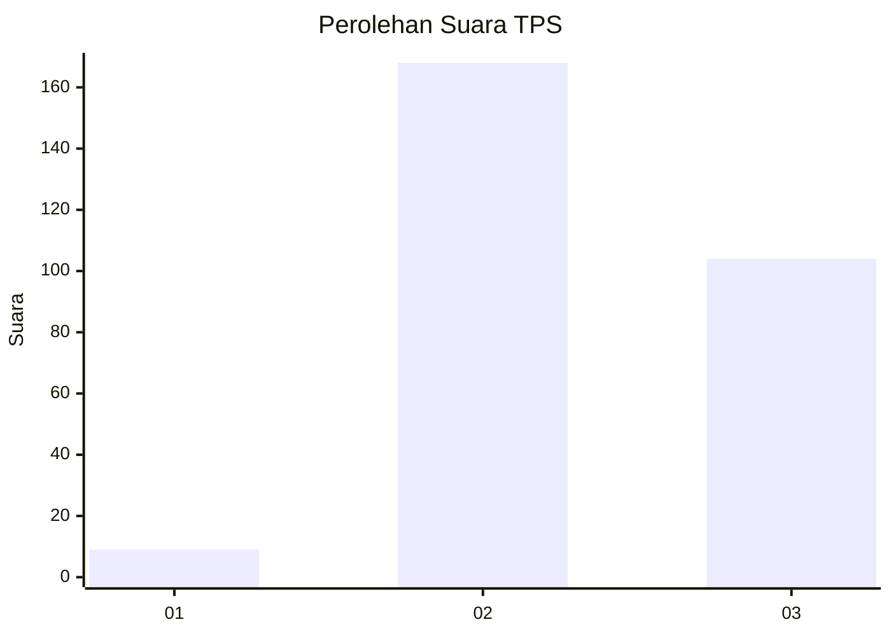
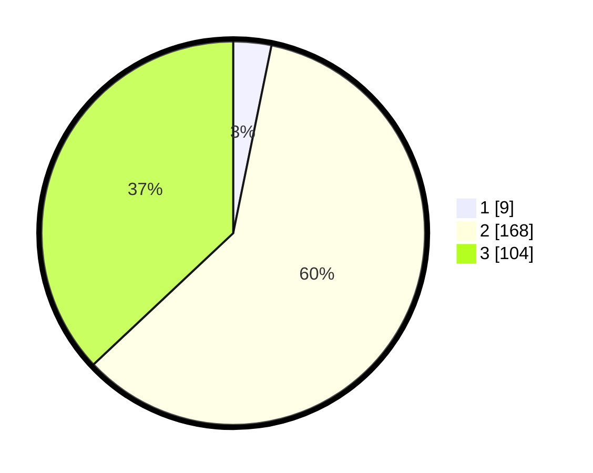

# Hasil

## Grafik

## Tabel

| No. | Nama Paslon    | Suara | Suara (raw) | Persentase |
|:--- |:-------------- | -----:| -----------:| ----------:|
| 1   | ANIES MUHAIMIN | 9     | [9][p-1]    | 3,20       |
| 2   | PRABOWO GIBRAN | 168   | [168][p-2]  | 59,79      |
| 3   | GANJAR MAHFUD  | 104   | [104][p-3]  | 37,01      |

[p-1]: https://github.com/gigit-pemilu/pemilu-2024-51-bali/blob/main/pilpres/hitung-suara/sub/51-bali/sub/03-badung/sub/05-kuta-selatan/sub/1004-benoa/sub/089-tps/sub/paslon-1.txt
[p-2]: https://github.com/gigit-pemilu/pemilu-2024-51-bali/blob/main/pilpres/hitung-suara/sub/51-bali/sub/03-badung/sub/05-kuta-selatan/sub/1004-benoa/sub/089-tps/sub/paslon-2.txt
[p-3]: https://github.com/gigit-pemilu/pemilu-2024-51-bali/blob/main/pilpres/hitung-suara/sub/51-bali/sub/03-badung/sub/05-kuta-selatan/sub/1004-benoa/sub/089-tps/sub/paslon-3.txt

## Foto C Plano

https://sirekap-obj-formc.kpu.go.id/8ed8/pemilu/ppwp/51/03/05/10/04/5103051004089-20240214-215410--ffe7dff2-ab2a-48cc-bf06-3f9611ec532a.jpg

https://sirekap-obj-formc.kpu.go.id/8ed8/pemilu/ppwp/51/03/05/10/04/5103051004089-20240214-215523--cec49796-c341-45e3-a236-186f1b1dd2c2.jpg

https://sirekap-obj-formc.kpu.go.id/8ed8/pemilu/ppwp/51/03/05/10/04/5103051004089-20240214-215641--f95952d3-81cf-49e1-b40a-9c8e05f4e4ee.jpg

## Metadata

| Key        | Value               |
| ---------- | ------------------- |
| Time Stamp | 2024-02-16 17:30:00 |

