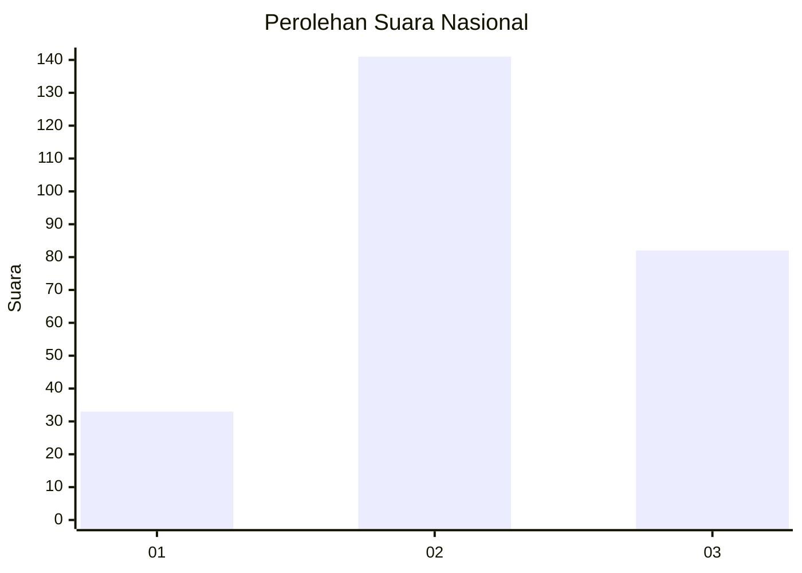
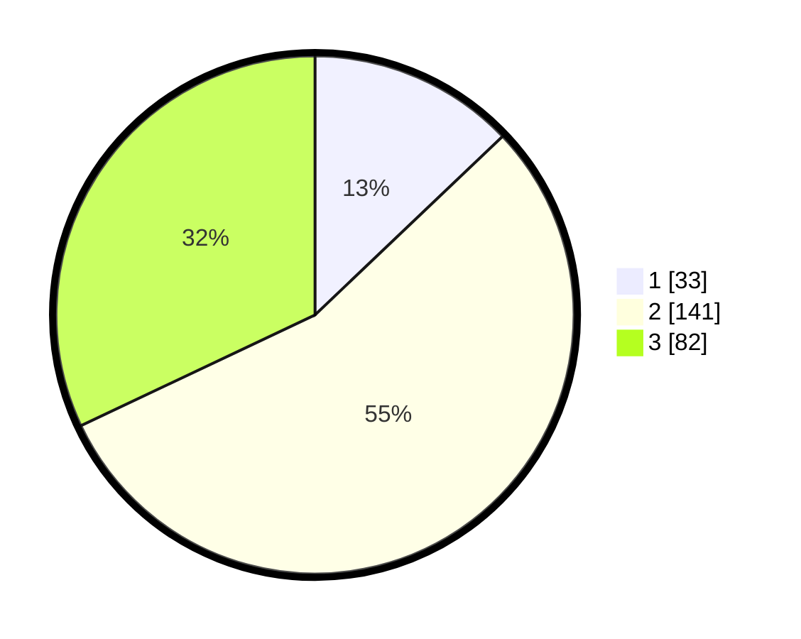

# Hasil

## Grafik

## Tabel

| No. | Nama Paslon    | Suara | Suara (raw) | Persentase |
|:--- |:-------------- | -----:| -----------:| ----------:|
| 1   | ANIES MUHAIMIN | 33    | [33][p-1]   | 12,89      |
| 2   | PRABOWO GIBRAN | 141   | [141][p-2]  | 55,08      |
| 3   | GANJAR MAHFUD  | 82    | [82][p-3]   | 32,03      |

[p-1]: https://github.com/gigit-pemilu/pemilu-2024/blob/main/pilpres/hitung-suara/sub/51-bali/sub/03-badung/sub/05-kuta-selatan/sub/1004-benoa/sub/092-tps/sub/paslon-1.txt
[p-2]: https://github.com/gigit-pemilu/pemilu-2024/blob/main/pilpres/hitung-suara/sub/51-bali/sub/03-badung/sub/05-kuta-selatan/sub/1004-benoa/sub/092-tps/sub/paslon-2.txt
[p-3]: https://github.com/gigit-pemilu/pemilu-2024/blob/main/pilpres/hitung-suara/sub/51-bali/sub/03-badung/sub/05-kuta-selatan/sub/1004-benoa/sub/092-tps/sub/paslon-3.txt

## Foto C Plano

https://sirekap-obj-formc.kpu.go.id/3cd2/pemilu/ppwp/51/03/05/10/04/5103051004092-20240215-004024--6ea1f115-e4b0-49ae-9b1e-b1d4889fc481.jpg

https://sirekap-obj-formc.kpu.go.id/3cd2/pemilu/ppwp/51/03/05/10/04/5103051004092-20240215-004147--571ead3c-0329-4c22-85ae-58a9c9eb1396.jpg

## Metadata

| Key        | Value               |
| ---------- | ------------------- |
| Time Stamp | 2024-02-24 22:31:28 |

