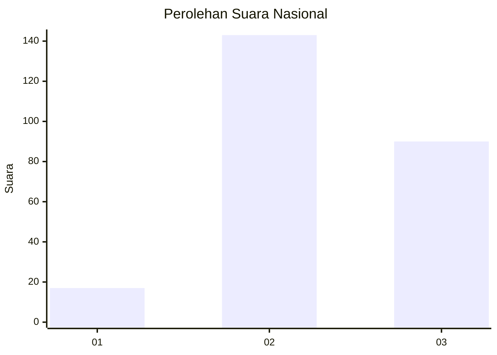
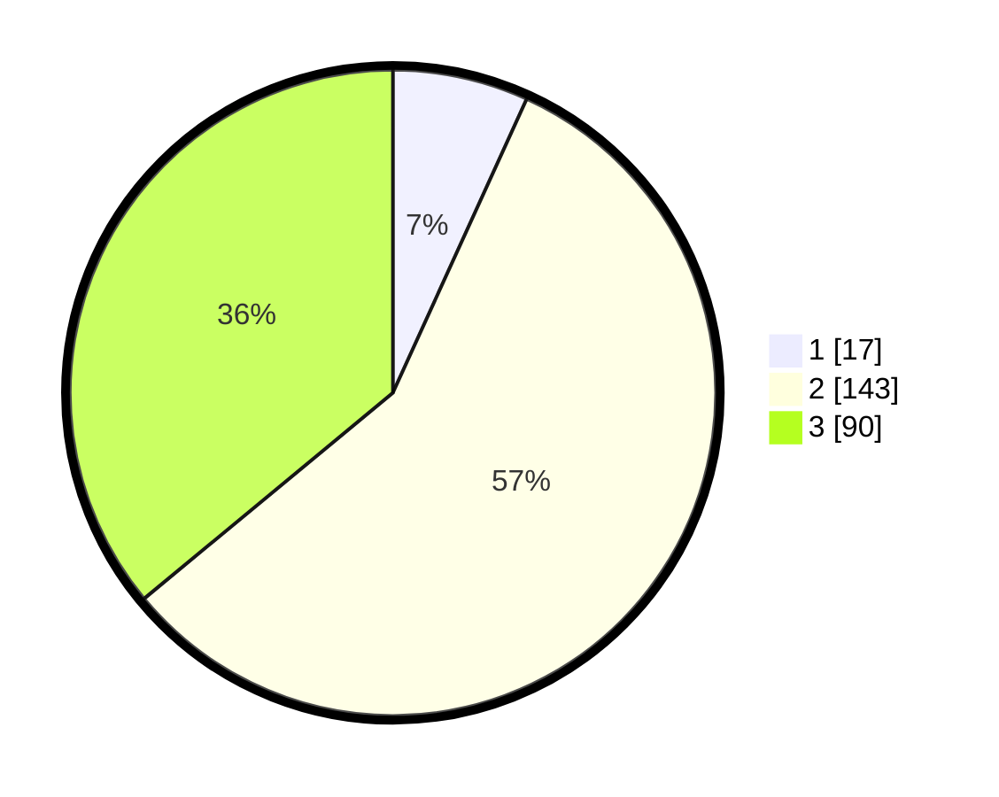

# Hasil

## Grafik

## Tabel

| No. | Nama Paslon    | Suara | Suara (raw) | Persentase |
|:--- |:-------------- | -----:| -----------:| ----------:|
| 1   | ANIES MUHAIMIN | 17    | [17][p-1]   | 6,80       |
| 2   | PRABOWO GIBRAN | 143   | [143][p-2]  | 57,20      |
| 3   | GANJAR MAHFUD  | 90    | [90][p-3]   | 36,00      |

[p-1]: https://github.com/gigit-pemilu/pemilu-2024/blob/main/pilpres/hitung-suara/sub/51-bali/sub/03-badung/sub/05-kuta-selatan/sub/1004-benoa/sub/095-tps/sub/paslon-1.txt
[p-2]: https://github.com/gigit-pemilu/pemilu-2024/blob/main/pilpres/hitung-suara/sub/51-bali/sub/03-badung/sub/05-kuta-selatan/sub/1004-benoa/sub/095-tps/sub/paslon-2.txt
[p-3]: https://github.com/gigit-pemilu/pemilu-2024/blob/main/pilpres/hitung-suara/sub/51-bali/sub/03-badung/sub/05-kuta-selatan/sub/1004-benoa/sub/095-tps/sub/paslon-3.txt

## Foto C Plano

https://sirekap-obj-formc.kpu.go.id/94ed/pemilu/ppwp/51/03/05/10/04/5103051004095-20240215-011329--458f4987-4481-4a33-8331-de75ee5813e7.jpg

https://sirekap-obj-formc.kpu.go.id/94ed/pemilu/ppwp/51/03/05/10/04/5103051004095-20240215-024646--2a086608-7e26-4c5a-bcdf-ce28719fee5c.jpg

https://sirekap-obj-formc.kpu.go.id/94ed/pemilu/ppwp/51/03/05/10/04/5103051004095-20240215-011526--828dbc06-6f59-471d-94a4-e67a720e1b27.jpg

## Metadata

| Key        | Value               |
| ---------- | ------------------- |
| Time Stamp | 2024-02-24 22:31:28 |

## DATA PEMILIH TETAP

Jumlah pemilih dalam DPT: **238**.
 * L: **109**.
 * P: **129**.

## DATA PENGGUNA HAK PILIH

Jumlah pengguna hak pilih dalam DPT: **238**.
 * L: **109**.
 * P: **129**.

Jumlah pengguna hak pilih dalam DPTb: **1**.
 * L: **0**.
 * P: **1**.

Jumlah pengguna hak pilih dalam DPK: **13**.
 * L: **4**.
 * P: **9**.

Jumlah pengguna hak pilih: **252**.
 * L: **113**.
 * P: **139**.

## JUMLAH SUARA SAH DAN TIDAK SAH

JUMLAH SELURUH SUARA SAH: **250**.

JUMLAH SUARA TIDAK SAH: **2**.

JUMLAH SELURUH SUARA SAH DAN SUARA TIDAK SAH: **252**.

