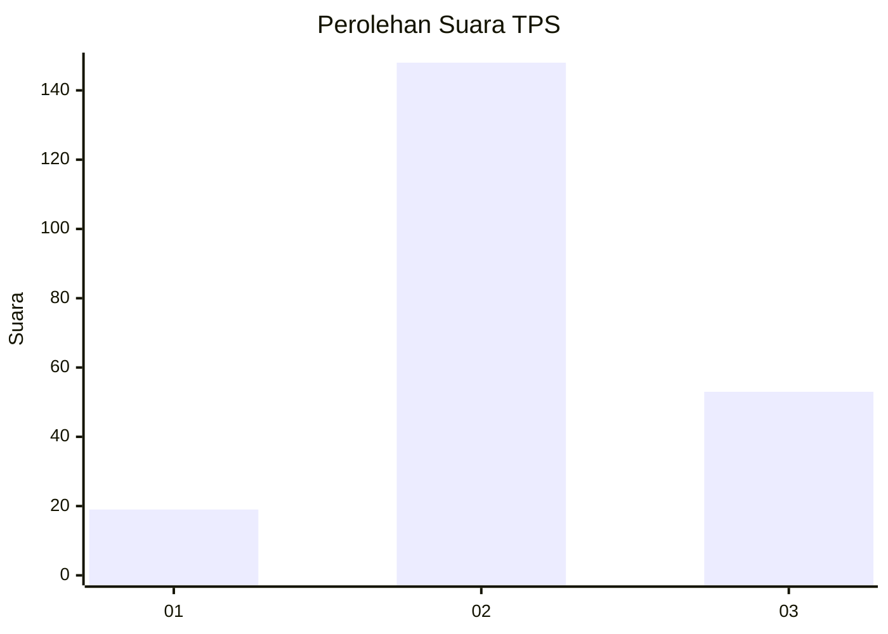
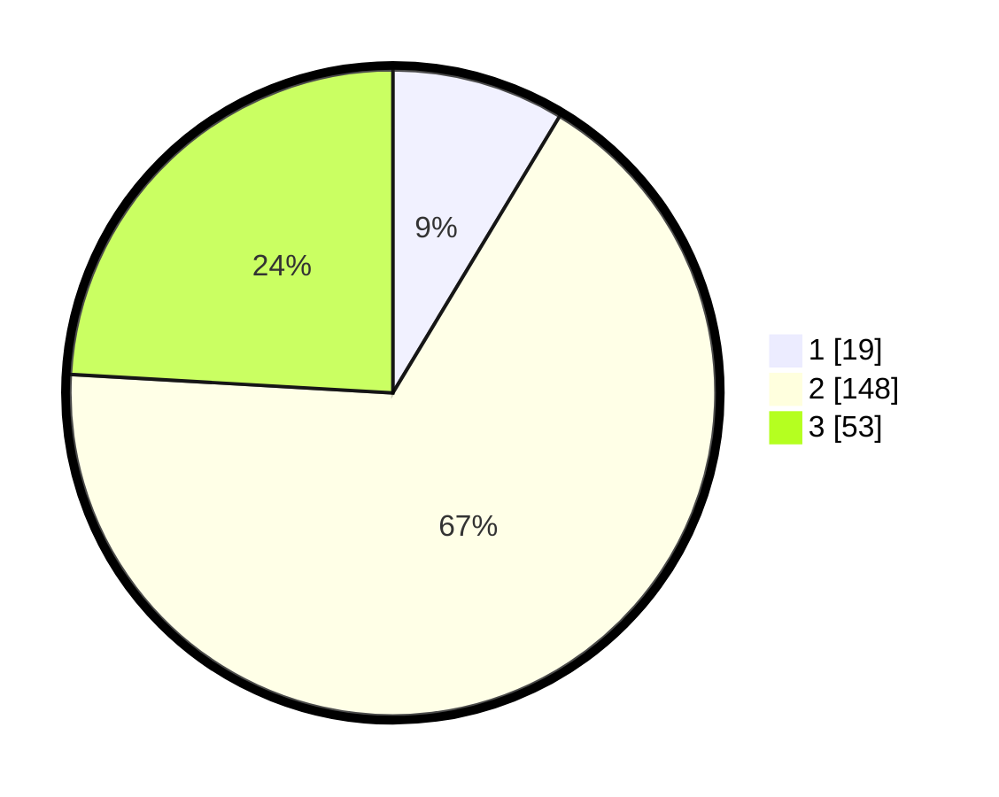

# Hasil

## Grafik

## Tabel

| No. | Nama Paslon    | Suara | Suara (raw) | Persentase |
|:--- |:-------------- | -----:| -----------:| ----------:|
| 1   | ANIES MUHAIMIN | 19    | [19][p-1]   | 8,64       |
| 2   | PRABOWO GIBRAN | 148   | [148][p-2]  | 67,27      |
| 3   | GANJAR MAHFUD  | 53    | [53][p-3]   | 24,09      |

[p-1]: https://github.com/gigit-pemilu/pemilu-2024-51-bali/blob/main/pilpres/hitung-suara/sub/51-bali/sub/03-badung/sub/05-kuta-selatan/sub/1004-benoa/sub/096-tps/sub/paslon-1.txt
[p-2]: https://github.com/gigit-pemilu/pemilu-2024-51-bali/blob/main/pilpres/hitung-suara/sub/51-bali/sub/03-badung/sub/05-kuta-selatan/sub/1004-benoa/sub/096-tps/sub/paslon-2.txt
[p-3]: https://github.com/gigit-pemilu/pemilu-2024-51-bali/blob/main/pilpres/hitung-suara/sub/51-bali/sub/03-badung/sub/05-kuta-selatan/sub/1004-benoa/sub/096-tps/sub/paslon-3.txt

## Foto C Plano

https://sirekap-obj-formc.kpu.go.id/fcc4/pemilu/ppwp/51/03/05/10/04/5103051004096-20240215-205906--e5f644c7-b8bd-41e8-b18d-62af21482d82.jpg

https://sirekap-obj-formc.kpu.go.id/fcc4/pemilu/ppwp/51/03/05/10/04/5103051004096-20240215-205909--9bb53322-b19f-4a43-b88e-012495004221.jpg

https://sirekap-obj-formc.kpu.go.id/fcc4/pemilu/ppwp/51/03/05/10/04/5103051004096-20240215-205907--2b832b6d-fe84-4745-b897-e8ea15f7d44d.jpg

## Metadata

| Key        | Value               |
| ---------- | ------------------- |
| Time Stamp | 2024-02-24 22:31:28 |

## DATA PEMILIH TETAP

Jumlah pemilih dalam DPT: **288**.
 * L: **150**.
 * P: **138**.

## DATA PENGGUNA HAK PILIH

Jumlah pengguna hak pilih dalam DPT: **200**.
 * L: **102**.
 * P: **98**.

Jumlah pengguna hak pilih dalam DPTb: **6**.
 * L: **3**.
 * P: **3**.

Jumlah pengguna hak pilih dalam DPK: **16**.
 * L: **9**.
 * P: **7**.

Jumlah pengguna hak pilih: **222**.
 * L: **114**.
 * P: **108**.

## JUMLAH SUARA SAH DAN TIDAK SAH

JUMLAH SELURUH SUARA SAH: **220**.

JUMLAH SUARA TIDAK SAH: **2**.

JUMLAH SELURUH SUARA SAH DAN SUARA TIDAK SAH: **222**.

