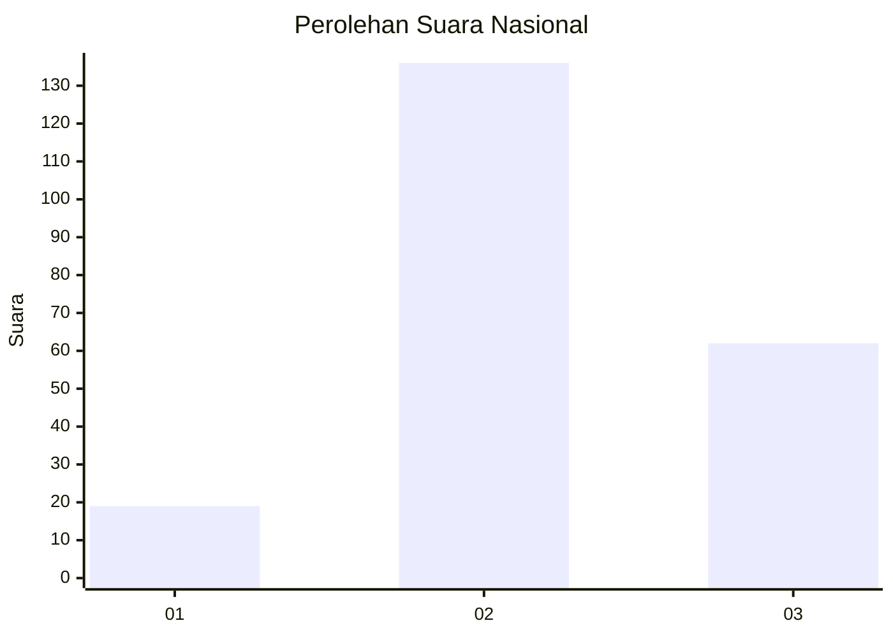
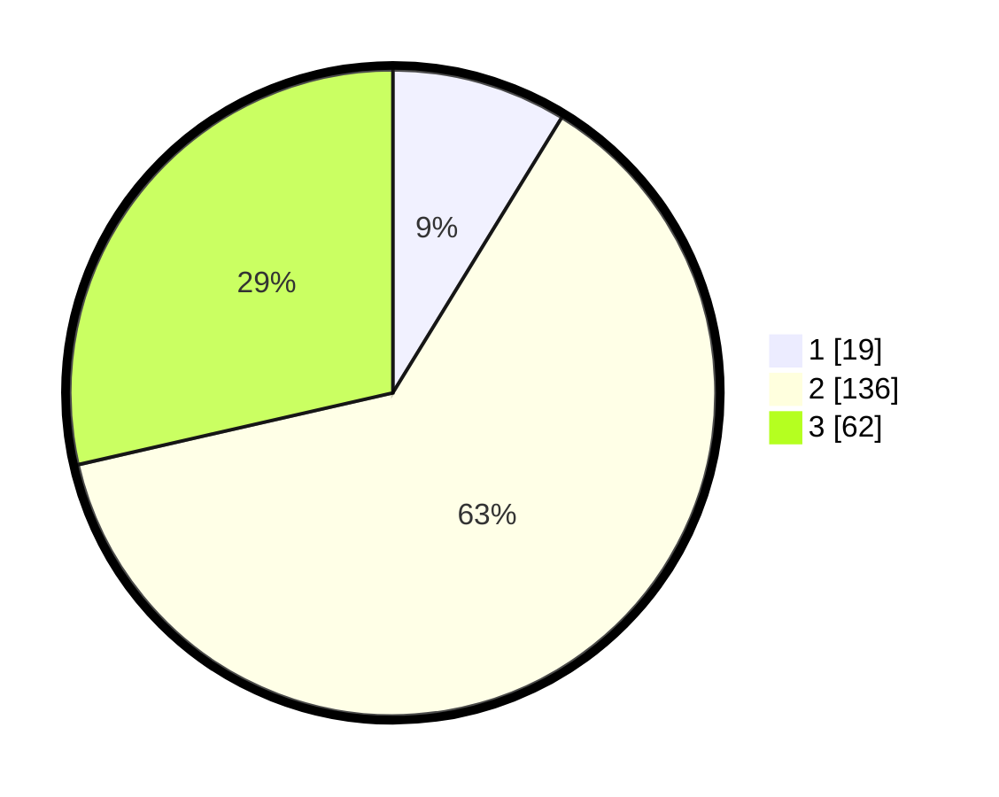

# Hasil

## Grafik

## Tabel

| No. | Nama Paslon    | Suara | Suara (raw) | Persentase |
|:--- |:-------------- | -----:| -----------:| ----------:|
| 1   | ANIES MUHAIMIN | 19    | [19][p-1]   | 8,76       |
| 2   | PRABOWO GIBRAN | 136   | [136][p-2]  | 62,67      |
| 3   | GANJAR MAHFUD  | 62    | [62][p-3]   | 28,57      |

[p-1]: https://github.com/gigit-pemilu/pemilu-2024/blob/main/pilpres/hitung-suara/sub/51-bali/sub/03-badung/sub/05-kuta-selatan/sub/1004-benoa/sub/097-tps/sub/paslon-1.txt
[p-2]: https://github.com/gigit-pemilu/pemilu-2024/blob/main/pilpres/hitung-suara/sub/51-bali/sub/03-badung/sub/05-kuta-selatan/sub/1004-benoa/sub/097-tps/sub/paslon-2.txt
[p-3]: https://github.com/gigit-pemilu/pemilu-2024/blob/main/pilpres/hitung-suara/sub/51-bali/sub/03-badung/sub/05-kuta-selatan/sub/1004-benoa/sub/097-tps/sub/paslon-3.txt

## Foto C Plano

https://sirekap-obj-formc.kpu.go.id/a522/pemilu/ppwp/51/03/05/10/04/5103051004097-20240214-155458--55449190-65a0-40d3-8726-1b30858cd265.jpg

https://sirekap-obj-formc.kpu.go.id/a522/pemilu/ppwp/51/03/05/10/04/5103051004097-20240214-155716--defcd850-db2f-4a63-ad63-c56f05d0b4c7.jpg

https://sirekap-obj-formc.kpu.go.id/a522/pemilu/ppwp/51/03/05/10/04/5103051004097-20240214-155804--00031f09-98f3-4d47-93eb-6f545fa5cc05.jpg

## Metadata

| Key        | Value               |
| ---------- | ------------------- |
| Time Stamp | 2024-02-24 22:31:28 |

