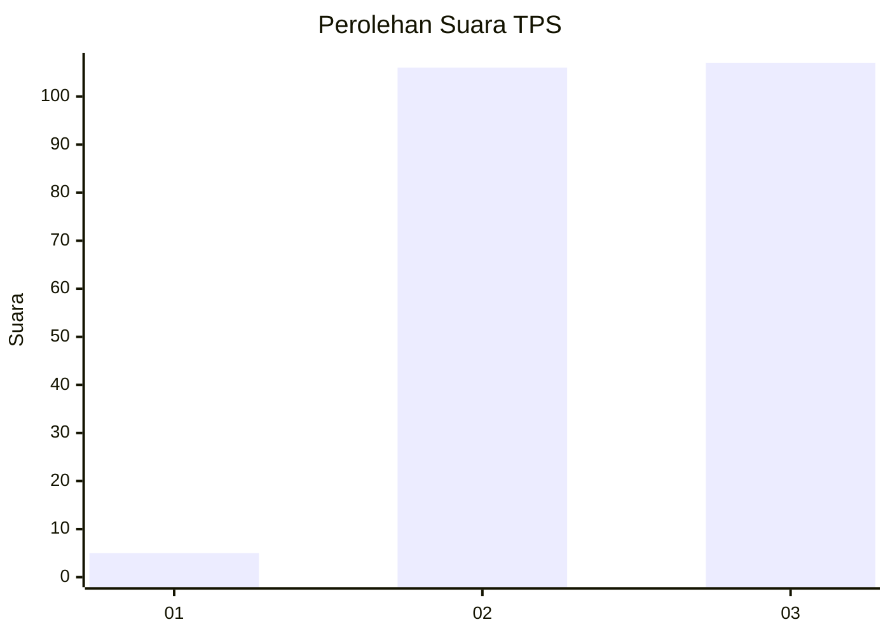
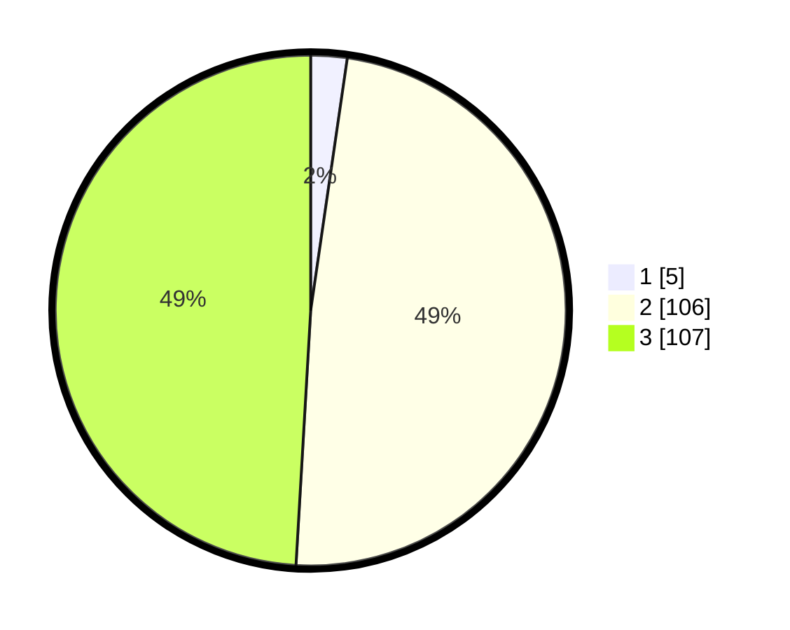

# Hasil

## Grafik

## Tabel

| No. | Nama Paslon    | Suara | Suara (raw) | Persentase |
|:--- |:-------------- | -----:| -----------:| ----------:|
| 1   | ANIES MUHAIMIN | 5     | [5][p-1]    | 2,29       |
| 2   | PRABOWO GIBRAN | 106   | [106][p-2]  | 48,62      |
| 3   | GANJAR MAHFUD  | 107   | [107][p-3]  | 49,08      |

[p-1]: https://github.com/gigit-pemilu/pemilu-2024-51-bali/blob/main/pilpres/hitung-suara/sub/51-bali/sub/03-badung/sub/05-kuta-selatan/sub/1004-benoa/sub/103-tps/sub/paslon-1.txt
[p-2]: https://github.com/gigit-pemilu/pemilu-2024-51-bali/blob/main/pilpres/hitung-suara/sub/51-bali/sub/03-badung/sub/05-kuta-selatan/sub/1004-benoa/sub/103-tps/sub/paslon-2.txt
[p-3]: https://github.com/gigit-pemilu/pemilu-2024-51-bali/blob/main/pilpres/hitung-suara/sub/51-bali/sub/03-badung/sub/05-kuta-selatan/sub/1004-benoa/sub/103-tps/sub/paslon-3.txt

## Foto C Plano

https://sirekap-obj-formc.kpu.go.id/6537/pemilu/ppwp/51/03/05/10/04/5103051004103-20240215-215659--81164bab-1e85-4fdb-9a14-5b00ade4cd85.jpg

https://sirekap-obj-formc.kpu.go.id/6537/pemilu/ppwp/51/03/05/10/04/5103051004103-20240215-215703--af9fb06d-f527-4807-90d7-fdbeb9937095.jpg

https://sirekap-obj-formc.kpu.go.id/6537/pemilu/ppwp/51/03/05/10/04/5103051004103-20240215-215702--6e7b7239-7b4a-484c-aa93-f947d0ac828a.jpg

## Metadata

| Key        | Value               |
| ---------- | ------------------- |
| Time Stamp | 2024-02-21 13:00:00 |

## DATA PEMILIH TETAP

Jumlah pemilih dalam DPT: **246**.
 * L: **120**.
 * P: **126**.

## DATA PENGGUNA HAK PILIH

Jumlah pengguna hak pilih dalam DPT: **209**.
 * L: **97**.
 * P: **112**.

Jumlah pengguna hak pilih dalam DPTb: **3**.
 * L: **2**.
 * P: **1**.

Jumlah pengguna hak pilih dalam DPK: **8**.
 * L: **5**.
 * P: **3**.

Jumlah pengguna hak pilih: **220**.
 * L: **104**.
 * P: **116**.

## JUMLAH SUARA SAH DAN TIDAK SAH

JUMLAH SELURUH SUARA SAH: **218**.

JUMLAH SUARA TIDAK SAH: **2**.

JUMLAH SELURUH SUARA SAH DAN SUARA TIDAK SAH: **220**.

