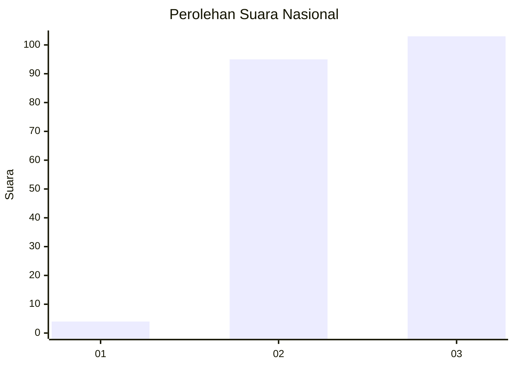
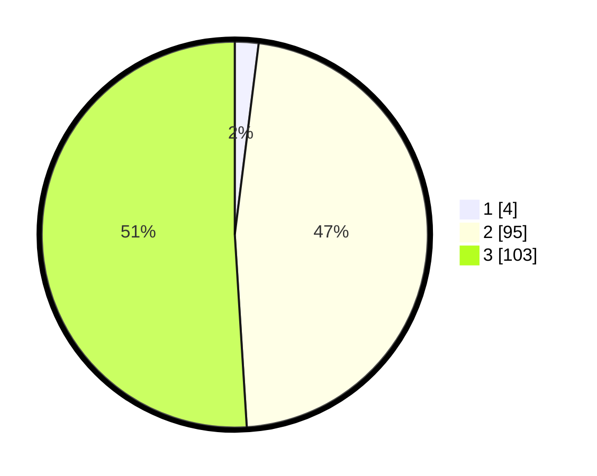

# Hasil

## Grafik

## Tabel

| No. | Nama Paslon    | Suara | Suara (raw) | Persentase |
|:--- |:-------------- | -----:| -----------:| ----------:|
| 1   | ANIES MUHAIMIN | 4     | [4][p-1]    | 1,98       |
| 2   | PRABOWO GIBRAN | 95    | [95][p-2]   | 47,03      |
| 3   | GANJAR MAHFUD  | 103   | [103][p-3]  | 50,99      |

[p-1]: https://github.com/gigit-pemilu/pemilu-2024/blob/main/pilpres/hitung-suara/sub/51-bali/sub/03-badung/sub/05-kuta-selatan/sub/1005-tanjung-benoa/sub/001-tps/sub/paslon-1.txt
[p-2]: https://github.com/gigit-pemilu/pemilu-2024/blob/main/pilpres/hitung-suara/sub/51-bali/sub/03-badung/sub/05-kuta-selatan/sub/1005-tanjung-benoa/sub/001-tps/sub/paslon-2.txt
[p-3]: https://github.com/gigit-pemilu/pemilu-2024/blob/main/pilpres/hitung-suara/sub/51-bali/sub/03-badung/sub/05-kuta-selatan/sub/1005-tanjung-benoa/sub/001-tps/sub/paslon-3.txt

## Foto C Plano

https://sirekap-obj-formc.kpu.go.id/ee85/pemilu/ppwp/51/03/05/10/05/5103051005001-20240214-234310--8bb9ab36-867c-48cf-8bc4-da7fa7d8ca41.jpg

https://sirekap-obj-formc.kpu.go.id/ee85/pemilu/ppwp/51/03/05/10/05/5103051005001-20240214-234524--d2de8f6c-b0df-4ae2-92b9-deac838bac0f.jpg

https://sirekap-obj-formc.kpu.go.id/ee85/pemilu/ppwp/51/03/05/10/05/5103051005001-20240214-234725--78fe2a7e-da88-4290-b272-71e098b14ede.jpg

## Metadata

| Key        | Value               |
| ---------- | ------------------- |
| Time Stamp | 2024-02-15 22:00:27 |

