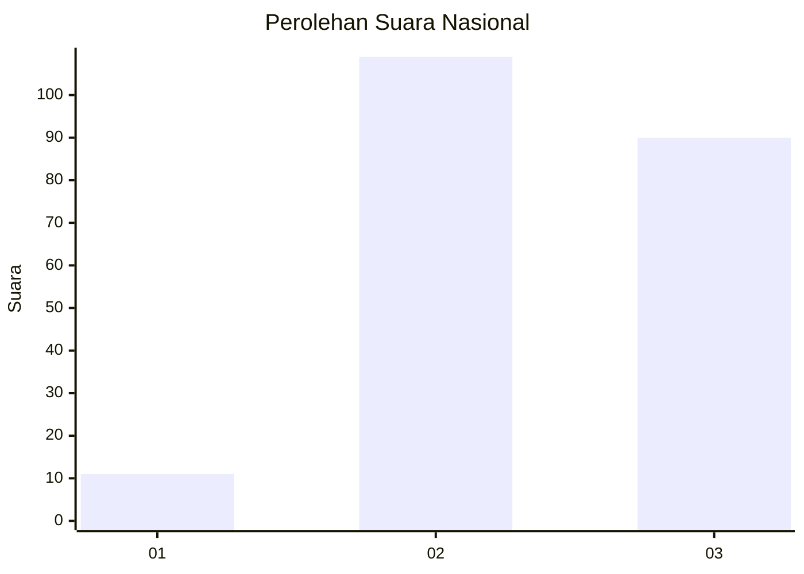
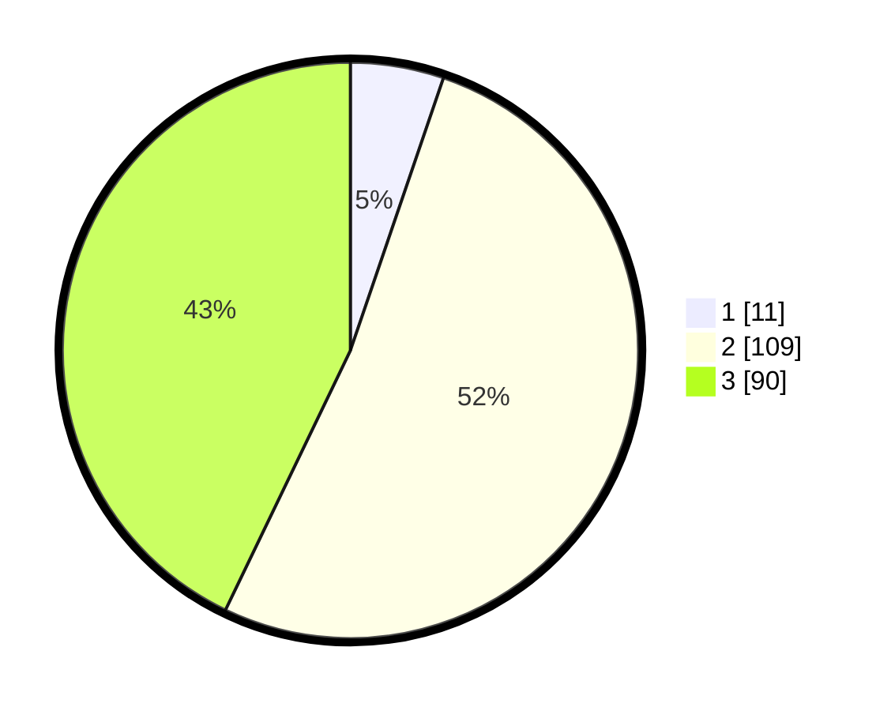

# Hasil

## Grafik

## Tabel

| No. | Nama Paslon    | Suara | Suara (raw) | Persentase |
|:--- |:-------------- | -----:| -----------:| ----------:|
| 1   | ANIES MUHAIMIN | 11    | [11][p-1]   | 5,24       |
| 2   | PRABOWO GIBRAN | 109   | [109][p-2]  | 51,90      |
| 3   | GANJAR MAHFUD  | 90    | [90][p-3]   | 42,86      |

[p-1]: https://github.com/gigit-pemilu/pemilu-2024/blob/main/pilpres/hitung-suara/sub/51-bali/sub/03-badung/sub/05-kuta-selatan/sub/1005-tanjung-benoa/sub/002-tps/sub/paslon-1.txt
[p-2]: https://github.com/gigit-pemilu/pemilu-2024/blob/main/pilpres/hitung-suara/sub/51-bali/sub/03-badung/sub/05-kuta-selatan/sub/1005-tanjung-benoa/sub/002-tps/sub/paslon-2.txt
[p-3]: https://github.com/gigit-pemilu/pemilu-2024/blob/main/pilpres/hitung-suara/sub/51-bali/sub/03-badung/sub/05-kuta-selatan/sub/1005-tanjung-benoa/sub/002-tps/sub/paslon-3.txt

## Foto C Plano

https://sirekap-obj-formc.kpu.go.id/a9f3/pemilu/ppwp/51/03/05/10/05/5103051005002-20240215-215433--5ada7bd4-b5e4-4868-b3c6-e732ef27ea18.jpg

https://sirekap-obj-formc.kpu.go.id/a9f3/pemilu/ppwp/51/03/05/10/05/5103051005002-20240215-215435--963897f8-073a-46c7-8bf8-53092156b4cd.jpg

https://sirekap-obj-formc.kpu.go.id/a9f3/pemilu/ppwp/51/03/05/10/05/5103051005002-20240215-215434--cc13f9ff-bbbb-47c8-96ae-89d2875bc48d.jpg

## Metadata

| Key        | Value               |
| ---------- | ------------------- |
| Time Stamp | 2024-02-21 10:00:00 |

## DATA PEMILIH TETAP

Jumlah pemilih dalam DPT: **229**.
 * L: **106**.
 * P: **123**.

## DATA PENGGUNA HAK PILIH

Jumlah pengguna hak pilih dalam DPT: **205**.
 * L: **94**.
 * P: **111**.

Jumlah pengguna hak pilih dalam DPTb: **6**.
 * L: **5**.
 * P: **1**.

Jumlah pengguna hak pilih dalam DPK: **1**.
 * L: **0**.
 * P: **1**.

Jumlah pengguna hak pilih: **212**.
 * L: **99**.
 * P: **113**.

## JUMLAH SUARA SAH DAN TIDAK SAH

JUMLAH SELURUH SUARA SAH: **210**.

JUMLAH SUARA TIDAK SAH: **2**.

JUMLAH SELURUH SUARA SAH DAN SUARA TIDAK SAH: **212**.

