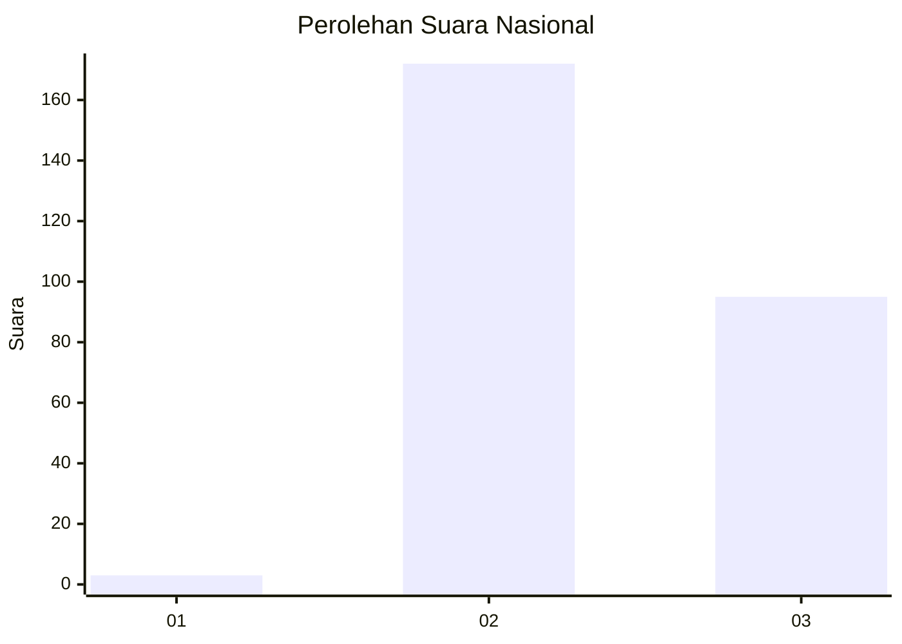
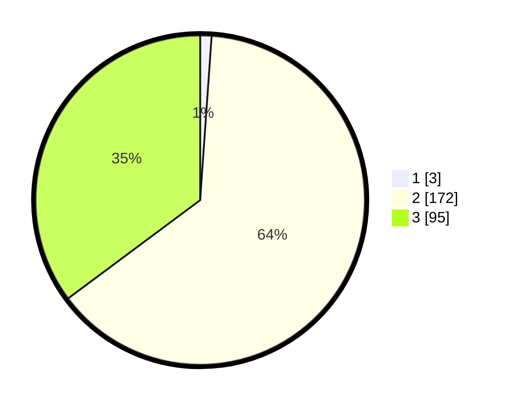

# Hasil

## Grafik

## Tabel

| No. | Nama Paslon    | Suara | Suara (raw) | Persentase |
|:--- |:-------------- | -----:| -----------:| ----------:|
| 1   | ANIES MUHAIMIN | 3     | [3][p-1]    | 1,11       |
| 2   | PRABOWO GIBRAN | 172   | [172][p-2]  | 63,70      |
| 3   | GANJAR MAHFUD  | 95    | [95][p-3]   | 35,19      |

[p-1]: https://github.com/gigit-pemilu/pemilu-2024/blob/main/pilpres/hitung-suara/sub/51-bali/sub/03-badung/sub/05-kuta-selatan/sub/1005-tanjung-benoa/sub/003-tps/sub/paslon-1.txt
[p-2]: https://github.com/gigit-pemilu/pemilu-2024/blob/main/pilpres/hitung-suara/sub/51-bali/sub/03-badung/sub/05-kuta-selatan/sub/1005-tanjung-benoa/sub/003-tps/sub/paslon-2.txt
[p-3]: https://github.com/gigit-pemilu/pemilu-2024/blob/main/pilpres/hitung-suara/sub/51-bali/sub/03-badung/sub/05-kuta-selatan/sub/1005-tanjung-benoa/sub/003-tps/sub/paslon-3.txt

## Foto C Plano

https://sirekap-obj-formc.kpu.go.id/3d31/pemilu/ppwp/51/03/05/10/05/5103051005003-20240214-194939--c99af18d-8fe7-4430-bef1-73d4fa28070c.jpg

https://sirekap-obj-formc.kpu.go.id/3d31/pemilu/ppwp/51/03/05/10/05/5103051005003-20240214-195009--ee225d67-7838-466a-8987-6bee5089592b.jpg

https://sirekap-obj-formc.kpu.go.id/3d31/pemilu/ppwp/51/03/05/10/05/5103051005003-20240214-195043--9e2d7835-c4f2-4829-a8a2-99d9127d633e.jpg

## Metadata

| Key        | Value               |
| ---------- | ------------------- |
| Time Stamp | 2024-02-15 22:00:27 |

## DATA PEMILIH TETAP

Jumlah pemilih dalam DPT: **291**.
 * L: **142**.
 * P: **149**.

## DATA PENGGUNA HAK PILIH

Jumlah pengguna hak pilih dalam DPT: **267**.
 * L: **127**.
 * P: **140**.

Jumlah pengguna hak pilih dalam DPTb: **7**.
 * L: **5**.
 * P: **2**.

Jumlah pengguna hak pilih dalam DPK: **0**.
 * L: **0**.
 * P: **0**.

Jumlah pengguna hak pilih: **274**.
 * L: **132**.
 * P: **142**.

## JUMLAH SUARA SAH DAN TIDAK SAH

JUMLAH SELURUH SUARA SAH: **270**.

JUMLAH SUARA TIDAK SAH: **4**.

JUMLAH SELURUH SUARA SAH DAN SUARA TIDAK SAH: **274**.

