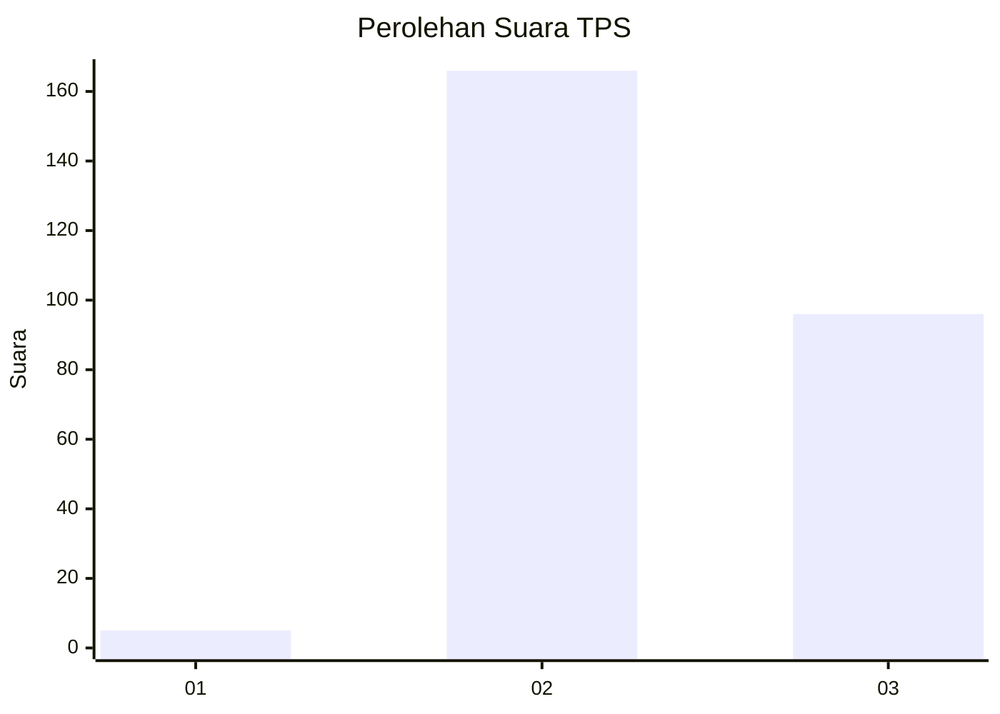
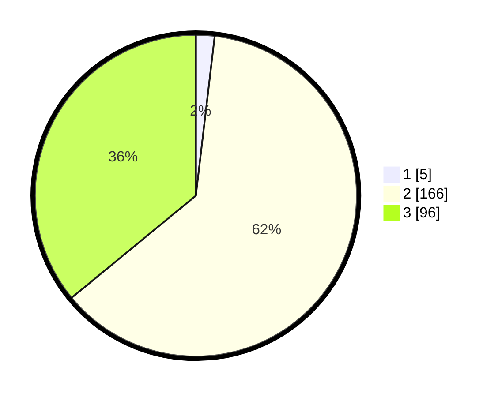

# Hasil

## Grafik

## Tabel

| No. | Nama Paslon    | Suara | Suara (raw) | Persentase |
|:--- |:-------------- | -----:| -----------:| ----------:|
| 1   | ANIES MUHAIMIN | 5     | [5][p-1]    | 1,87       |
| 2   | PRABOWO GIBRAN | 166   | [166][p-2]  | 62,17      |
| 3   | GANJAR MAHFUD  | 96    | [96][p-3]   | 35,96      |

[p-1]: https://github.com/gigit-pemilu/pemilu-2024-51-bali/blob/main/pilpres/hitung-suara/sub/51-bali/sub/03-badung/sub/05-kuta-selatan/sub/1005-tanjung-benoa/sub/005-tps/sub/paslon-1.txt
[p-2]: https://github.com/gigit-pemilu/pemilu-2024-51-bali/blob/main/pilpres/hitung-suara/sub/51-bali/sub/03-badung/sub/05-kuta-selatan/sub/1005-tanjung-benoa/sub/005-tps/sub/paslon-2.txt
[p-3]: https://github.com/gigit-pemilu/pemilu-2024-51-bali/blob/main/pilpres/hitung-suara/sub/51-bali/sub/03-badung/sub/05-kuta-selatan/sub/1005-tanjung-benoa/sub/005-tps/sub/paslon-3.txt

## Foto C Plano

https://sirekap-obj-formc.kpu.go.id/cb06/pemilu/ppwp/51/03/05/10/05/5103051005005-20240214-141009--42a62e45-62e9-40df-9bf7-3ea9e783fd53.jpg

https://sirekap-obj-formc.kpu.go.id/cb06/pemilu/ppwp/51/03/05/10/05/5103051005005-20240214-141243--b5594010-3019-4152-9732-63177ff8d4b2.jpg

https://sirekap-obj-formc.kpu.go.id/cb06/pemilu/ppwp/51/03/05/10/05/5103051005005-20240214-212839--eea6b9d5-23cf-4d4b-bd88-7df96ce31e01.jpg

## Metadata

| Key        | Value               |
| ---------- | ------------------- |
| Time Stamp | 2024-02-15 02:10:27 |

