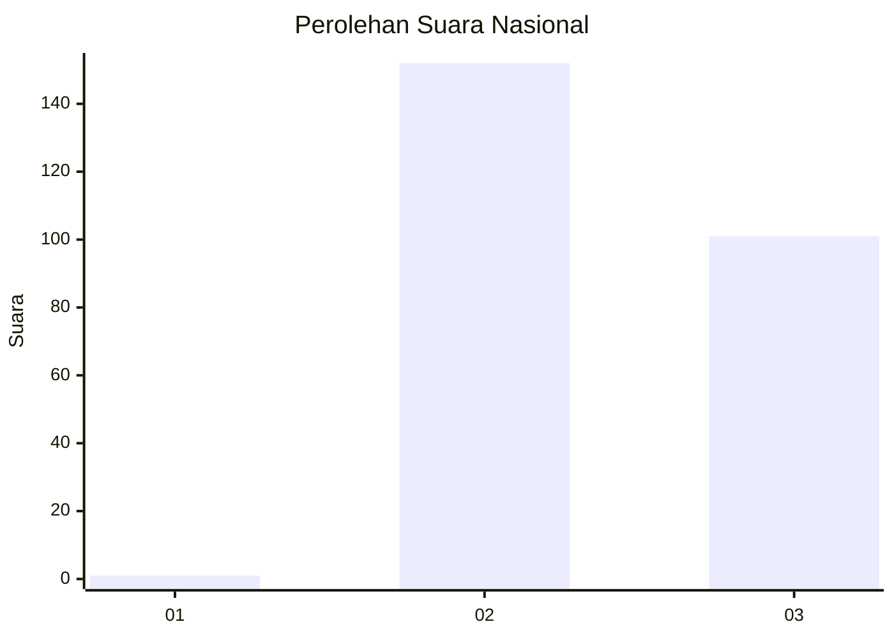
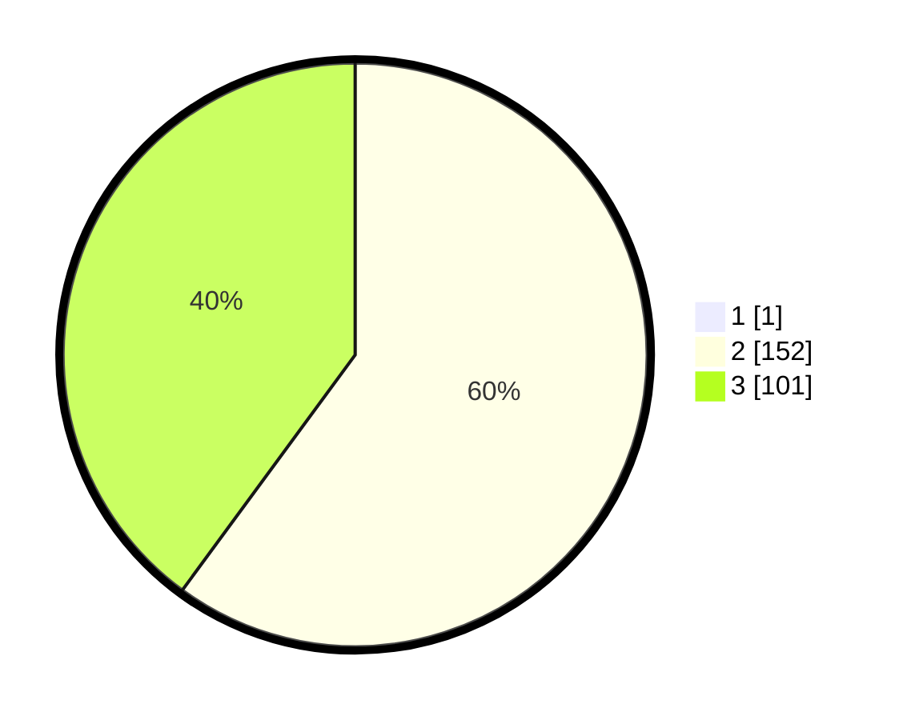

# Hasil

## Grafik

## Tabel

| No. | Nama Paslon    | Suara | Suara (raw) | Persentase |
|:--- |:-------------- | -----:| -----------:| ----------:|
| 1   | ANIES MUHAIMIN | 1     | [1][p-1]    | 0,39       |
| 2   | PRABOWO GIBRAN | 152   | [152][p-2]  | 59,84      |
| 3   | GANJAR MAHFUD  | 101   | [101][p-3]  | 39,76      |

[p-1]: https://github.com/gigit-pemilu/pemilu-2024/blob/main/pilpres/hitung-suara/sub/51-bali/sub/03-badung/sub/05-kuta-selatan/sub/1005-tanjung-benoa/sub/011-tps/sub/paslon-1.txt
[p-2]: https://github.com/gigit-pemilu/pemilu-2024/blob/main/pilpres/hitung-suara/sub/51-bali/sub/03-badung/sub/05-kuta-selatan/sub/1005-tanjung-benoa/sub/011-tps/sub/paslon-2.txt
[p-3]: https://github.com/gigit-pemilu/pemilu-2024/blob/main/pilpres/hitung-suara/sub/51-bali/sub/03-badung/sub/05-kuta-selatan/sub/1005-tanjung-benoa/sub/011-tps/sub/paslon-3.txt

## Foto C Plano

https://sirekap-obj-formc.kpu.go.id/9217/pemilu/ppwp/51/03/05/10/05/5103051005011-20240214-210351--7aca33ee-274c-4c07-9efe-c86cb874e6f4.jpg

https://sirekap-obj-formc.kpu.go.id/9217/pemilu/ppwp/51/03/05/10/05/5103051005011-20240214-210503--494c4a20-fd02-443b-9173-d9094e5a1db6.jpg

https://sirekap-obj-formc.kpu.go.id/9217/pemilu/ppwp/51/03/05/10/05/5103051005011-20240214-210626--f16f2cd6-807d-4cb1-8e4e-6557be92a593.jpg

## Metadata

| Key        | Value               |
| ---------- | ------------------- |
| Time Stamp | 2024-02-15 22:30:27 |

