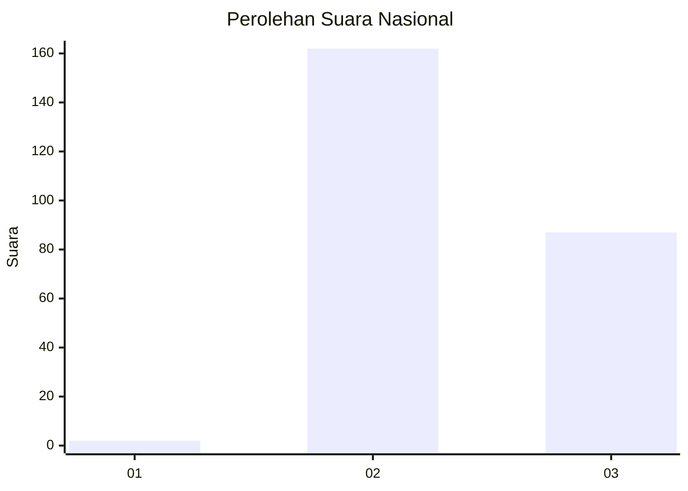
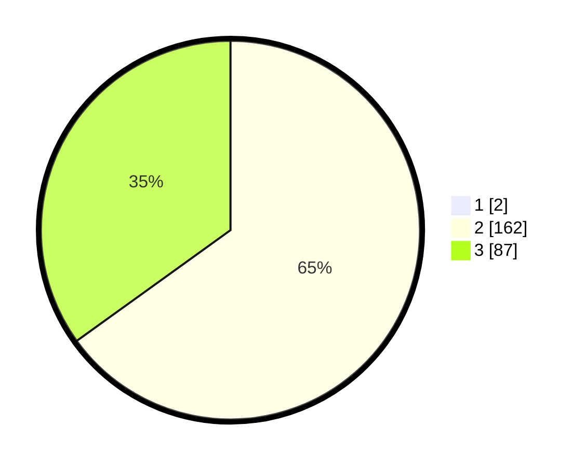

# Hasil

## Grafik

## Tabel

| No. | Nama Paslon    | Suara | Suara (raw) | Persentase |
|:--- |:-------------- | -----:| -----------:| ----------:|
| 1   | ANIES MUHAIMIN | 2     | [2][p-1]    | 0,80       |
| 2   | PRABOWO GIBRAN | 162   | [162][p-2]  | 64,54      |
| 3   | GANJAR MAHFUD  | 87    | [87][p-3]   | 34,66      |

[p-1]: https://github.com/gigit-pemilu/pemilu-2024/blob/main/pilpres/hitung-suara/sub/51-bali/sub/03-badung/sub/05-kuta-selatan/sub/1005-tanjung-benoa/sub/012-tps/sub/paslon-1.txt
[p-2]: https://github.com/gigit-pemilu/pemilu-2024/blob/main/pilpres/hitung-suara/sub/51-bali/sub/03-badung/sub/05-kuta-selatan/sub/1005-tanjung-benoa/sub/012-tps/sub/paslon-2.txt
[p-3]: https://github.com/gigit-pemilu/pemilu-2024/blob/main/pilpres/hitung-suara/sub/51-bali/sub/03-badung/sub/05-kuta-selatan/sub/1005-tanjung-benoa/sub/012-tps/sub/paslon-3.txt

## Foto C Plano

https://sirekap-obj-formc.kpu.go.id/225f/pemilu/ppwp/51/03/05/10/05/5103051005012-20240214-233643--5b59a4fe-3778-4834-8eb0-4429e6a4353e.jpg

https://sirekap-obj-formc.kpu.go.id/225f/pemilu/ppwp/51/03/05/10/05/5103051005012-20240214-233836--5e0cfea5-fe27-427d-8f1a-9215defb1a14.jpg

https://sirekap-obj-formc.kpu.go.id/225f/pemilu/ppwp/51/03/05/10/05/5103051005012-20240214-233552--55702575-8d50-4f28-bf41-7bc29f7fadab.jpg

## Metadata

| Key        | Value               |
| ---------- | ------------------- |
| Time Stamp | 2024-02-15 22:30:27 |

