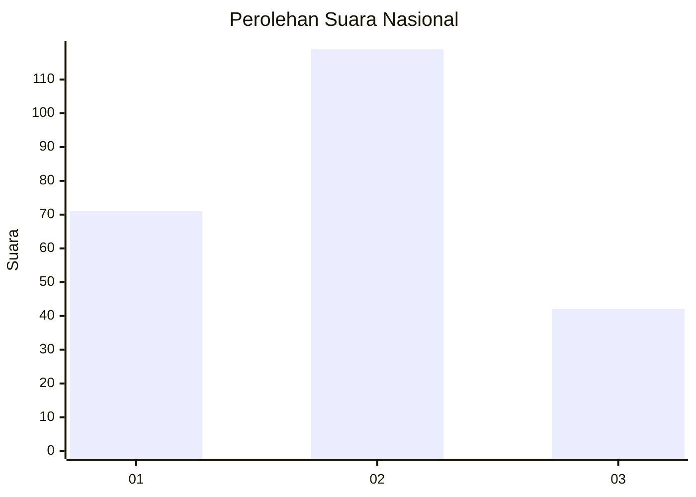
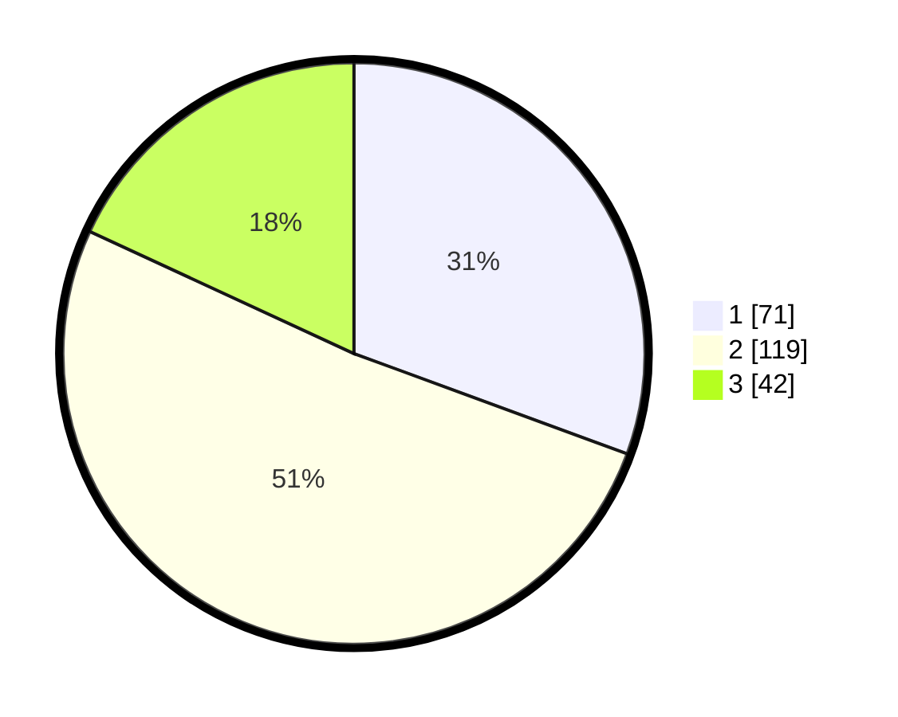

# Hasil

## Grafik

## Tabel

| No. | Nama Paslon    | Suara | Suara (raw) | Persentase |
|:--- |:-------------- | -----:| -----------:| ----------:|
| 1   | ANIES MUHAIMIN | 71    | [71][p-1]   | 30,60      |
| 2   | PRABOWO GIBRAN | 119   | [119][p-2]  | 51,29      |
| 3   | GANJAR MAHFUD  | 42    | [42][p-3]   | 18,10      |

[p-1]: https://github.com/gigit-pemilu/pemilu-2024/blob/main/pilpres/hitung-suara/sub/51-bali/sub/03-badung/sub/05-kuta-selatan/sub/1005-tanjung-benoa/sub/015-tps/sub/paslon-1.txt
[p-2]: https://github.com/gigit-pemilu/pemilu-2024/blob/main/pilpres/hitung-suara/sub/51-bali/sub/03-badung/sub/05-kuta-selatan/sub/1005-tanjung-benoa/sub/015-tps/sub/paslon-2.txt
[p-3]: https://github.com/gigit-pemilu/pemilu-2024/blob/main/pilpres/hitung-suara/sub/51-bali/sub/03-badung/sub/05-kuta-selatan/sub/1005-tanjung-benoa/sub/015-tps/sub/paslon-3.txt

## Foto C Plano

https://sirekap-obj-formc.kpu.go.id/f638/pemilu/ppwp/51/03/05/10/05/5103051005015-20240214-231111--f505f5ee-be9a-45fe-92ee-1649ed14f943.jpg

https://sirekap-obj-formc.kpu.go.id/f638/pemilu/ppwp/51/03/05/10/05/5103051005015-20240214-231216--bedf9e4a-e608-457c-af1b-dfb09836a00a.jpg

https://sirekap-obj-formc.kpu.go.id/f638/pemilu/ppwp/51/03/05/10/05/5103051005015-20240214-190641--ba92d397-8154-4362-8213-f21e1528c14d.jpg

## Metadata

| Key        | Value               |
| ---------- | ------------------- |
| Time Stamp | 2024-02-15 22:30:27 |

