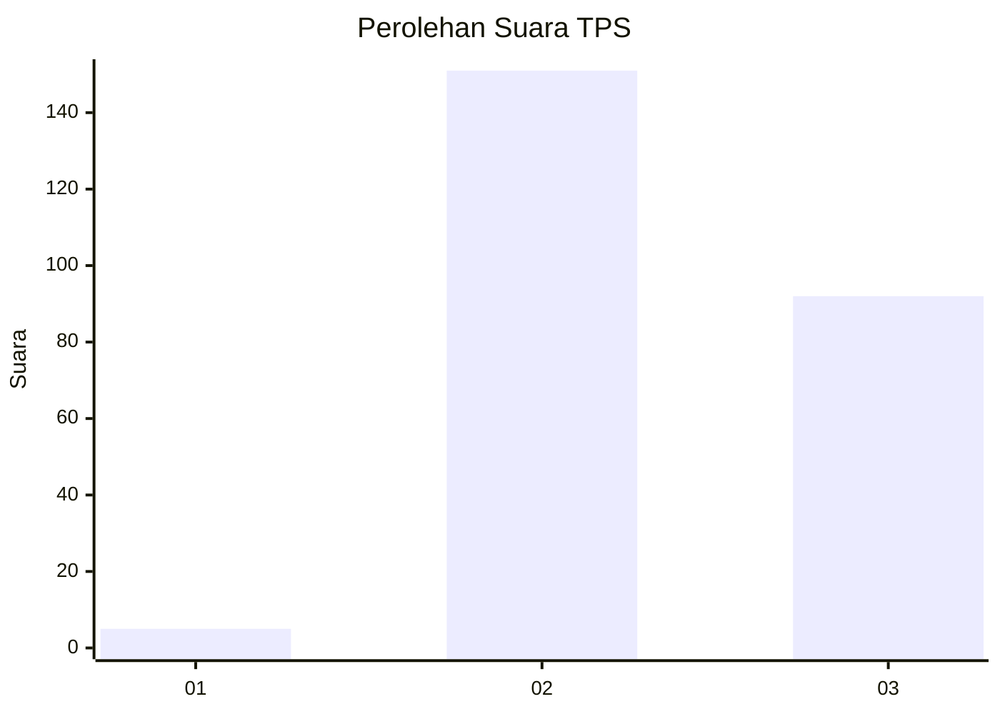
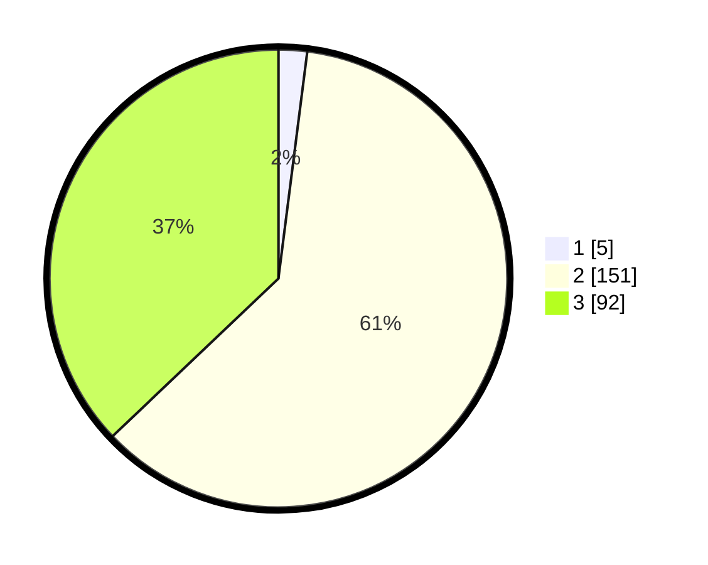

# Hasil

## Grafik

## Tabel

| No. | Nama Paslon    | Suara | Suara (raw) | Persentase |
|:--- |:-------------- | -----:| -----------:| ----------:|
| 1   | ANIES MUHAIMIN | 5     | [5][p-1]    | 2,02       |
| 2   | PRABOWO GIBRAN | 151   | [151][p-2]  | 60,89      |
| 3   | GANJAR MAHFUD  | 92    | [92][p-3]   | 37,10      |

[p-1]: https://github.com/gigit-pemilu/pemilu-2024-51-bali/blob/main/pilpres/hitung-suara/sub/51-bali/sub/03-badung/sub/05-kuta-selatan/sub/1006-jimbaran/sub/001-tps/sub/paslon-1.txt
[p-2]: https://github.com/gigit-pemilu/pemilu-2024-51-bali/blob/main/pilpres/hitung-suara/sub/51-bali/sub/03-badung/sub/05-kuta-selatan/sub/1006-jimbaran/sub/001-tps/sub/paslon-2.txt
[p-3]: https://github.com/gigit-pemilu/pemilu-2024-51-bali/blob/main/pilpres/hitung-suara/sub/51-bali/sub/03-badung/sub/05-kuta-selatan/sub/1006-jimbaran/sub/001-tps/sub/paslon-3.txt

## Foto C Plano

https://sirekap-obj-formc.kpu.go.id/3ed0/pemilu/ppwp/51/03/05/10/06/5103051006001-20240215-000954--a8e6c49b-6c4e-4fe8-a6a0-2ef53eccb4e3.jpg

https://sirekap-obj-formc.kpu.go.id/3ed0/pemilu/ppwp/51/03/05/10/06/5103051006001-20240215-001050--5c2a2c4f-c9db-40bd-b5bc-81ae85f73179.jpg

https://sirekap-obj-formc.kpu.go.id/3ed0/pemilu/ppwp/51/03/05/10/06/5103051006001-20240215-001223--26bb6361-d5e5-4acd-9436-cade7f5c9189.jpg

## Metadata

| Key        | Value               |
| ---------- | ------------------- |
| Time Stamp | 2024-02-15 17:30:25 |

## DATA PEMILIH TETAP

Jumlah pemilih dalam DPT: **293**.
 * L: **159**.
 * P: **134**.

## DATA PENGGUNA HAK PILIH

Jumlah pengguna hak pilih dalam DPT: **240**.
 * L: **132**.
 * P: **108**.

Jumlah pengguna hak pilih dalam DPTb: **7**.
 * L: **3**.
 * P: **4**.

Jumlah pengguna hak pilih dalam DPK: **5**.
 * L: **4**.
 * P: **1**.

Jumlah pengguna hak pilih: **252**.
 * L: **139**.
 * P: **113**.

## JUMLAH SUARA SAH DAN TIDAK SAH

JUMLAH SELURUH SUARA SAH: **248**.

JUMLAH SUARA TIDAK SAH: **4**.

JUMLAH SELURUH SUARA SAH DAN SUARA TIDAK SAH: **252**.

