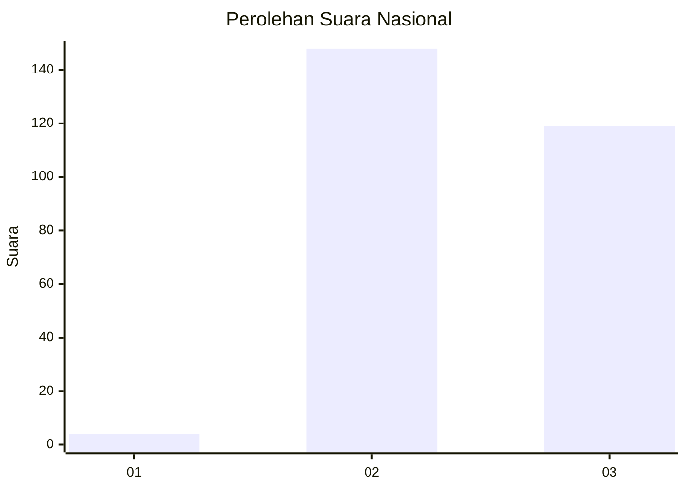
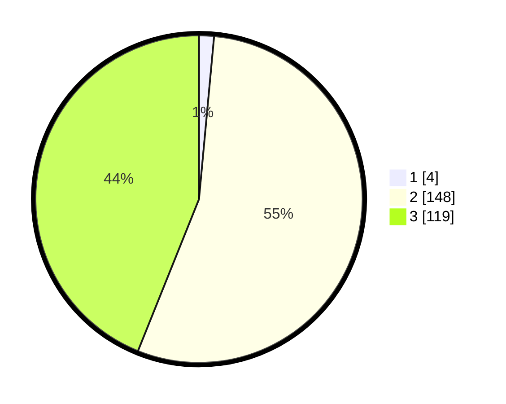

# Hasil

## Grafik

## Tabel

| No. | Nama Paslon    | Suara | Suara (raw) | Persentase |
|:--- |:-------------- | -----:| -----------:| ----------:|
| 1   | ANIES MUHAIMIN | 4     | [4][p-1]    | 1,48       |
| 2   | PRABOWO GIBRAN | 148   | [148][p-2]  | 54,61      |
| 3   | GANJAR MAHFUD  | 119   | [119][p-3]  | 43,91      |

[p-1]: https://github.com/gigit-pemilu/pemilu-2024/blob/main/pilpres/hitung-suara/sub/51-bali/sub/03-badung/sub/05-kuta-selatan/sub/1006-jimbaran/sub/002-tps/sub/paslon-1.txt
[p-2]: https://github.com/gigit-pemilu/pemilu-2024/blob/main/pilpres/hitung-suara/sub/51-bali/sub/03-badung/sub/05-kuta-selatan/sub/1006-jimbaran/sub/002-tps/sub/paslon-2.txt
[p-3]: https://github.com/gigit-pemilu/pemilu-2024/blob/main/pilpres/hitung-suara/sub/51-bali/sub/03-badung/sub/05-kuta-selatan/sub/1006-jimbaran/sub/002-tps/sub/paslon-3.txt

## Foto C Plano

https://sirekap-obj-formc.kpu.go.id/cb58/pemilu/ppwp/51/03/05/10/06/5103051006002-20240214-202857--becc2db5-f1dd-4d25-bfbd-74e43bb990d6.jpg

https://sirekap-obj-formc.kpu.go.id/cb58/pemilu/ppwp/51/03/05/10/06/5103051006002-20240214-203851--733c5b0e-6ab3-4188-835f-c8e69f9ee3e6.jpg

https://sirekap-obj-formc.kpu.go.id/cb58/pemilu/ppwp/51/03/05/10/06/5103051006002-20240214-203559--0a56b63c-d341-44d6-9add-ac52acd3b02e.jpg

## Metadata

| Key        | Value               |
| ---------- | ------------------- |
| Time Stamp | 2024-02-21 12:00:00 |

## DATA PEMILIH TETAP

Jumlah pemilih dalam DPT: **292**.
 * L: **149**.
 * P: **143**.

## DATA PENGGUNA HAK PILIH

Jumlah pengguna hak pilih dalam DPT: **251**.
 * L: **125**.
 * P: **126**.

Jumlah pengguna hak pilih dalam DPTb: **6**.
 * L: **2**.
 * P: **4**.

Jumlah pengguna hak pilih dalam DPK: **18**.
 * L: **11**.
 * P: **7**.

Jumlah pengguna hak pilih: **275**.
 * L: **138**.
 * P: **137**.

## JUMLAH SUARA SAH DAN TIDAK SAH

JUMLAH SELURUH SUARA SAH: **271**.

JUMLAH SUARA TIDAK SAH: **4**.

JUMLAH SELURUH SUARA SAH DAN SUARA TIDAK SAH: **275**.

