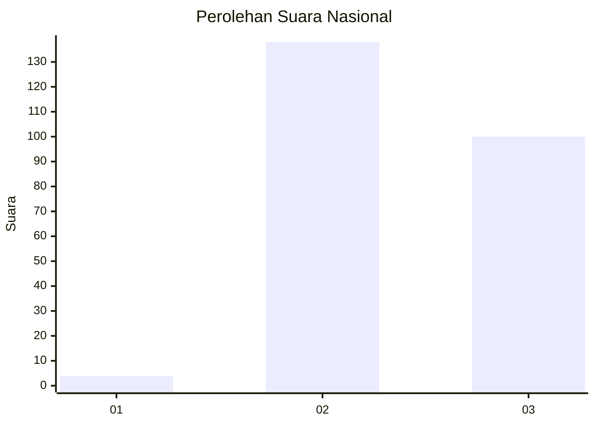
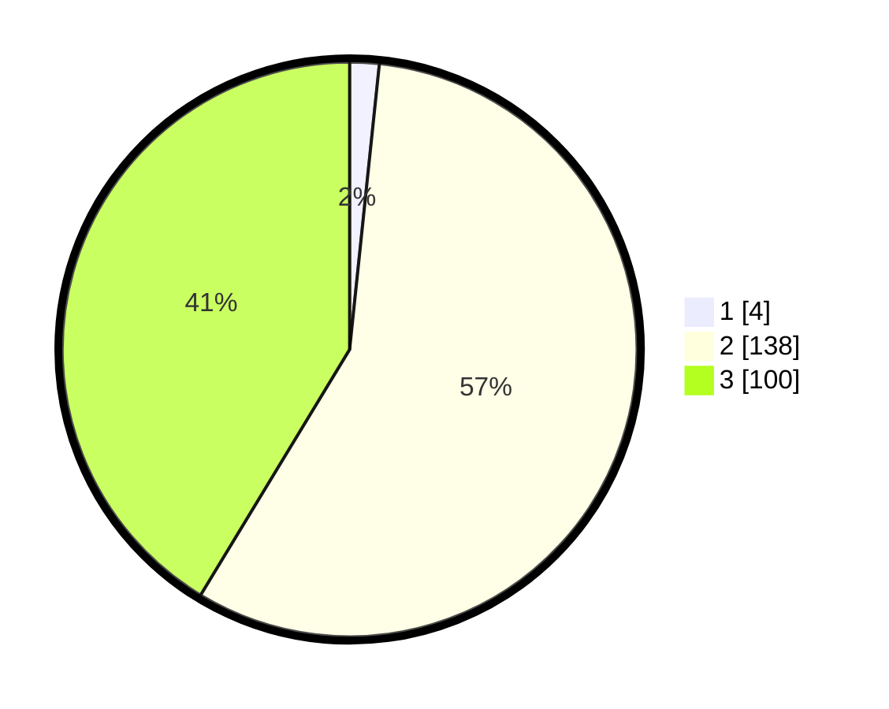

# Hasil

## Grafik

## Tabel

| No. | Nama Paslon    | Suara | Suara (raw) | Persentase |
|:--- |:-------------- | -----:| -----------:| ----------:|
| 1   | ANIES MUHAIMIN | 4     | [4][p-1]    | 1,65       |
| 2   | PRABOWO GIBRAN | 138   | [138][p-2]  | 57,02      |
| 3   | GANJAR MAHFUD  | 100   | [100][p-3]  | 41,32      |

[p-1]: https://github.com/gigit-pemilu/pemilu-2024/blob/main/pilpres/hitung-suara/sub/51-bali/sub/03-badung/sub/05-kuta-selatan/sub/1006-jimbaran/sub/009-tps/sub/paslon-1.txt
[p-2]: https://github.com/gigit-pemilu/pemilu-2024/blob/main/pilpres/hitung-suara/sub/51-bali/sub/03-badung/sub/05-kuta-selatan/sub/1006-jimbaran/sub/009-tps/sub/paslon-2.txt
[p-3]: https://github.com/gigit-pemilu/pemilu-2024/blob/main/pilpres/hitung-suara/sub/51-bali/sub/03-badung/sub/05-kuta-selatan/sub/1006-jimbaran/sub/009-tps/sub/paslon-3.txt

## Foto C Plano

https://sirekap-obj-formc.kpu.go.id/34ef/pemilu/ppwp/51/03/05/10/06/5103051006009-20240215-111039--a24740b5-f03d-479a-9192-db1dba6fa6e6.jpg

https://sirekap-obj-formc.kpu.go.id/34ef/pemilu/ppwp/51/03/05/10/06/5103051006009-20240214-201100--9d2dbe0b-2347-465e-a6ea-8646872b0be5.jpg

https://sirekap-obj-formc.kpu.go.id/34ef/pemilu/ppwp/51/03/05/10/06/5103051006009-20240214-201407--eec654e0-edcd-49a0-ba52-09606ec49155.jpg

## Metadata

| Key        | Value               |
| ---------- | ------------------- |
| Time Stamp | 2024-02-15 15:00:29 |

