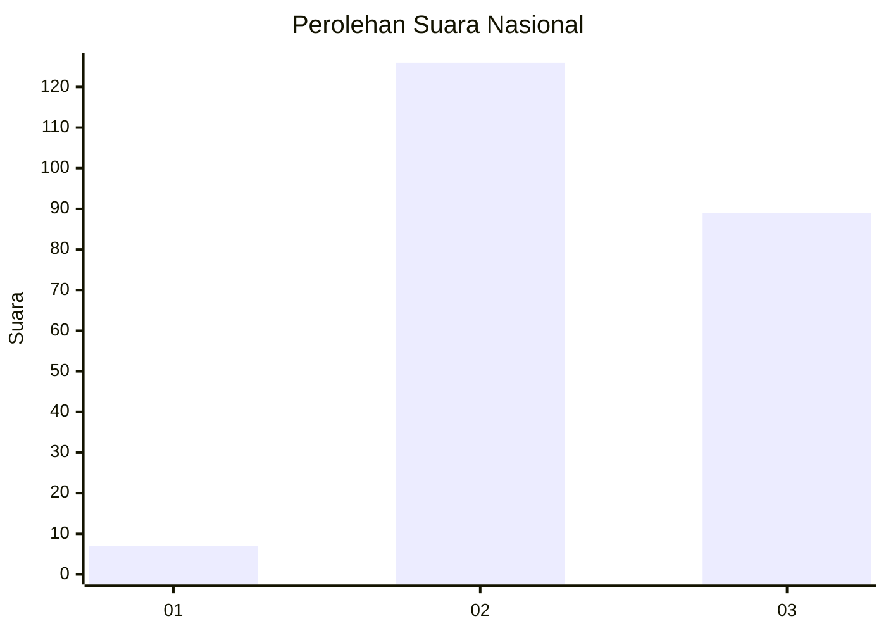
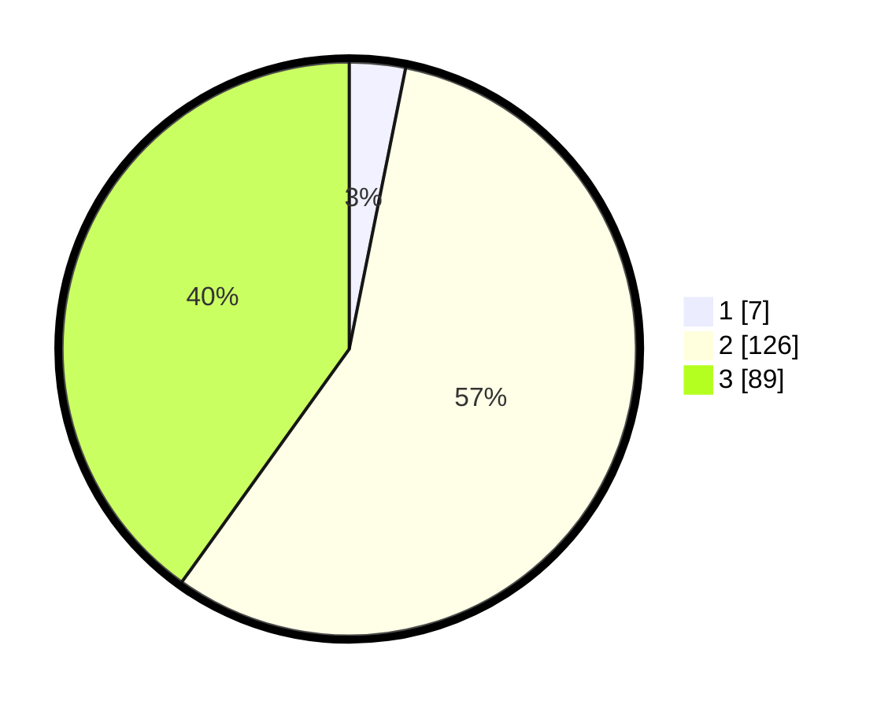

# Hasil

## Grafik

## Tabel

| No. | Nama Paslon    | Suara | Suara (raw) | Persentase |
|:--- |:-------------- | -----:| -----------:| ----------:|
| 1   | ANIES MUHAIMIN | 7     | [7][p-1]    | 3,15       |
| 2   | PRABOWO GIBRAN | 126   | [126][p-2]  | 56,76      |
| 3   | GANJAR MAHFUD  | 89    | [89][p-3]   | 40,09      |

[p-1]: https://github.com/gigit-pemilu/pemilu-2024/blob/main/pilpres/hitung-suara/sub/51-bali/sub/03-badung/sub/05-kuta-selatan/sub/1006-jimbaran/sub/010-tps/sub/paslon-1.txt
[p-2]: https://github.com/gigit-pemilu/pemilu-2024/blob/main/pilpres/hitung-suara/sub/51-bali/sub/03-badung/sub/05-kuta-selatan/sub/1006-jimbaran/sub/010-tps/sub/paslon-2.txt
[p-3]: https://github.com/gigit-pemilu/pemilu-2024/blob/main/pilpres/hitung-suara/sub/51-bali/sub/03-badung/sub/05-kuta-selatan/sub/1006-jimbaran/sub/010-tps/sub/paslon-3.txt

## Foto C Plano

https://sirekap-obj-formc.kpu.go.id/944a/pemilu/ppwp/51/03/05/10/06/5103051006010-20240214-191338--03233218-e06e-4e85-b748-032ab32faefc.jpg

https://sirekap-obj-formc.kpu.go.id/944a/pemilu/ppwp/51/03/05/10/06/5103051006010-20240214-192121--de8c5ac4-6c56-47a7-a23c-92783f555c2d.jpg

https://sirekap-obj-formc.kpu.go.id/944a/pemilu/ppwp/51/03/05/10/06/5103051006010-20240214-192631--3d237a6c-0def-49be-92d5-c6ae45106946.jpg

## Metadata

| Key        | Value               |
| ---------- | ------------------- |
| Time Stamp | 2024-02-24 22:31:28 |

