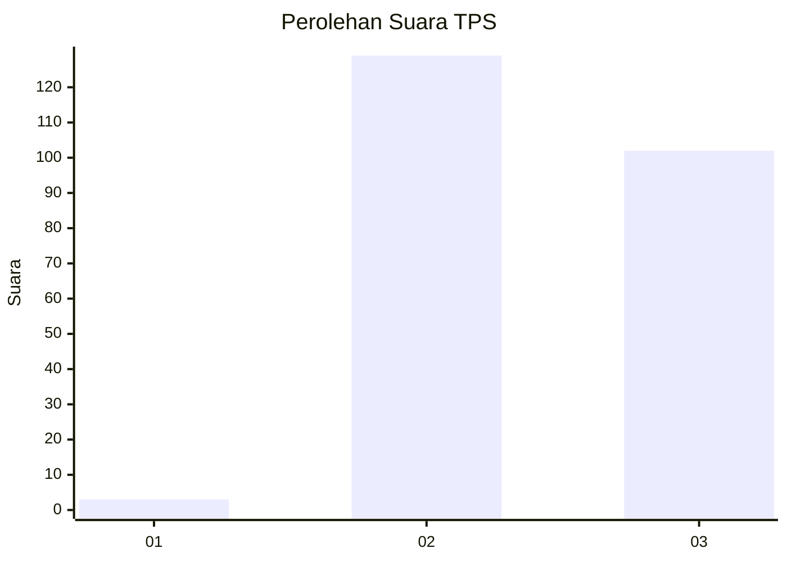
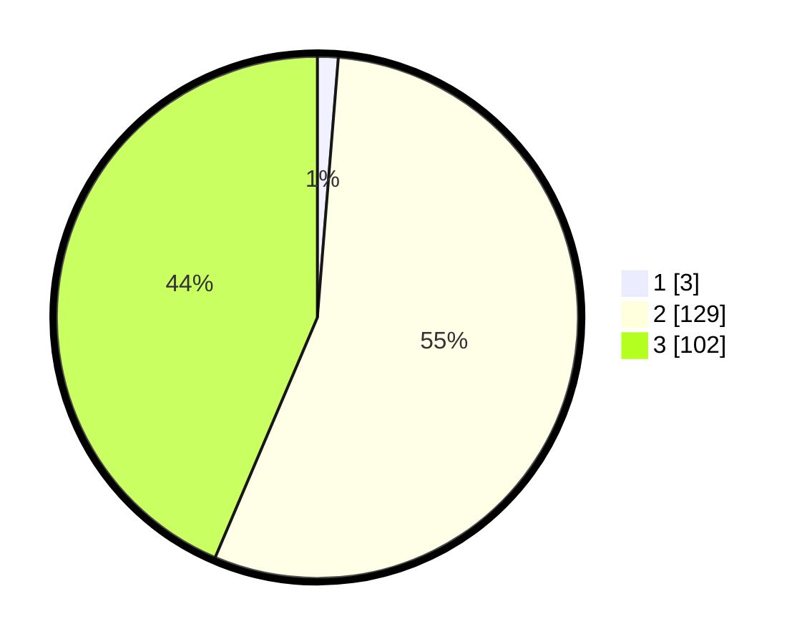

# Hasil

## Grafik

## Tabel

| No. | Nama Paslon    | Suara | Suara (raw) | Persentase |
|:--- |:-------------- | -----:| -----------:| ----------:|
| 1   | ANIES MUHAIMIN | 3     | [3][p-1]    | 1,28       |
| 2   | PRABOWO GIBRAN | 129   | [129][p-2]  | 55,13      |
| 3   | GANJAR MAHFUD  | 102   | [102][p-3]  | 43,59      |

[p-1]: https://github.com/gigit-pemilu/pemilu-2024-51-bali/blob/main/pilpres/hitung-suara/sub/51-bali/sub/03-badung/sub/05-kuta-selatan/sub/1006-jimbaran/sub/012-tps/sub/paslon-1.txt
[p-2]: https://github.com/gigit-pemilu/pemilu-2024-51-bali/blob/main/pilpres/hitung-suara/sub/51-bali/sub/03-badung/sub/05-kuta-selatan/sub/1006-jimbaran/sub/012-tps/sub/paslon-2.txt
[p-3]: https://github.com/gigit-pemilu/pemilu-2024-51-bali/blob/main/pilpres/hitung-suara/sub/51-bali/sub/03-badung/sub/05-kuta-selatan/sub/1006-jimbaran/sub/012-tps/sub/paslon-3.txt

## Foto C Plano

https://sirekap-obj-formc.kpu.go.id/46b9/pemilu/ppwp/51/03/05/10/06/5103051006012-20240214-235332--3309ac00-0ce2-42c7-b425-3f9456e24062.jpg

https://sirekap-obj-formc.kpu.go.id/46b9/pemilu/ppwp/51/03/05/10/06/5103051006012-20240214-235628--d1a6ddf9-d274-48e5-90d1-b91b16cdcbaf.jpg

https://sirekap-obj-formc.kpu.go.id/46b9/pemilu/ppwp/51/03/05/10/06/5103051006012-20240214-235725--c40b95ab-1387-4085-9f1c-6d3bbc27281b.jpg

## Metadata

| Key        | Value               |
| ---------- | ------------------- |
| Time Stamp | 2024-02-24 22:31:28 |

