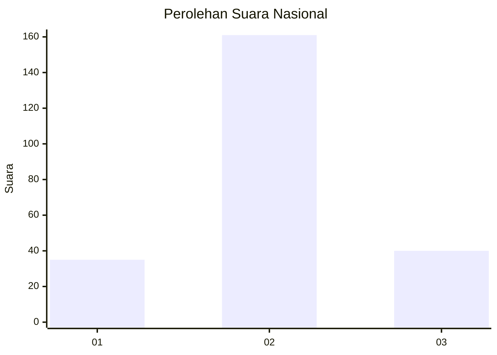
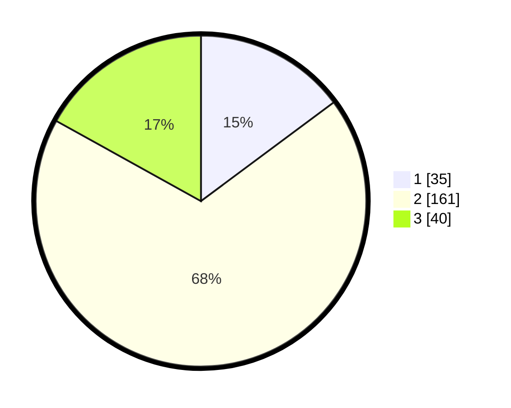

# Hasil

## Grafik

## Tabel

| No. | Nama Paslon    | Suara | Suara (raw) | Persentase |
|:--- |:-------------- | -----:| -----------:| ----------:|
| 1   | ANIES MUHAIMIN | 35    | [35][p-1]   | 14,83      |
| 2   | PRABOWO GIBRAN | 161   | [161][p-2]  | 68,22      |
| 3   | GANJAR MAHFUD  | 40    | [40][p-3]   | 16,95      |

[p-1]: https://github.com/gigit-pemilu/pemilu-2024/blob/main/pilpres/hitung-suara/sub/51-bali/sub/03-badung/sub/05-kuta-selatan/sub/1006-jimbaran/sub/016-tps/sub/paslon-1.txt
[p-2]: https://github.com/gigit-pemilu/pemilu-2024/blob/main/pilpres/hitung-suara/sub/51-bali/sub/03-badung/sub/05-kuta-selatan/sub/1006-jimbaran/sub/016-tps/sub/paslon-2.txt
[p-3]: https://github.com/gigit-pemilu/pemilu-2024/blob/main/pilpres/hitung-suara/sub/51-bali/sub/03-badung/sub/05-kuta-selatan/sub/1006-jimbaran/sub/016-tps/sub/paslon-3.txt

## Foto C Plano

https://sirekap-obj-formc.kpu.go.id/47b3/pemilu/ppwp/51/03/05/10/06/5103051006016-20240214-141537--a2808ae5-0b74-4e11-bf5f-ce47cd523622.jpg

https://sirekap-obj-formc.kpu.go.id/47b3/pemilu/ppwp/51/03/05/10/06/5103051006016-20240214-141618--c31b9b3b-8e26-4f18-93d4-80755f2b4deb.jpg

https://sirekap-obj-formc.kpu.go.id/47b3/pemilu/ppwp/51/03/05/10/06/5103051006016-20240214-204422--a9576ee7-57cd-42b5-93bc-cdb7bbfaae3c.jpg

## Metadata

| Key        | Value               |
| ---------- | ------------------- |
| Time Stamp | 2024-02-24 22:31:28 |

