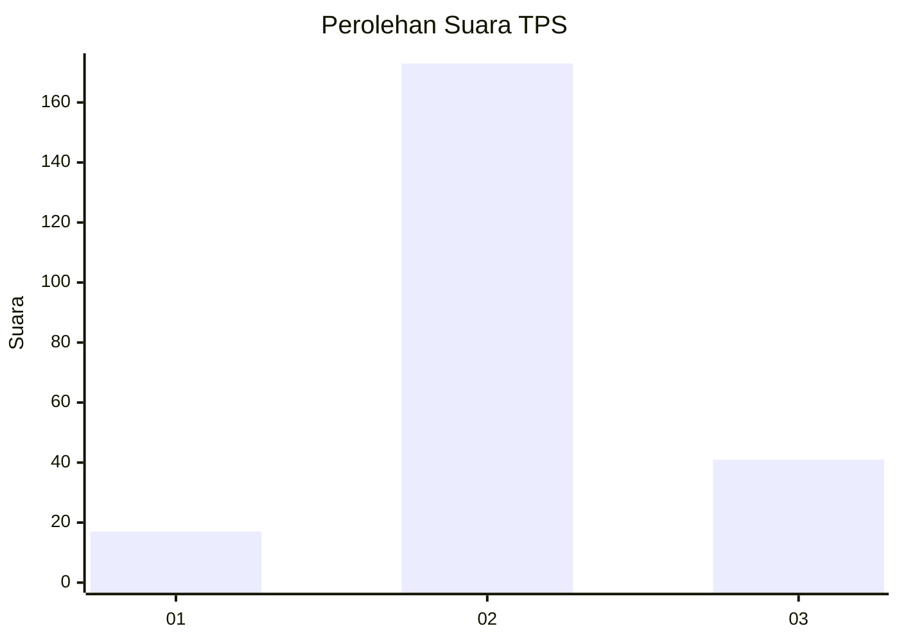

# Hasil

## Grafik

## Tabel

| No. | Nama Paslon    | Suara | Suara (raw) | Persentase |
|:--- |:-------------- | -----:| -----------:| ----------:|
| 1   | ANIES MUHAIMIN | 17    | [17][p-1]   | 7,36       |
| 2   | PRABOWO GIBRAN | 173   | [173][p-2]  | 74,89      |
| 3   | GANJAR MAHFUD  | 41    | [41][p-3]   | 17,75      |

[p-1]: https://github.com/gigit-pemilu/pemilu-2024-51-bali/blob/main/pilpres/hitung-suara/sub/51-bali/sub/03-badung/sub/05-kuta-selatan/sub/1006-jimbaran/sub/024-tps/sub/paslon-1.txt
[p-2]: https://github.com/gigit-pemilu/pemilu-2024-51-bali/blob/main/pilpres/hitung-suara/sub/51-bali/sub/03-badung/sub/05-kuta-selatan/sub/1006-jimbaran/sub/024-tps/sub/paslon-2.txt
[p-3]: https://github.com/gigit-pemilu/pemilu-2024-51-bali/blob/main/pilpres/hitung-suara/sub/51-bali/sub/03-badung/sub/05-kuta-selatan/sub/1006-jimbaran/sub/024-tps/sub/paslon-3.txt

## Foto C Plano

https://sirekap-obj-formc.kpu.go.id/2c8b/pemilu/ppwp/51/03/05/10/06/5103051006024-20240214-141122--bb8af8d6-636e-427d-b962-a5a684a2b400.jpg

https://sirekap-obj-formc.kpu.go.id/2c8b/pemilu/ppwp/51/03/05/10/06/5103051006024-20240214-141317--b7170615-3d27-4851-a94d-30bc9d17e6ff.jpg

https://sirekap-obj-formc.kpu.go.id/2c8b/pemilu/ppwp/51/03/05/10/06/5103051006024-20240214-141356--6dfe4583-a84a-4cdd-b7b2-3a5817605a9e.jpg

## Metadata

| Key        | Value               |
| ---------- | ------------------- |
| Time Stamp | 2024-02-24 22:31:28 |

## DATA PEMILIH TETAP

Jumlah pemilih dalam DPT: **289**.
 * L: **145**.
 * P: **144**.

## DATA PENGGUNA HAK PILIH

Jumlah pengguna hak pilih dalam DPT: **223**.
 * L: **108**.
 * P: **115**.

Jumlah pengguna hak pilih dalam DPTb: **4**.
 * L: **2**.
 * P: **2**.

Jumlah pengguna hak pilih dalam DPK: **6**.
 * L: **2**.
 * P: **4**.

Jumlah pengguna hak pilih: **233**.
 * L: **112**.
 * P: **121**.

## JUMLAH SUARA SAH DAN TIDAK SAH

JUMLAH SELURUH SUARA SAH: **231**.

JUMLAH SUARA TIDAK SAH: **2**.

JUMLAH SELURUH SUARA SAH DAN SUARA TIDAK SAH: **233**.

