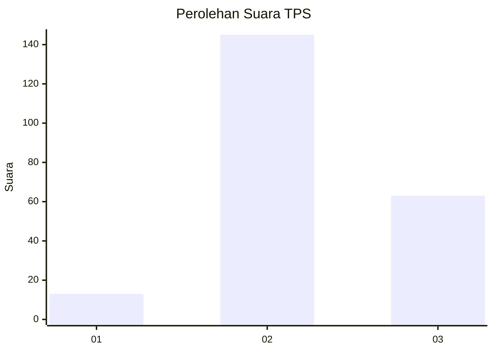
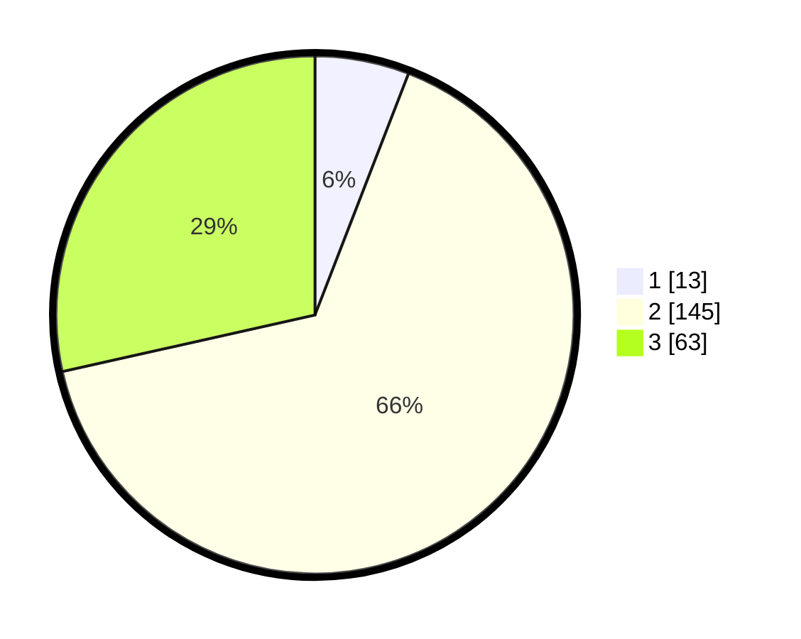

# Hasil

## Grafik

## Tabel

| No. | Nama Paslon    | Suara | Suara (raw) | Persentase |
|:--- |:-------------- | -----:| -----------:| ----------:|
| 1   | ANIES MUHAIMIN | 13    | [13][p-1]   | 5,88       |
| 2   | PRABOWO GIBRAN | 145   | [145][p-2]  | 65,61      |
| 3   | GANJAR MAHFUD  | 63    | [63][p-3]   | 28,51      |

[p-1]: https://github.com/gigit-pemilu/pemilu-2024-51-bali/blob/main/pilpres/hitung-suara/sub/51-bali/sub/03-badung/sub/05-kuta-selatan/sub/1006-jimbaran/sub/029-tps/sub/paslon-1.txt
[p-2]: https://github.com/gigit-pemilu/pemilu-2024-51-bali/blob/main/pilpres/hitung-suara/sub/51-bali/sub/03-badung/sub/05-kuta-selatan/sub/1006-jimbaran/sub/029-tps/sub/paslon-2.txt
[p-3]: https://github.com/gigit-pemilu/pemilu-2024-51-bali/blob/main/pilpres/hitung-suara/sub/51-bali/sub/03-badung/sub/05-kuta-selatan/sub/1006-jimbaran/sub/029-tps/sub/paslon-3.txt

## Foto C Plano

https://sirekap-obj-formc.kpu.go.id/64e4/pemilu/ppwp/51/03/05/10/06/5103051006029-20240214-212938--f5a4aac4-446a-430d-8234-a20138bfde19.jpg

https://sirekap-obj-formc.kpu.go.id/64e4/pemilu/ppwp/51/03/05/10/06/5103051006029-20240214-195209--9f22e495-9690-41e5-8ee9-7e235649018c.jpg

https://sirekap-obj-formc.kpu.go.id/64e4/pemilu/ppwp/51/03/05/10/06/5103051006029-20240214-195219--8bfbe3f5-b094-4d89-b121-ddc8cd556561.jpg

## Metadata

| Key        | Value               |
| ---------- | ------------------- |
| Time Stamp | 2024-02-25 14:00:00 |

