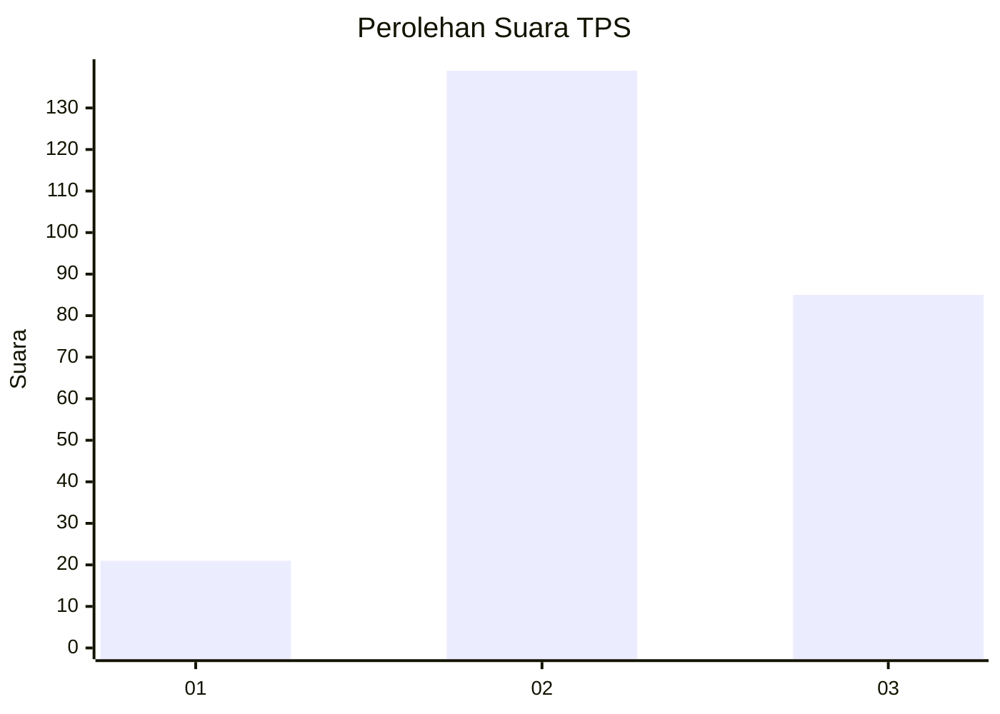
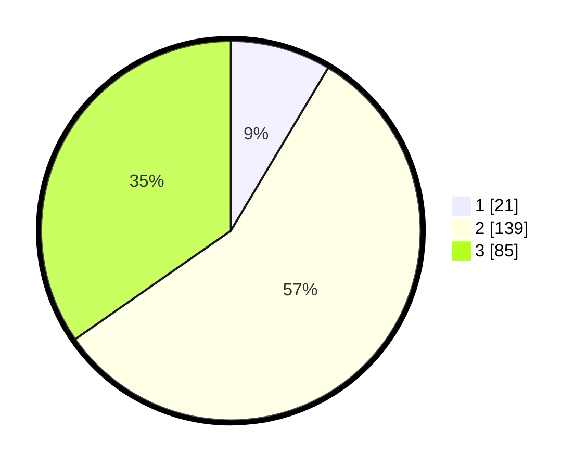

# Hasil

## Grafik

## Tabel

| No. | Nama Paslon    | Suara | Suara (raw) | Persentase |
|:--- |:-------------- | -----:| -----------:| ----------:|
| 1   | ANIES MUHAIMIN | 21    | [21][p-1]   | 8,57       |
| 2   | PRABOWO GIBRAN | 139   | [139][p-2]  | 56,73      |
| 3   | GANJAR MAHFUD  | 85    | [85][p-3]   | 34,69      |

[p-1]: https://github.com/gigit-pemilu/pemilu-2024-51-bali/blob/main/pilpres/hitung-suara/sub/51-bali/sub/03-badung/sub/05-kuta-selatan/sub/1006-jimbaran/sub/042-tps/sub/paslon-1.txt
[p-2]: https://github.com/gigit-pemilu/pemilu-2024-51-bali/blob/main/pilpres/hitung-suara/sub/51-bali/sub/03-badung/sub/05-kuta-selatan/sub/1006-jimbaran/sub/042-tps/sub/paslon-2.txt
[p-3]: https://github.com/gigit-pemilu/pemilu-2024-51-bali/blob/main/pilpres/hitung-suara/sub/51-bali/sub/03-badung/sub/05-kuta-selatan/sub/1006-jimbaran/sub/042-tps/sub/paslon-3.txt

## Foto C Plano

https://sirekap-obj-formc.kpu.go.id/5ab7/pemilu/ppwp/51/03/05/10/06/5103051006042-20240214-205226--3446cada-ddcc-4cb8-980f-abad2dd39115.jpg

https://sirekap-obj-formc.kpu.go.id/5ab7/pemilu/ppwp/51/03/05/10/06/5103051006042-20240214-205229--88f73de3-8d5f-4b99-a451-cd8d5703498a.jpg

## Metadata

| Key        | Value               |
| ---------- | ------------------- |
| Time Stamp | 2024-02-25 12:00:00 |

