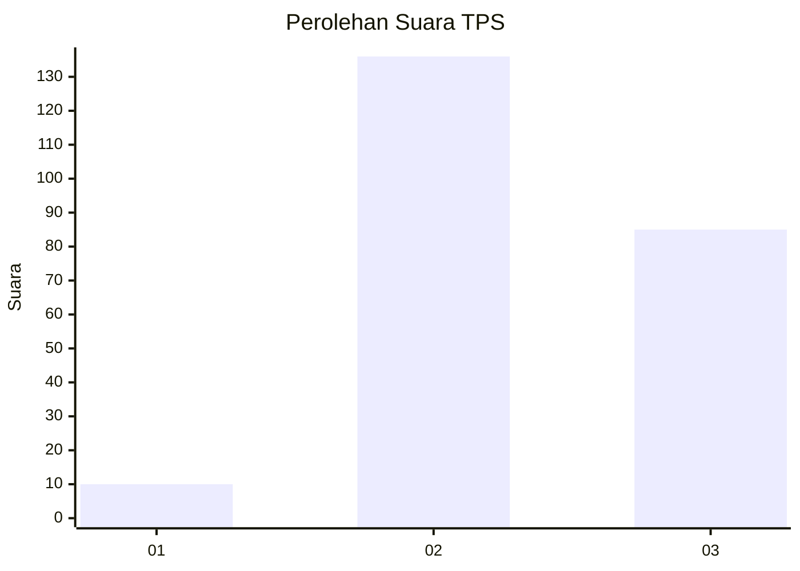
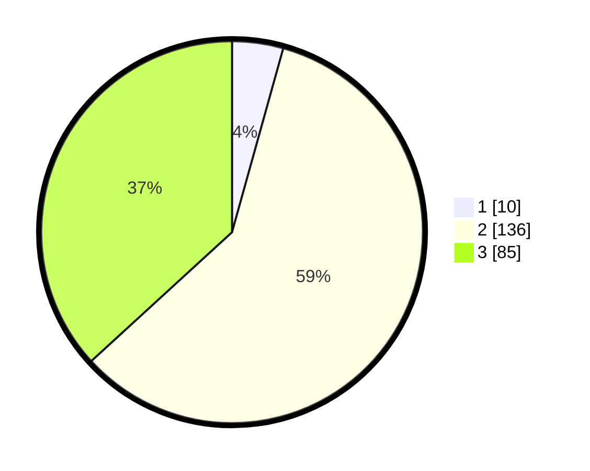

# Hasil

## Grafik

## Tabel

| No. | Nama Paslon    | Suara | Suara (raw) | Persentase |
|:--- |:-------------- | -----:| -----------:| ----------:|
| 1   | ANIES MUHAIMIN | 10    | [10][p-1]   | 4,33       |
| 2   | PRABOWO GIBRAN | 136   | [136][p-2]  | 58,87      |
| 3   | GANJAR MAHFUD  | 85    | [85][p-3]   | 36,80      |

[p-1]: https://github.com/gigit-pemilu/pemilu-2024-51-bali/blob/main/pilpres/hitung-suara/sub/51-bali/sub/03-badung/sub/05-kuta-selatan/sub/1006-jimbaran/sub/056-tps/sub/paslon-1.txt
[p-2]: https://github.com/gigit-pemilu/pemilu-2024-51-bali/blob/main/pilpres/hitung-suara/sub/51-bali/sub/03-badung/sub/05-kuta-selatan/sub/1006-jimbaran/sub/056-tps/sub/paslon-2.txt
[p-3]: https://github.com/gigit-pemilu/pemilu-2024-51-bali/blob/main/pilpres/hitung-suara/sub/51-bali/sub/03-badung/sub/05-kuta-selatan/sub/1006-jimbaran/sub/056-tps/sub/paslon-3.txt

## Foto C Plano

https://sirekap-obj-formc.kpu.go.id/6d3c/pemilu/ppwp/51/03/05/10/06/5103051006056-20240214-224859--5b63f9d6-03b3-48a3-99d4-73067baa235f.jpg

https://sirekap-obj-formc.kpu.go.id/6d3c/pemilu/ppwp/51/03/05/10/06/5103051006056-20240214-225043--39e9732e-4078-465b-8f05-e513ffd24ee7.jpg

https://sirekap-obj-formc.kpu.go.id/6d3c/pemilu/ppwp/51/03/05/10/06/5103051006056-20240214-225239--a769cb4c-f397-4b9f-81f0-7a7a5c336b0b.jpg

## Metadata

| Key        | Value               |
| ---------- | ------------------- |
| Time Stamp | 2024-02-24 22:31:28 |

