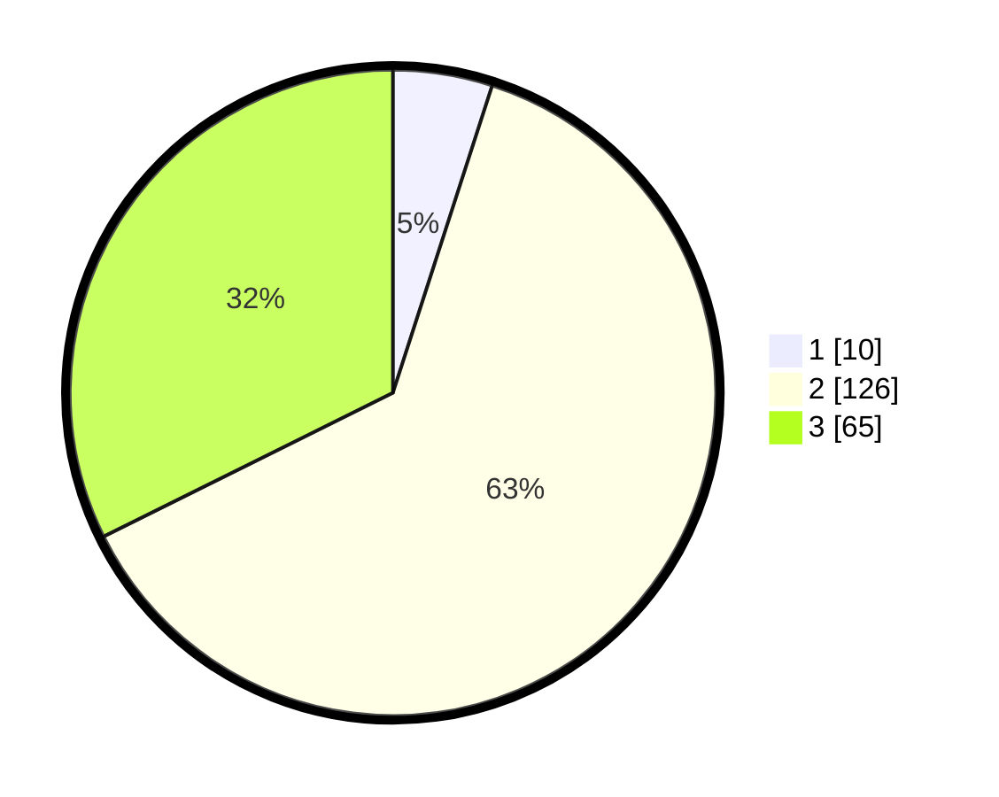

# Hasil

## Grafik

## Tabel

| No. | Nama Paslon    | Suara | Suara (raw) | Persentase |
|:--- |:-------------- | -----:| -----------:| ----------:|
| 1   | ANIES MUHAIMIN | 10    | [10][p-1]   | 4,98       |
| 2   | PRABOWO GIBRAN | 126   | [126][p-2]  | 62,69      |
| 3   | GANJAR MAHFUD  | 65    | [65][p-3]   | 32,34      |

[p-1]: https://github.com/gigit-pemilu/pemilu-2024-51-bali/blob/main/pilpres/hitung-suara/sub/51-bali/sub/03-badung/sub/05-kuta-selatan/sub/1006-jimbaran/sub/057-tps/sub/paslon-1.txt
[p-2]: https://github.com/gigit-pemilu/pemilu-2024-51-bali/blob/main/pilpres/hitung-suara/sub/51-bali/sub/03-badung/sub/05-kuta-selatan/sub/1006-jimbaran/sub/057-tps/sub/paslon-2.txt
[p-3]: https://github.com/gigit-pemilu/pemilu-2024-51-bali/blob/main/pilpres/hitung-suara/sub/51-bali/sub/03-badung/sub/05-kuta-selatan/sub/1006-jimbaran/sub/057-tps/sub/paslon-3.txt

## Foto C Plano

https://sirekap-obj-formc.kpu.go.id/7ebe/pemilu/ppwp/51/03/05/10/06/5103051006057-20240214-221329--5c33ee66-7aca-4db4-b83e-4f465652108d.jpg

https://sirekap-obj-formc.kpu.go.id/7ebe/pemilu/ppwp/51/03/05/10/06/5103051006057-20240214-221521--8bb93f6a-ac73-4f64-8f7f-f85a01ade934.jpg

https://sirekap-obj-formc.kpu.go.id/7ebe/pemilu/ppwp/51/03/05/10/06/5103051006057-20240214-221650--ac3fb85f-522f-45e9-979c-ad9a05b47e1a.jpg

## Metadata

| Key        | Value               |
| ---------- | ------------------- |
| Time Stamp | 2024-02-24 22:31:28 |

