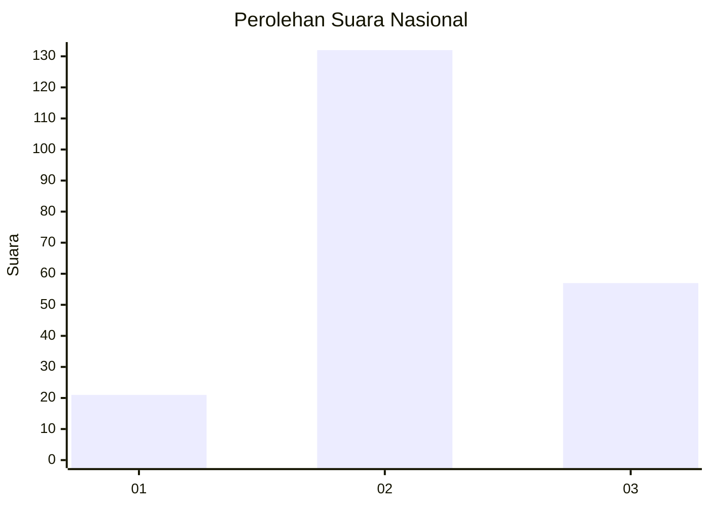
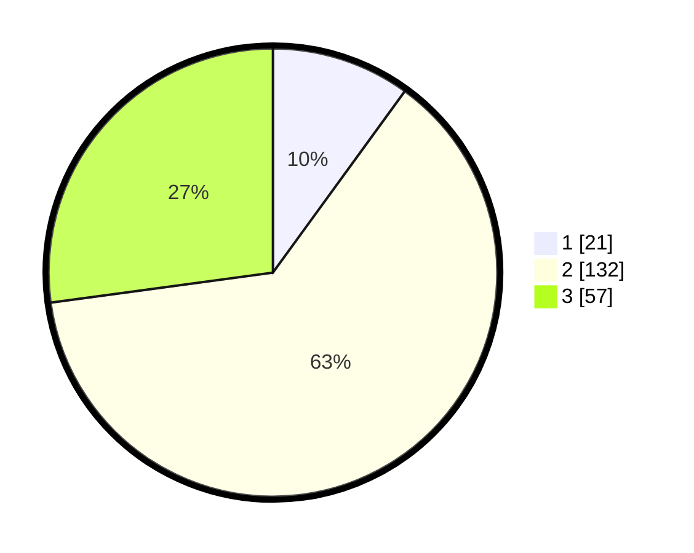

# Hasil

## Grafik

## Tabel

| No. | Nama Paslon    | Suara | Suara (raw) | Persentase |
|:--- |:-------------- | -----:| -----------:| ----------:|
| 1   | ANIES MUHAIMIN | 21    | [21][p-1]   | 10,00      |
| 2   | PRABOWO GIBRAN | 132   | [132][p-2]  | 62,86      |
| 3   | GANJAR MAHFUD  | 57    | [57][p-3]   | 27,14      |

[p-1]: https://github.com/gigit-pemilu/pemilu-2024/blob/main/pilpres/hitung-suara/sub/51-bali/sub/03-badung/sub/05-kuta-selatan/sub/1006-jimbaran/sub/058-tps/sub/paslon-1.txt
[p-2]: https://github.com/gigit-pemilu/pemilu-2024/blob/main/pilpres/hitung-suara/sub/51-bali/sub/03-badung/sub/05-kuta-selatan/sub/1006-jimbaran/sub/058-tps/sub/paslon-2.txt
[p-3]: https://github.com/gigit-pemilu/pemilu-2024/blob/main/pilpres/hitung-suara/sub/51-bali/sub/03-badung/sub/05-kuta-selatan/sub/1006-jimbaran/sub/058-tps/sub/paslon-3.txt

## Foto C Plano

https://sirekap-obj-formc.kpu.go.id/69dd/pemilu/ppwp/51/03/05/10/06/5103051006058-20240221-184908--5a6832bf-9c35-484b-b555-7bd06d88164f.jpg

https://sirekap-obj-formc.kpu.go.id/69dd/pemilu/ppwp/51/03/05/10/06/5103051006058-20240214-223649--e547dfd3-aa6a-40d8-b8bd-94c94f73e44d.jpg

https://sirekap-obj-formc.kpu.go.id/69dd/pemilu/ppwp/51/03/05/10/06/5103051006058-20240214-223653--89a3f73b-a55a-4a47-a256-9add2047a323.jpg

## Metadata

| Key        | Value               |
| ---------- | ------------------- |
| Time Stamp | 2024-02-21 19:00:00 |

