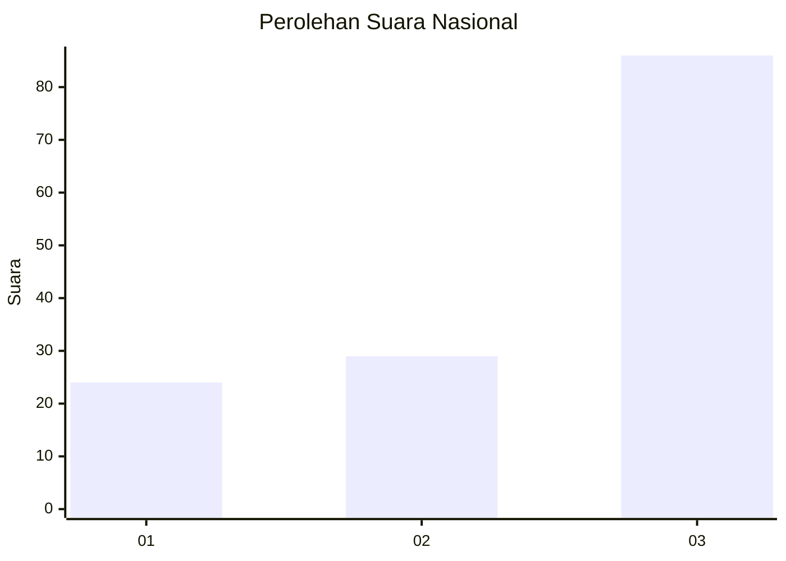
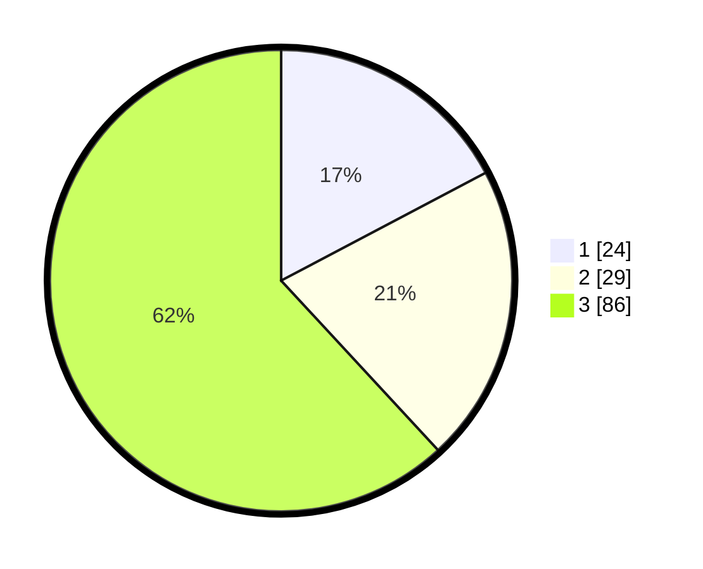

# Hasil

## Grafik

## Tabel

| No. | Nama Paslon    | Suara | Suara (raw) | Persentase |
|:--- |:-------------- | -----:| -----------:| ----------:|
| 1   | ANIES MUHAIMIN | 24    | [24][p-1]   | 17,27      |
| 2   | PRABOWO GIBRAN | 29    | [29][p-2]   | 20,86      |
| 3   | GANJAR MAHFUD  | 86    | [86][p-3]   | 61,87      |

[p-1]: https://github.com/gigit-pemilu/pemilu-2024/blob/main/pilpres/hitung-suara/sub/51-bali/sub/03-badung/sub/05-kuta-selatan/sub/1006-jimbaran/sub/060-tps/sub/paslon-1.txt
[p-2]: https://github.com/gigit-pemilu/pemilu-2024/blob/main/pilpres/hitung-suara/sub/51-bali/sub/03-badung/sub/05-kuta-selatan/sub/1006-jimbaran/sub/060-tps/sub/paslon-2.txt
[p-3]: https://github.com/gigit-pemilu/pemilu-2024/blob/main/pilpres/hitung-suara/sub/51-bali/sub/03-badung/sub/05-kuta-selatan/sub/1006-jimbaran/sub/060-tps/sub/paslon-3.txt

## Foto C Plano

https://sirekap-obj-formc.kpu.go.id/d58a/pemilu/ppwp/51/03/05/10/06/5103051006060-20240214-213631--17873220-c604-43f3-865b-fb91053ae20b.jpg

https://sirekap-obj-formc.kpu.go.id/d58a/pemilu/ppwp/51/03/05/10/06/5103051006060-20240214-213637--dbdb391e-b302-4b80-a3e2-1d3301d7ecf3.jpg

https://sirekap-obj-formc.kpu.go.id/d58a/pemilu/ppwp/51/03/05/10/06/5103051006060-20240214-213641--d7832ff5-8344-42c2-9ba8-8dcbbd0d7138.jpg

## Metadata

| Key        | Value               |
| ---------- | ------------------- |
| Time Stamp | 2024-02-24 22:31:28 |

