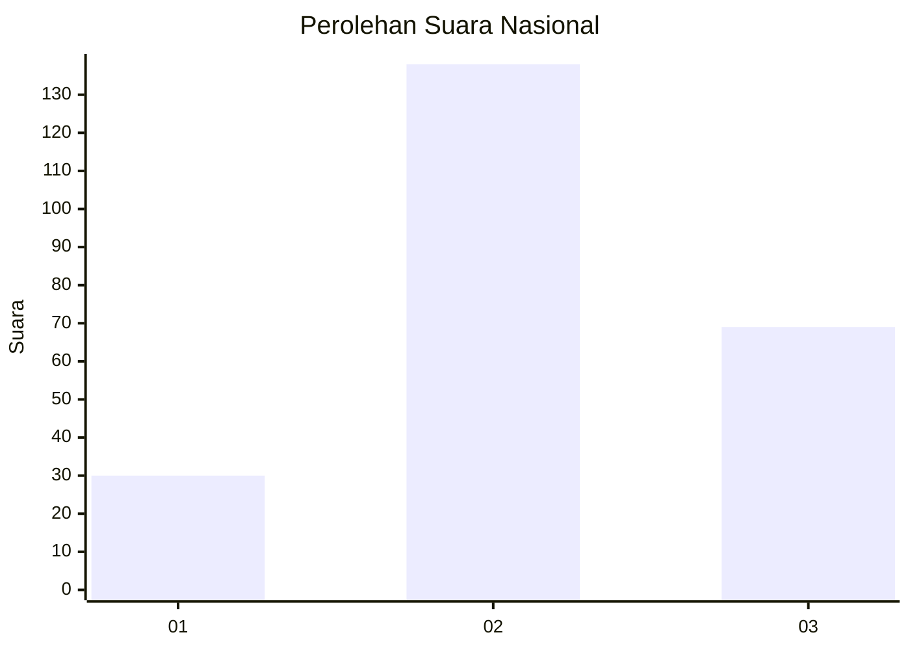
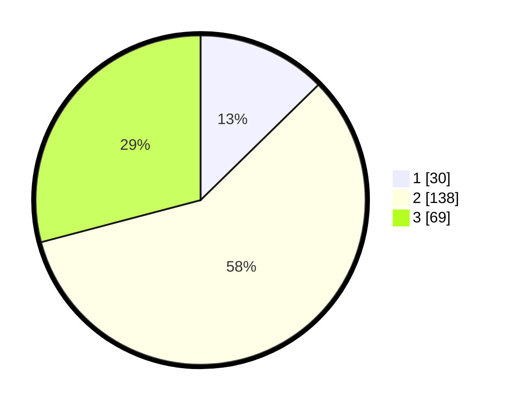

# Hasil

## Grafik

## Tabel

| No. | Nama Paslon    | Suara | Suara (raw) | Persentase |
|:--- |:-------------- | -----:| -----------:| ----------:|
| 1   | ANIES MUHAIMIN | 30    | [30][p-1]   | 12,66      |
| 2   | PRABOWO GIBRAN | 138   | [138][p-2]  | 58,23      |
| 3   | GANJAR MAHFUD  | 69    | [69][p-3]   | 29,11      |

[p-1]: https://github.com/gigit-pemilu/pemilu-2024/blob/main/pilpres/hitung-suara/sub/51-bali/sub/03-badung/sub/05-kuta-selatan/sub/1006-jimbaran/sub/062-tps/sub/paslon-1.txt
[p-2]: https://github.com/gigit-pemilu/pemilu-2024/blob/main/pilpres/hitung-suara/sub/51-bali/sub/03-badung/sub/05-kuta-selatan/sub/1006-jimbaran/sub/062-tps/sub/paslon-2.txt
[p-3]: https://github.com/gigit-pemilu/pemilu-2024/blob/main/pilpres/hitung-suara/sub/51-bali/sub/03-badung/sub/05-kuta-selatan/sub/1006-jimbaran/sub/062-tps/sub/paslon-3.txt

## Foto C Plano

https://sirekap-obj-formc.kpu.go.id/e859/pemilu/ppwp/51/03/05/10/06/5103051006062-20240214-221702--0f8ac445-802b-488e-84f1-a1f2cb4b69de.jpg

https://sirekap-obj-formc.kpu.go.id/e859/pemilu/ppwp/51/03/05/10/06/5103051006062-20240214-221828--4b86c226-e2d2-4214-9176-811a70d7ad1f.jpg

https://sirekap-obj-formc.kpu.go.id/e859/pemilu/ppwp/51/03/05/10/06/5103051006062-20240214-221814--51d80722-16e3-455f-ab8b-d1db99c24cf4.jpg

## Metadata

| Key        | Value               |
| ---------- | ------------------- |
| Time Stamp | 2024-02-24 22:31:28 |

