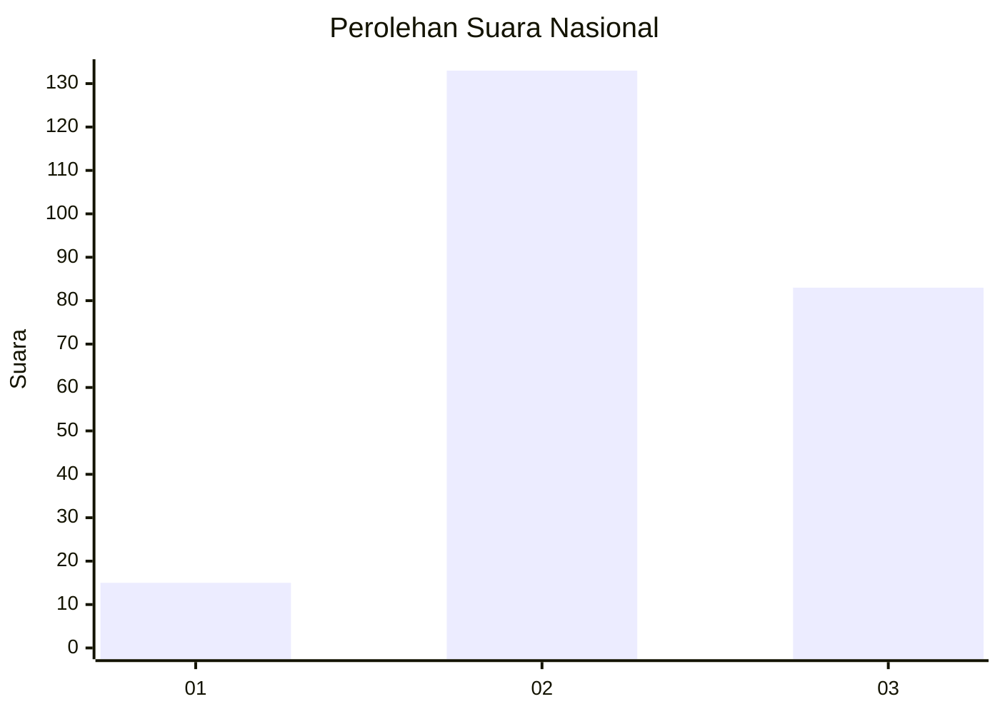
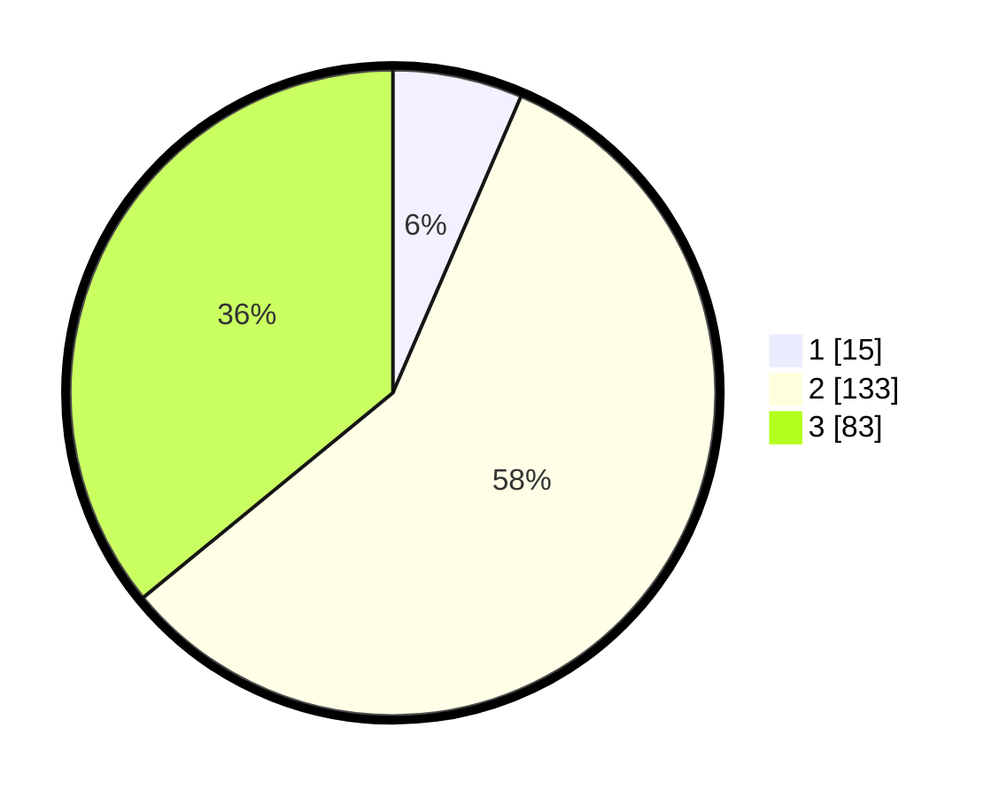

# Hasil

## Grafik

## Tabel

| No. | Nama Paslon    | Suara | Suara (raw) | Persentase |
|:--- |:-------------- | -----:| -----------:| ----------:|
| 1   | ANIES MUHAIMIN | 15    | [15][p-1]   | 6,49       |
| 2   | PRABOWO GIBRAN | 133   | [133][p-2]  | 57,58      |
| 3   | GANJAR MAHFUD  | 83    | [83][p-3]   | 35,93      |

[p-1]: https://github.com/gigit-pemilu/pemilu-2024/blob/main/pilpres/hitung-suara/sub/51-bali/sub/03-badung/sub/05-kuta-selatan/sub/1006-jimbaran/sub/063-tps/sub/paslon-1.txt
[p-2]: https://github.com/gigit-pemilu/pemilu-2024/blob/main/pilpres/hitung-suara/sub/51-bali/sub/03-badung/sub/05-kuta-selatan/sub/1006-jimbaran/sub/063-tps/sub/paslon-2.txt
[p-3]: https://github.com/gigit-pemilu/pemilu-2024/blob/main/pilpres/hitung-suara/sub/51-bali/sub/03-badung/sub/05-kuta-selatan/sub/1006-jimbaran/sub/063-tps/sub/paslon-3.txt

## Foto C Plano

https://sirekap-obj-formc.kpu.go.id/d024/pemilu/ppwp/51/03/05/10/06/5103051006063-20240214-141523--d4159cd0-13e4-4d4b-b1db-2863bf826055.jpg

https://sirekap-obj-formc.kpu.go.id/d024/pemilu/ppwp/51/03/05/10/06/5103051006063-20240214-141725--90b4fd6d-a275-4173-b013-441968250ca4.jpg

https://sirekap-obj-formc.kpu.go.id/d024/pemilu/ppwp/51/03/05/10/06/5103051006063-20240214-141824--7aeb1b9e-4e67-4809-b225-b408c7932078.jpg

## Metadata

| Key        | Value               |
| ---------- | ------------------- |
| Time Stamp | 2024-02-14 21:46:01 |

