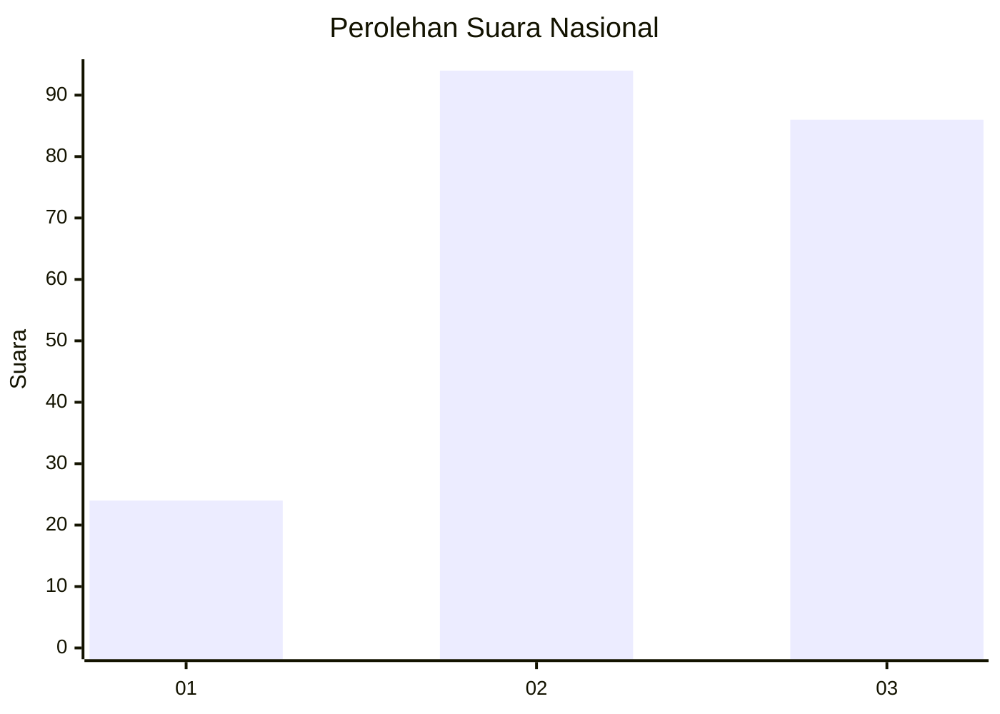
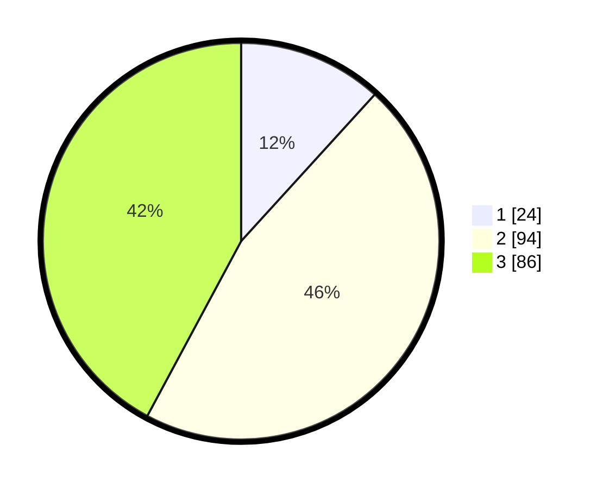

# Hasil

## Grafik

## Tabel

| No. | Nama Paslon    | Suara | Suara (raw) | Persentase |
|:--- |:-------------- | -----:| -----------:| ----------:|
| 1   | ANIES MUHAIMIN | 24    | [24][p-1]   | 11,76      |
| 2   | PRABOWO GIBRAN | 94    | [94][p-2]   | 46,08      |
| 3   | GANJAR MAHFUD  | 86    | [86][p-3]   | 42,16      |

[p-1]: https://github.com/gigit-pemilu/pemilu-2024/blob/main/pilpres/hitung-suara/sub/51-bali/sub/03-badung/sub/05-kuta-selatan/sub/1006-jimbaran/sub/064-tps/sub/paslon-1.txt
[p-2]: https://github.com/gigit-pemilu/pemilu-2024/blob/main/pilpres/hitung-suara/sub/51-bali/sub/03-badung/sub/05-kuta-selatan/sub/1006-jimbaran/sub/064-tps/sub/paslon-2.txt
[p-3]: https://github.com/gigit-pemilu/pemilu-2024/blob/main/pilpres/hitung-suara/sub/51-bali/sub/03-badung/sub/05-kuta-selatan/sub/1006-jimbaran/sub/064-tps/sub/paslon-3.txt

## Foto C Plano

https://sirekap-obj-formc.kpu.go.id/9a9b/pemilu/ppwp/51/03/05/10/06/5103051006064-20240216-202212--60d21b93-2050-4043-9d63-862c7915e9f3.jpg

https://sirekap-obj-formc.kpu.go.id/9a9b/pemilu/ppwp/51/03/05/10/06/5103051006064-20240216-145029--045f661d-82e7-4e95-b4e0-0e9d4bea2375.jpg

https://sirekap-obj-formc.kpu.go.id/9a9b/pemilu/ppwp/51/03/05/10/06/5103051006064-20240216-211239--b7b15501-d6f7-47af-aae3-0752d40f6d17.jpg

## Metadata

| Key        | Value               |
| ---------- | ------------------- |
| Time Stamp | 2024-02-21 12:00:00 |

## DATA PEMILIH TETAP

Jumlah pemilih dalam DPT: **292**.
 * L: **134**.
 * P: **158**.

## DATA PENGGUNA HAK PILIH

Jumlah pengguna hak pilih dalam DPT: **191**.
 * L: **84**.
 * P: **107**.

Jumlah pengguna hak pilih dalam DPTb: **5**.
 * L: **3**.
 * P: **2**.

Jumlah pengguna hak pilih dalam DPK: **9**.
 * L: **5**.
 * P: **4**.

Jumlah pengguna hak pilih: **205**.
 * L: **92**.
 * P: **113**.

## JUMLAH SUARA SAH DAN TIDAK SAH

JUMLAH SELURUH SUARA SAH: **204**.

JUMLAH SUARA TIDAK SAH: **1**.

JUMLAH SELURUH SUARA SAH DAN SUARA TIDAK SAH: **205**.

