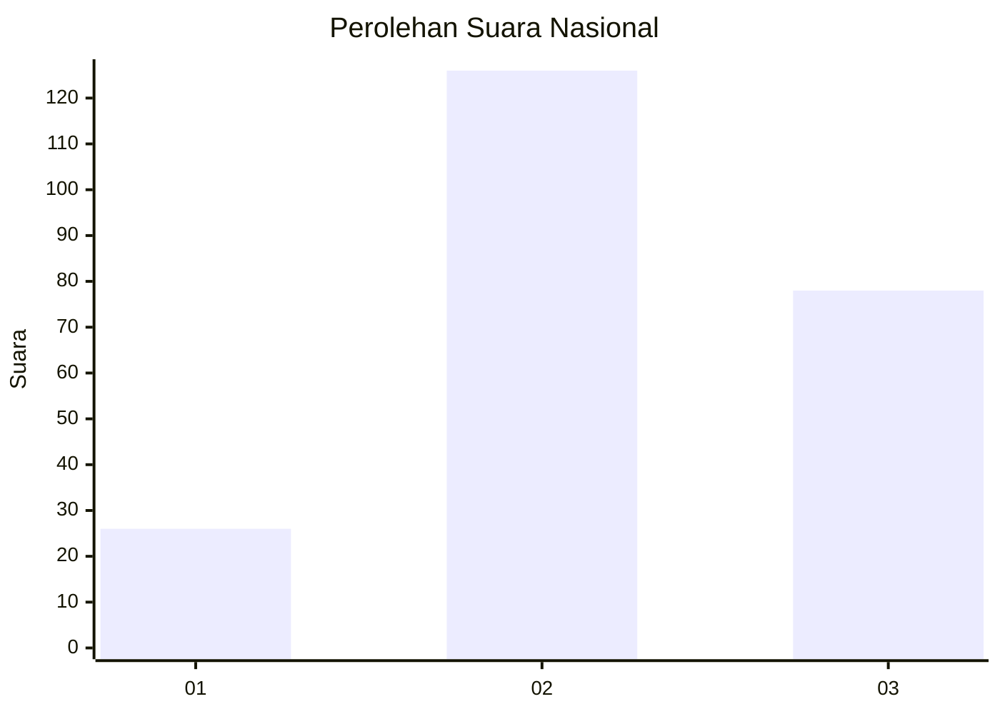
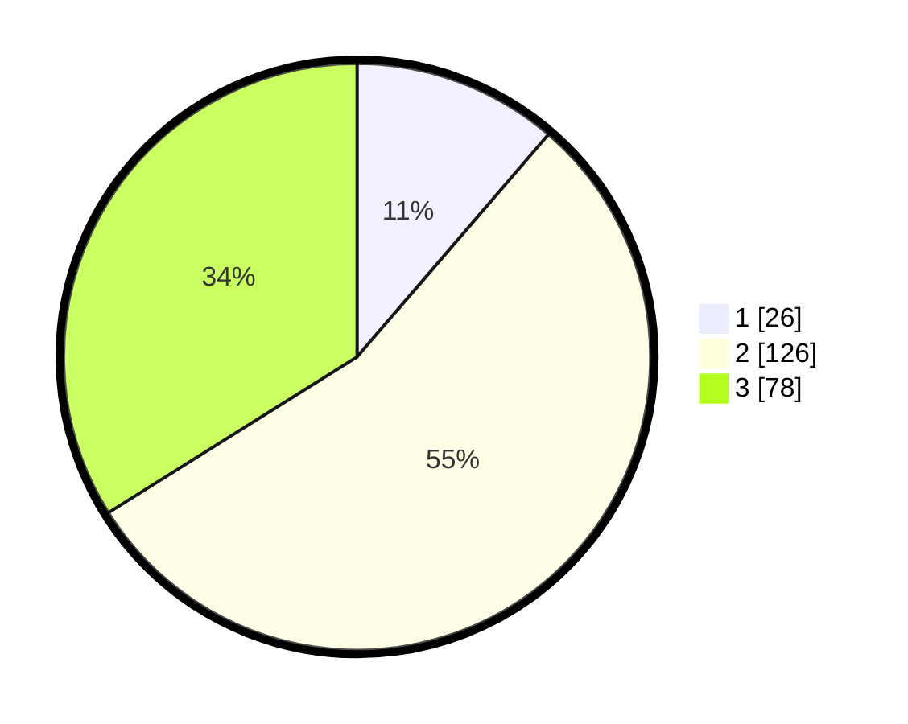

# Hasil

## Grafik

## Tabel

| No. | Nama Paslon    | Suara | Suara (raw) | Persentase |
|:--- |:-------------- | -----:| -----------:| ----------:|
| 1   | ANIES MUHAIMIN | 26    | [26][p-1]   | 11,30      |
| 2   | PRABOWO GIBRAN | 126   | [126][p-2]  | 54,78      |
| 3   | GANJAR MAHFUD  | 78    | [78][p-3]   | 33,91      |

[p-1]: https://github.com/gigit-pemilu/pemilu-2024/blob/main/pilpres/hitung-suara/sub/51-bali/sub/03-badung/sub/05-kuta-selatan/sub/1006-jimbaran/sub/065-tps/sub/paslon-1.txt
[p-2]: https://github.com/gigit-pemilu/pemilu-2024/blob/main/pilpres/hitung-suara/sub/51-bali/sub/03-badung/sub/05-kuta-selatan/sub/1006-jimbaran/sub/065-tps/sub/paslon-2.txt
[p-3]: https://github.com/gigit-pemilu/pemilu-2024/blob/main/pilpres/hitung-suara/sub/51-bali/sub/03-badung/sub/05-kuta-selatan/sub/1006-jimbaran/sub/065-tps/sub/paslon-3.txt

## Foto C Plano

https://sirekap-obj-formc.kpu.go.id/7a28/pemilu/ppwp/51/03/05/10/06/5103051006065-20240214-185042--b8b997f4-7f79-4e33-91d4-674b0a80b54e.jpg

https://sirekap-obj-formc.kpu.go.id/7a28/pemilu/ppwp/51/03/05/10/06/5103051006065-20240214-185634--512ce34e-ca49-4191-871d-5bec0ee2ed4a.jpg

https://sirekap-obj-formc.kpu.go.id/7a28/pemilu/ppwp/51/03/05/10/06/5103051006065-20240214-185048--b4c1958d-525a-41b6-8297-70b3c9ee260d.jpg

## Metadata

| Key        | Value               |
| ---------- | ------------------- |
| Time Stamp | 2024-02-15 00:41:44 |

## DATA PEMILIH TETAP

Jumlah pemilih dalam DPT: **289**.
 * L: **147**.
 * P: **142**.

## DATA PENGGUNA HAK PILIH

Jumlah pengguna hak pilih dalam DPT: **212**.
 * L: **104**.
 * P: **108**.

Jumlah pengguna hak pilih dalam DPTb: **1**.
 * L: **0**.
 * P: **1**.

Jumlah pengguna hak pilih dalam DPK: **18**.
 * L: **6**.
 * P: **12**.

Jumlah pengguna hak pilih: **231**.
 * L: **110**.
 * P: **121**.

## JUMLAH SUARA SAH DAN TIDAK SAH

JUMLAH SELURUH SUARA SAH: **230**.

JUMLAH SUARA TIDAK SAH: **1**.

JUMLAH SELURUH SUARA SAH DAN SUARA TIDAK SAH: **231**.

