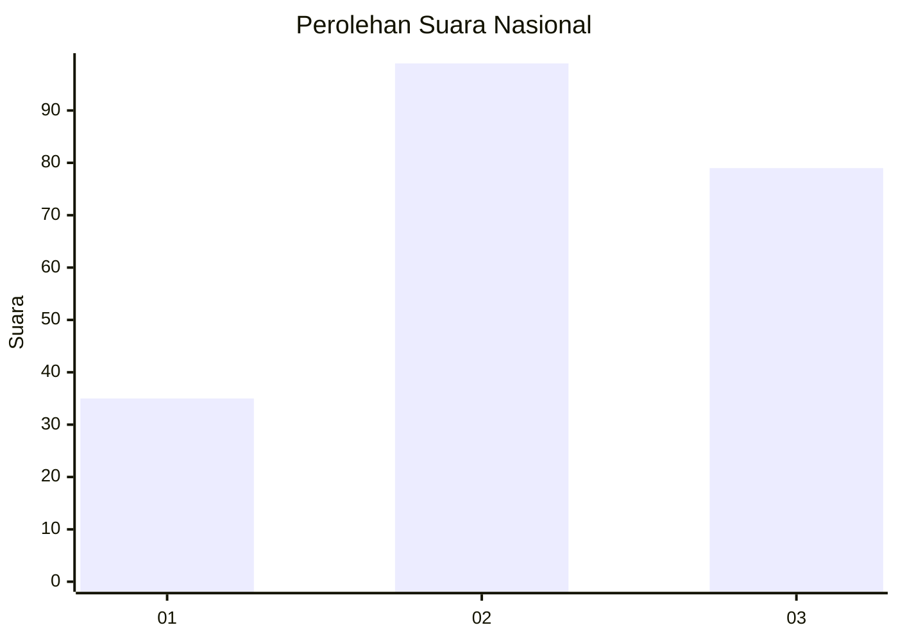
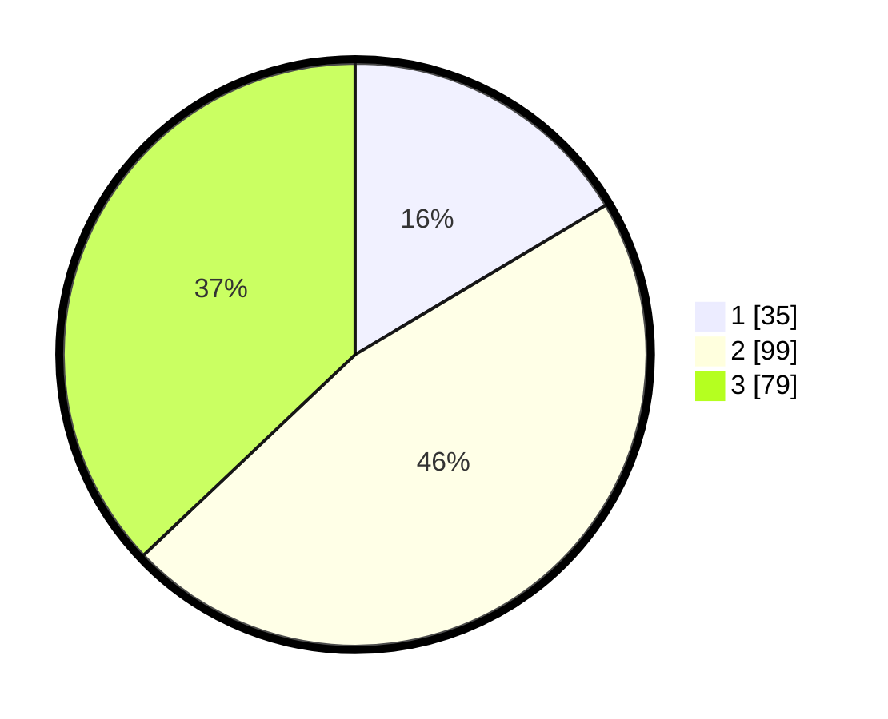

# Hasil

## Grafik

## Tabel

| No. | Nama Paslon    | Suara | Suara (raw) | Persentase |
|:--- |:-------------- | -----:| -----------:| ----------:|
| 1   | ANIES MUHAIMIN | 35    | [35][p-1]   | 16,43      |
| 2   | PRABOWO GIBRAN | 99    | [99][p-2]   | 46,48      |
| 3   | GANJAR MAHFUD  | 79    | [79][p-3]   | 37,09      |

[p-1]: https://github.com/gigit-pemilu/pemilu-2024/blob/main/pilpres/hitung-suara/sub/51-bali/sub/03-badung/sub/05-kuta-selatan/sub/1006-jimbaran/sub/067-tps/sub/paslon-1.txt
[p-2]: https://github.com/gigit-pemilu/pemilu-2024/blob/main/pilpres/hitung-suara/sub/51-bali/sub/03-badung/sub/05-kuta-selatan/sub/1006-jimbaran/sub/067-tps/sub/paslon-2.txt
[p-3]: https://github.com/gigit-pemilu/pemilu-2024/blob/main/pilpres/hitung-suara/sub/51-bali/sub/03-badung/sub/05-kuta-selatan/sub/1006-jimbaran/sub/067-tps/sub/paslon-3.txt

## Foto C Plano

https://sirekap-obj-formc.kpu.go.id/88b6/pemilu/ppwp/51/03/05/10/06/5103051006067-20240214-214653--eda786c7-fb6f-41ec-9f50-edbcafd4f797.jpg

https://sirekap-obj-formc.kpu.go.id/88b6/pemilu/ppwp/51/03/05/10/06/5103051006067-20240214-214843--fff755da-be4e-4a06-8d45-1dc38ac410db.jpg

https://sirekap-obj-formc.kpu.go.id/88b6/pemilu/ppwp/51/03/05/10/06/5103051006067-20240214-215009--36ae00b6-3be8-4bac-bc20-d140748aaef6.jpg

## Metadata

| Key        | Value               |
| ---------- | ------------------- |
| Time Stamp | 2024-02-24 22:31:28 |

