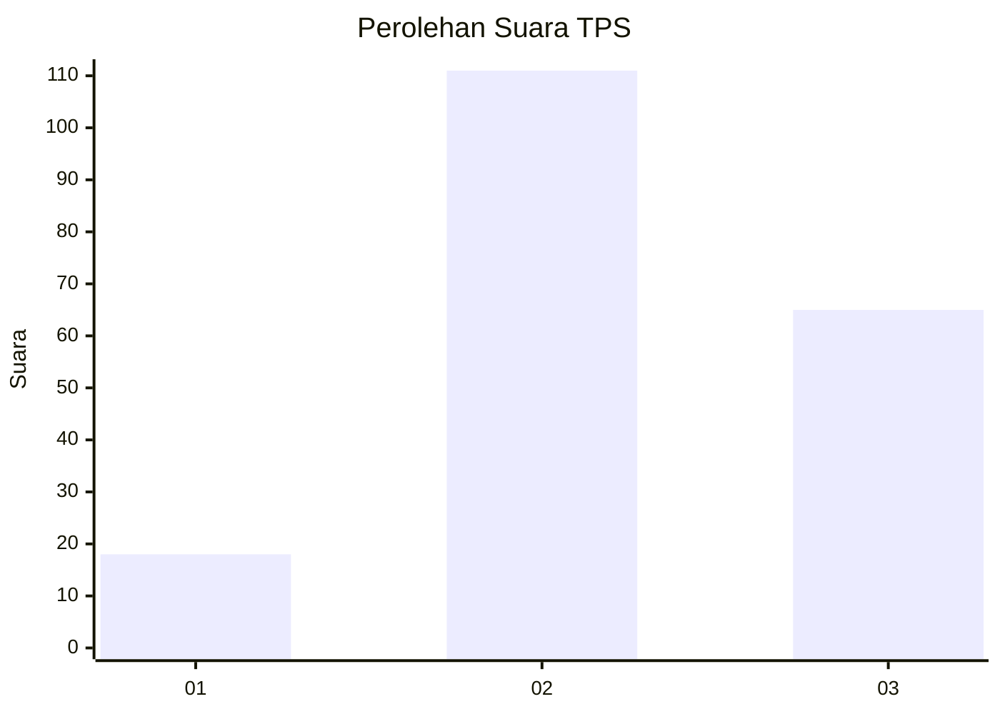
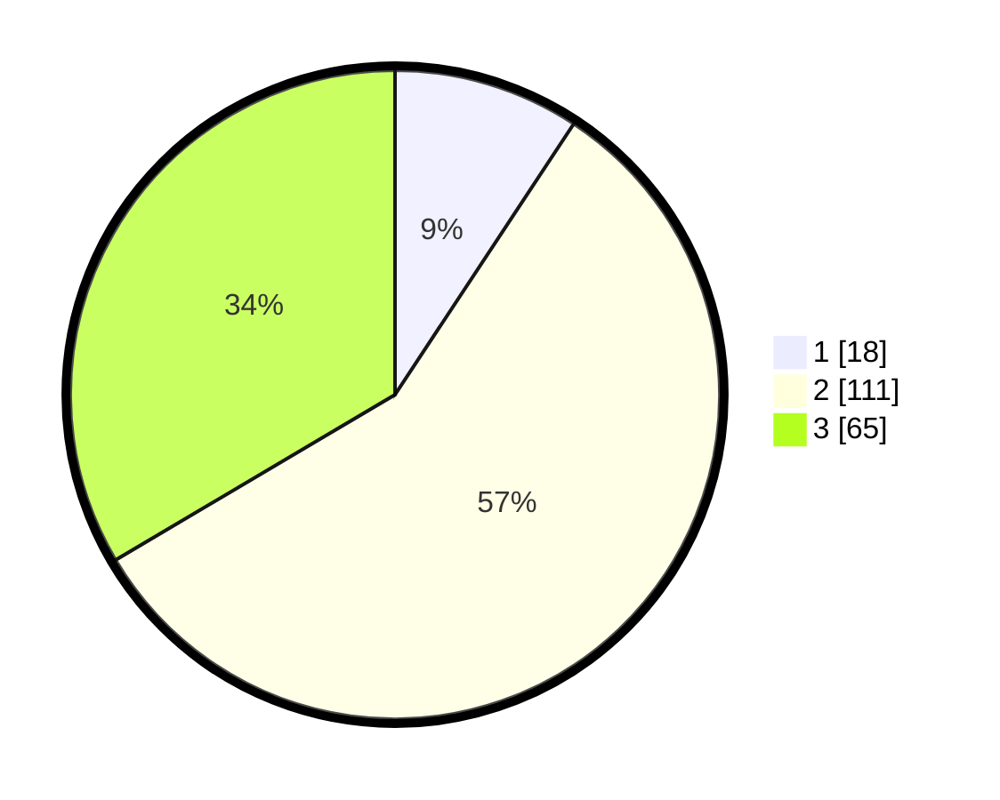

# Hasil

## Grafik

## Tabel

| No. | Nama Paslon    | Suara | Suara (raw) | Persentase |
|:--- |:-------------- | -----:| -----------:| ----------:|
| 1   | ANIES MUHAIMIN | 18    | [18][p-1]   | 9,28       |
| 2   | PRABOWO GIBRAN | 111   | [111][p-2]  | 57,22      |
| 3   | GANJAR MAHFUD  | 65    | [65][p-3]   | 33,51      |

[p-1]: https://github.com/gigit-pemilu/pemilu-2024-51-bali/blob/main/pilpres/hitung-suara/sub/51-bali/sub/03-badung/sub/05-kuta-selatan/sub/1006-jimbaran/sub/074-tps/sub/paslon-1.txt
[p-2]: https://github.com/gigit-pemilu/pemilu-2024-51-bali/blob/main/pilpres/hitung-suara/sub/51-bali/sub/03-badung/sub/05-kuta-selatan/sub/1006-jimbaran/sub/074-tps/sub/paslon-2.txt
[p-3]: https://github.com/gigit-pemilu/pemilu-2024-51-bali/blob/main/pilpres/hitung-suara/sub/51-bali/sub/03-badung/sub/05-kuta-selatan/sub/1006-jimbaran/sub/074-tps/sub/paslon-3.txt

## Foto C Plano

https://sirekap-obj-formc.kpu.go.id/de1c/pemilu/ppwp/51/03/05/10/06/5103051006074-20240215-003113--91f90c14-b790-4be2-83d4-2a6bc8953a72.jpg

https://sirekap-obj-formc.kpu.go.id/de1c/pemilu/ppwp/51/03/05/10/06/5103051006074-20240215-003229--70af1a52-02d7-404e-992a-b7a0a0f4365f.jpg

https://sirekap-obj-formc.kpu.go.id/de1c/pemilu/ppwp/51/03/05/10/06/5103051006074-20240215-003420--3973b7a6-ea02-4e01-8ac5-2f094a363da3.jpg

## Metadata

| Key        | Value               |
| ---------- | ------------------- |
| Time Stamp | 2024-02-25 17:00:00 |

