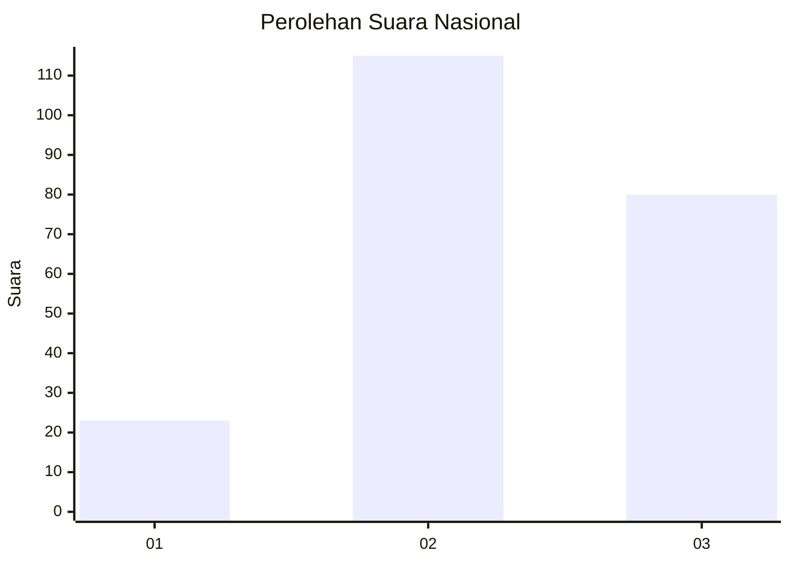
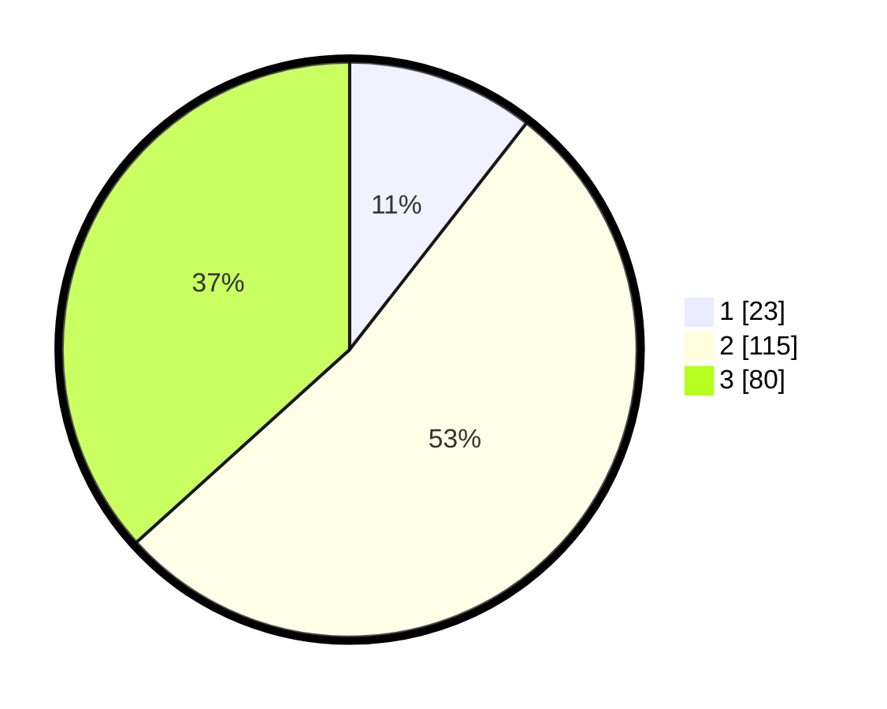

# Hasil

## Grafik

## Tabel

| No. | Nama Paslon    | Suara | Suara (raw) | Persentase |
|:--- |:-------------- | -----:| -----------:| ----------:|
| 1   | ANIES MUHAIMIN | 23    | [23][p-1]   | 10,55      |
| 2   | PRABOWO GIBRAN | 115   | [115][p-2]  | 52,75      |
| 3   | GANJAR MAHFUD  | 80    | [80][p-3]   | 36,70      |

[p-1]: https://github.com/gigit-pemilu/pemilu-2024/blob/main/pilpres/hitung-suara/sub/51-bali/sub/03-badung/sub/05-kuta-selatan/sub/1006-jimbaran/sub/076-tps/sub/paslon-1.txt
[p-2]: https://github.com/gigit-pemilu/pemilu-2024/blob/main/pilpres/hitung-suara/sub/51-bali/sub/03-badung/sub/05-kuta-selatan/sub/1006-jimbaran/sub/076-tps/sub/paslon-2.txt
[p-3]: https://github.com/gigit-pemilu/pemilu-2024/blob/main/pilpres/hitung-suara/sub/51-bali/sub/03-badung/sub/05-kuta-selatan/sub/1006-jimbaran/sub/076-tps/sub/paslon-3.txt

## Foto C Plano

https://sirekap-obj-formc.kpu.go.id/0d7c/pemilu/ppwp/51/03/05/10/06/5103051006076-20240214-214403--0d1e98f8-7117-4060-87b3-2db7c848f7e0.jpg

https://sirekap-obj-formc.kpu.go.id/0d7c/pemilu/ppwp/51/03/05/10/06/5103051006076-20240214-214746--fc8ee220-1165-43e4-baf7-2d90de632d9c.jpg

https://sirekap-obj-formc.kpu.go.id/0d7c/pemilu/ppwp/51/03/05/10/06/5103051006076-20240214-214914--6632e7c0-81d4-4c9a-b481-3bd6242085fe.jpg

## Metadata

| Key        | Value               |
| ---------- | ------------------- |
| Time Stamp | 2024-02-24 22:31:28 |

