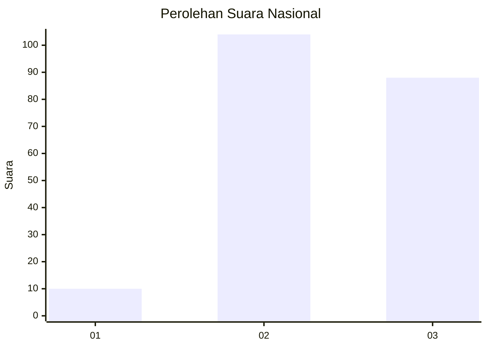
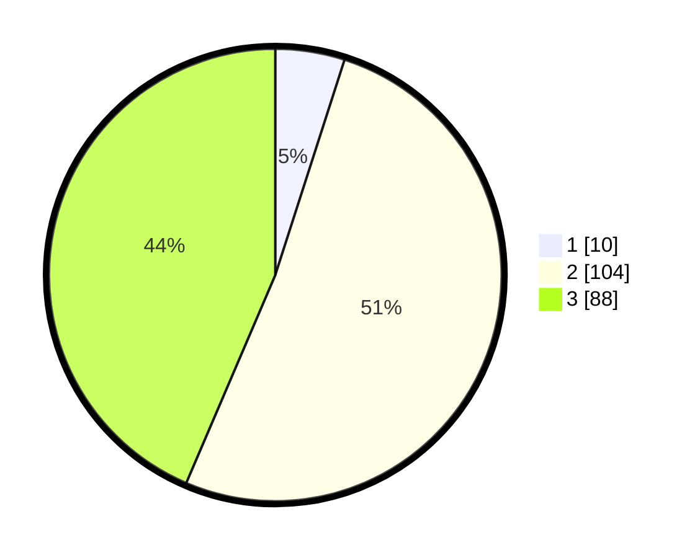

# Hasil

## Grafik

## Tabel

| No. | Nama Paslon    | Suara | Suara (raw) | Persentase |
|:--- |:-------------- | -----:| -----------:| ----------:|
| 1   | ANIES MUHAIMIN | 10    | [10][p-1]   | 4,95       |
| 2   | PRABOWO GIBRAN | 104   | [104][p-2]  | 51,49      |
| 3   | GANJAR MAHFUD  | 88    | [88][p-3]   | 43,56      |

[p-1]: https://github.com/gigit-pemilu/pemilu-2024/blob/main/pilpres/hitung-suara/sub/51-bali/sub/03-badung/sub/05-kuta-selatan/sub/1006-jimbaran/sub/077-tps/sub/paslon-1.txt
[p-2]: https://github.com/gigit-pemilu/pemilu-2024/blob/main/pilpres/hitung-suara/sub/51-bali/sub/03-badung/sub/05-kuta-selatan/sub/1006-jimbaran/sub/077-tps/sub/paslon-2.txt
[p-3]: https://github.com/gigit-pemilu/pemilu-2024/blob/main/pilpres/hitung-suara/sub/51-bali/sub/03-badung/sub/05-kuta-selatan/sub/1006-jimbaran/sub/077-tps/sub/paslon-3.txt

## Foto C Plano

https://sirekap-obj-formc.kpu.go.id/d73a/pemilu/ppwp/51/03/05/10/06/5103051006077-20240214-141303--b6701612-328a-4e84-b8ed-0619e1158a15.jpg

https://sirekap-obj-formc.kpu.go.id/d73a/pemilu/ppwp/51/03/05/10/06/5103051006077-20240214-141308--5a669625-4fca-413c-be37-96569eb1cc70.jpg

https://sirekap-obj-formc.kpu.go.id/d73a/pemilu/ppwp/51/03/05/10/06/5103051006077-20240215-195625--b1f8ef2c-f8ea-4b59-bd36-084e33cd99a6.jpg

## Metadata

| Key        | Value               |
| ---------- | ------------------- |
| Time Stamp | 2024-02-15 20:00:44 |

## DATA PEMILIH TETAP

Jumlah pemilih dalam DPT: **292**.
 * L: **155**.
 * P: **137**.

## DATA PENGGUNA HAK PILIH

Jumlah pengguna hak pilih dalam DPT: **198**.
 * L: **102**.
 * P: **96**.

Jumlah pengguna hak pilih dalam DPTb: **0**.
 * L: **0**.
 * P: **0**.

Jumlah pengguna hak pilih dalam DPK: **4**.
 * L: **3**.
 * P: **1**.

Jumlah pengguna hak pilih: **202**.
 * L: **105**.
 * P: **97**.

## JUMLAH SUARA SAH DAN TIDAK SAH

JUMLAH SELURUH SUARA SAH: **202**.

JUMLAH SUARA TIDAK SAH: **0**.

JUMLAH SELURUH SUARA SAH DAN SUARA TIDAK SAH: **202**.

