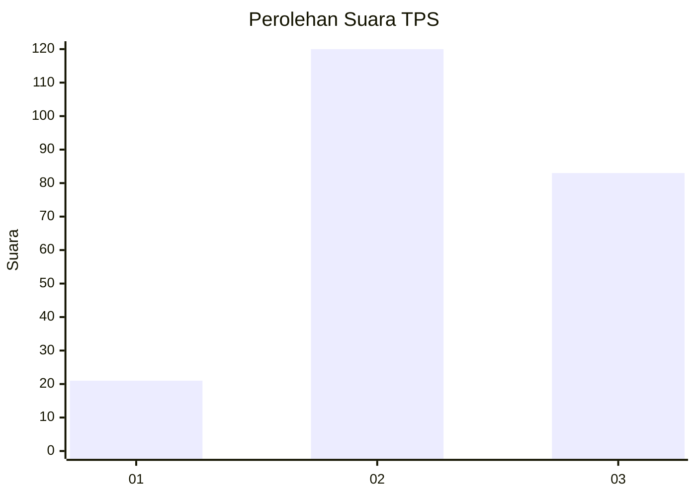
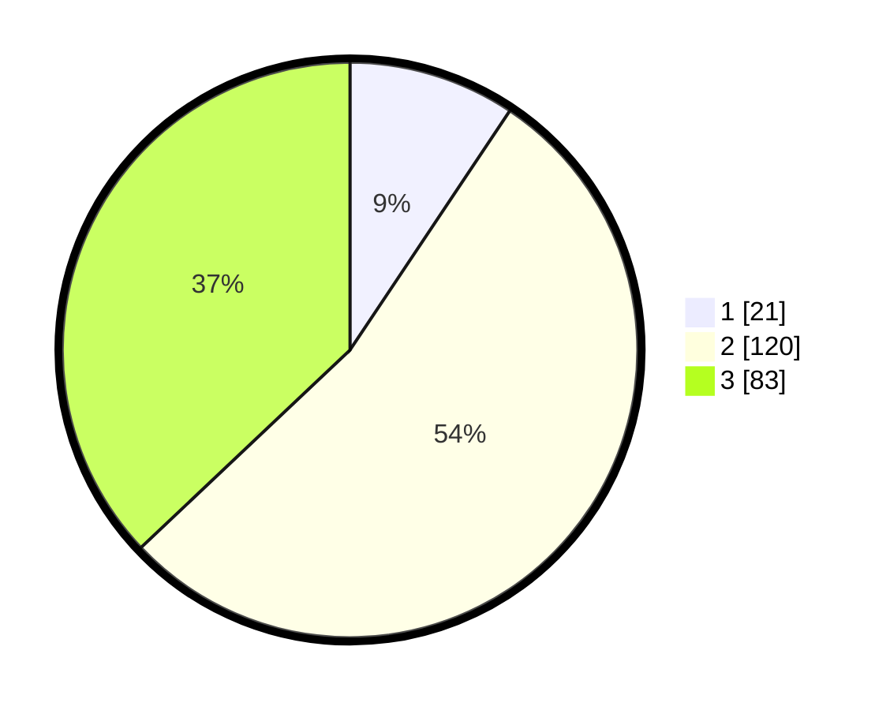

# Hasil

## Grafik

## Tabel

| No. | Nama Paslon    | Suara | Suara (raw) | Persentase |
|:--- |:-------------- | -----:| -----------:| ----------:|
| 1   | ANIES MUHAIMIN | 21    | [21][p-1]   | 9,38       |
| 2   | PRABOWO GIBRAN | 120   | [120][p-2]  | 53,57      |
| 3   | GANJAR MAHFUD  | 83    | [83][p-3]   | 37,05      |

[p-1]: https://github.com/gigit-pemilu/pemilu-2024-51-bali/blob/main/pilpres/hitung-suara/sub/51-bali/sub/03-badung/sub/05-kuta-selatan/sub/1006-jimbaran/sub/083-tps/sub/paslon-1.txt
[p-2]: https://github.com/gigit-pemilu/pemilu-2024-51-bali/blob/main/pilpres/hitung-suara/sub/51-bali/sub/03-badung/sub/05-kuta-selatan/sub/1006-jimbaran/sub/083-tps/sub/paslon-2.txt
[p-3]: https://github.com/gigit-pemilu/pemilu-2024-51-bali/blob/main/pilpres/hitung-suara/sub/51-bali/sub/03-badung/sub/05-kuta-selatan/sub/1006-jimbaran/sub/083-tps/sub/paslon-3.txt

## Foto C Plano

https://sirekap-obj-formc.kpu.go.id/ec5f/pemilu/ppwp/51/03/05/10/06/5103051006083-20240216-115455--16ab7e57-089d-4be9-b347-f114453c6b9f.jpg

https://sirekap-obj-formc.kpu.go.id/ec5f/pemilu/ppwp/51/03/05/10/06/5103051006083-20240216-120737--d28f6afd-24b2-4144-8627-b8a830b1bd9e.jpg

https://sirekap-obj-formc.kpu.go.id/ec5f/pemilu/ppwp/51/03/05/10/06/5103051006083-20240214-215306--1978a894-8bda-4597-9da5-ea9ce411801e.jpg

## Metadata

| Key        | Value               |
| ---------- | ------------------- |
| Time Stamp | 2024-02-21 12:00:00 |

## DATA PEMILIH TETAP

Jumlah pemilih dalam DPT: **290**.
 * L: **137**.
 * P: **153**.

## DATA PENGGUNA HAK PILIH

Jumlah pengguna hak pilih dalam DPT: **216**.
 * L: **95**.
 * P: **121**.

Jumlah pengguna hak pilih dalam DPTb: **8**.
 * L: **4**.
 * P: **4**.

Jumlah pengguna hak pilih dalam DPK: **4**.
 * L: **2**.
 * P: **2**.

Jumlah pengguna hak pilih: **228**.
 * L: **101**.
 * P: **127**.

## JUMLAH SUARA SAH DAN TIDAK SAH

JUMLAH SELURUH SUARA SAH: **224**.

JUMLAH SUARA TIDAK SAH: **4**.

JUMLAH SELURUH SUARA SAH DAN SUARA TIDAK SAH: **228**.

