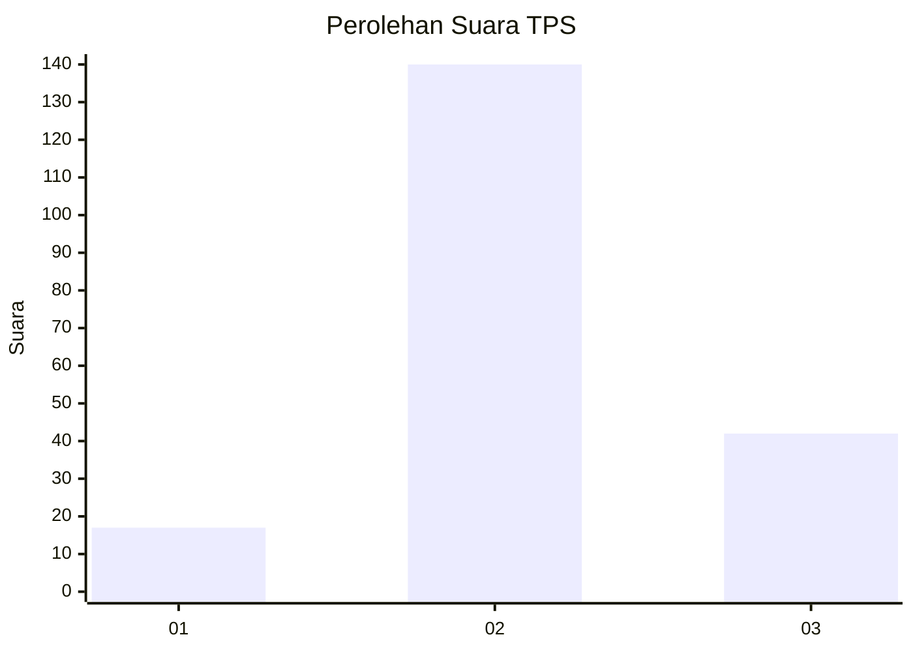
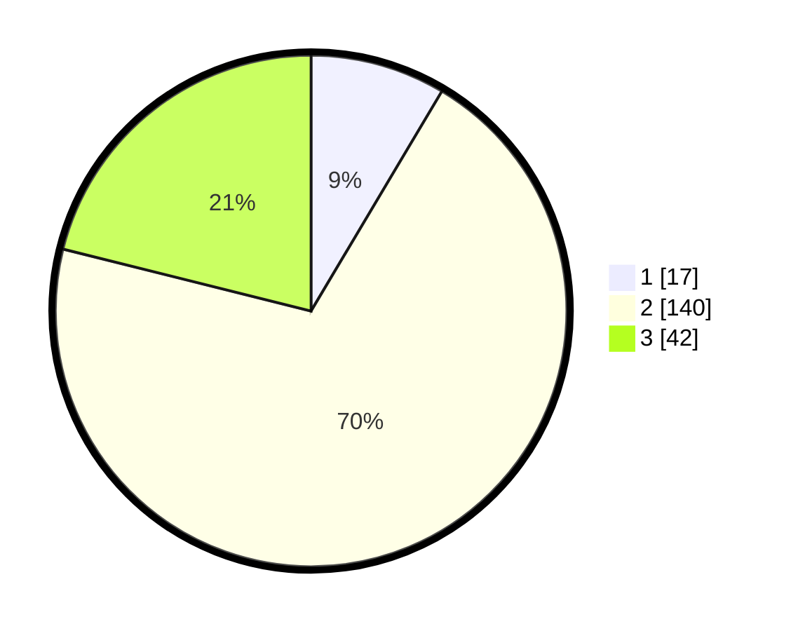

# Hasil

## Grafik

## Tabel

| No. | Nama Paslon    | Suara | Suara (raw) | Persentase |
|:--- |:-------------- | -----:| -----------:| ----------:|
| 1   | ANIES MUHAIMIN | 17    | [17][p-1]   | 8,54       |
| 2   | PRABOWO GIBRAN | 140   | [140][p-2]  | 70,35      |
| 3   | GANJAR MAHFUD  | 42    | [42][p-3]   | 21,11      |

[p-1]: https://github.com/gigit-pemilu/pemilu-2024-51-bali/blob/main/pilpres/hitung-suara/sub/51-bali/sub/03-badung/sub/05-kuta-selatan/sub/1006-jimbaran/sub/087-tps/sub/paslon-1.txt
[p-2]: https://github.com/gigit-pemilu/pemilu-2024-51-bali/blob/main/pilpres/hitung-suara/sub/51-bali/sub/03-badung/sub/05-kuta-selatan/sub/1006-jimbaran/sub/087-tps/sub/paslon-2.txt
[p-3]: https://github.com/gigit-pemilu/pemilu-2024-51-bali/blob/main/pilpres/hitung-suara/sub/51-bali/sub/03-badung/sub/05-kuta-selatan/sub/1006-jimbaran/sub/087-tps/sub/paslon-3.txt

## Foto C Plano

https://sirekap-obj-formc.kpu.go.id/6f90/pemilu/ppwp/51/03/05/10/06/5103051006087-20240214-214658--7f2200e6-22dc-40fb-8170-7683a8f41e64.jpg

https://sirekap-obj-formc.kpu.go.id/6f90/pemilu/ppwp/51/03/05/10/06/5103051006087-20240214-214818--d101a783-7295-4c6c-9f8b-b13c0c7970de.jpg

https://sirekap-obj-formc.kpu.go.id/6f90/pemilu/ppwp/51/03/05/10/06/5103051006087-20240214-214916--a8e05c6d-777a-41a1-b8b9-c317aa010cc2.jpg

## Metadata

| Key        | Value               |
| ---------- | ------------------- |
| Time Stamp | 2024-02-24 22:31:28 |

