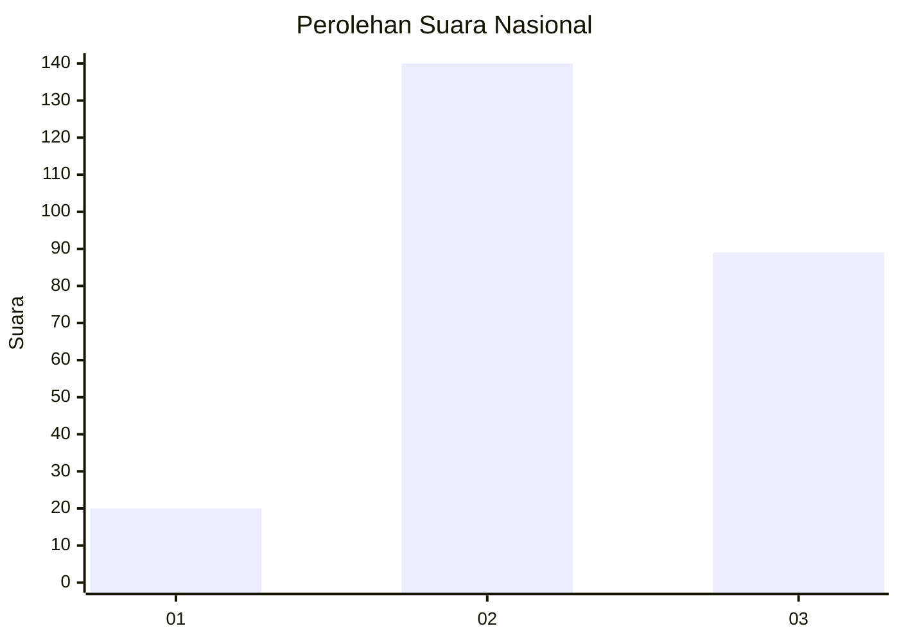
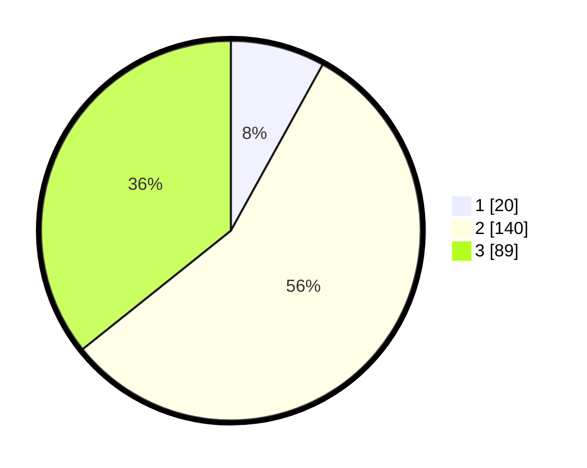

# Hasil

## Grafik

## Tabel

| No. | Nama Paslon    | Suara | Suara (raw) | Persentase |
|:--- |:-------------- | -----:| -----------:| ----------:|
| 1   | ANIES MUHAIMIN | 20    | [20][p-1]   | 8,03       |
| 2   | PRABOWO GIBRAN | 140   | [140][p-2]  | 56,22      |
| 3   | GANJAR MAHFUD  | 89    | [89][p-3]   | 35,74      |

[p-1]: https://github.com/gigit-pemilu/pemilu-2024/blob/main/pilpres/hitung-suara/sub/51-bali/sub/03-badung/sub/05-kuta-selatan/sub/1006-jimbaran/sub/088-tps/sub/paslon-1.txt
[p-2]: https://github.com/gigit-pemilu/pemilu-2024/blob/main/pilpres/hitung-suara/sub/51-bali/sub/03-badung/sub/05-kuta-selatan/sub/1006-jimbaran/sub/088-tps/sub/paslon-2.txt
[p-3]: https://github.com/gigit-pemilu/pemilu-2024/blob/main/pilpres/hitung-suara/sub/51-bali/sub/03-badung/sub/05-kuta-selatan/sub/1006-jimbaran/sub/088-tps/sub/paslon-3.txt

## Foto C Plano

https://sirekap-obj-formc.kpu.go.id/ca78/pemilu/ppwp/51/03/05/10/06/5103051006088-20240214-214447--96e5cefa-33e3-458b-acef-8bfd3a9f5f1e.jpg

https://sirekap-obj-formc.kpu.go.id/ca78/pemilu/ppwp/51/03/05/10/06/5103051006088-20240214-214823--88f6a8cd-4561-45df-80cc-d693f4610bf5.jpg

https://sirekap-obj-formc.kpu.go.id/ca78/pemilu/ppwp/51/03/05/10/06/5103051006088-20240214-214729--4599f4f3-5f5c-4e8a-9578-d70de1bc606a.jpg

## Metadata

| Key        | Value               |
| ---------- | ------------------- |
| Time Stamp | 2024-02-24 22:31:28 |

