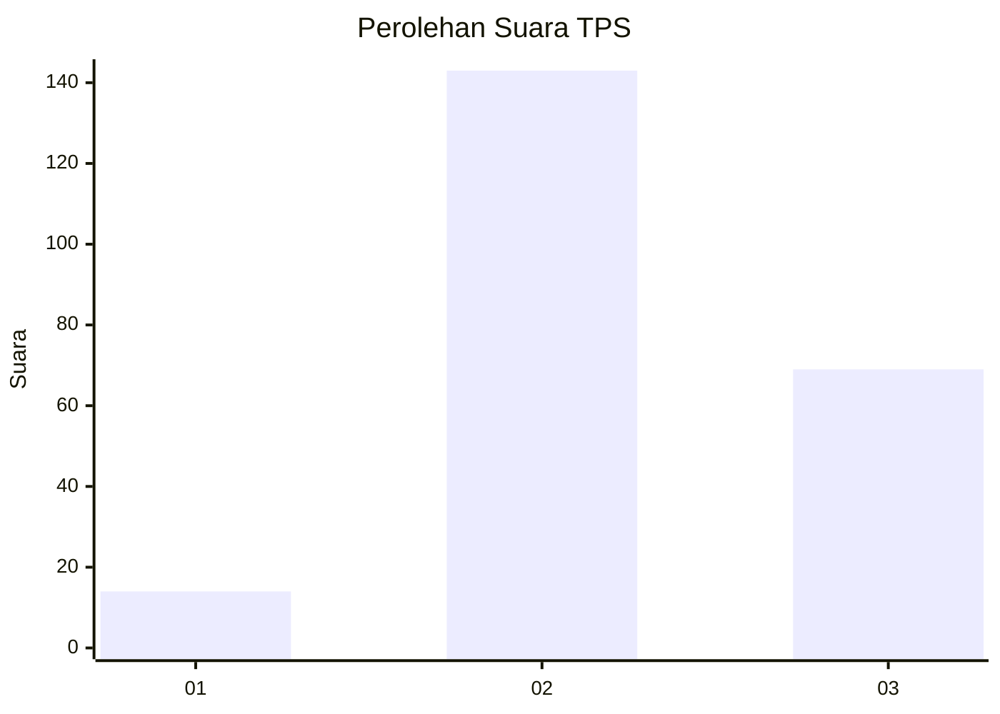
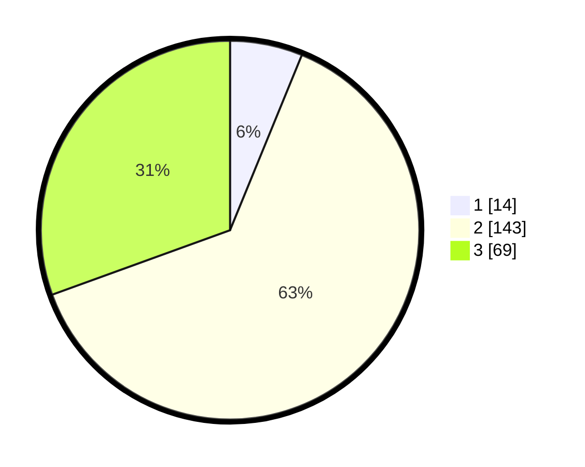

# Hasil

## Grafik

## Tabel

| No. | Nama Paslon    | Suara | Suara (raw) | Persentase |
|:--- |:-------------- | -----:| -----------:| ----------:|
| 1   | ANIES MUHAIMIN | 14    | [14][p-1]   | 6,19       |
| 2   | PRABOWO GIBRAN | 143   | [143][p-2]  | 63,27      |
| 3   | GANJAR MAHFUD  | 69    | [69][p-3]   | 30,53      |

[p-1]: https://github.com/gigit-pemilu/pemilu-2024-51-bali/blob/main/pilpres/hitung-suara/sub/51-bali/sub/03-badung/sub/05-kuta-selatan/sub/1006-jimbaran/sub/089-tps/sub/paslon-1.txt
[p-2]: https://github.com/gigit-pemilu/pemilu-2024-51-bali/blob/main/pilpres/hitung-suara/sub/51-bali/sub/03-badung/sub/05-kuta-selatan/sub/1006-jimbaran/sub/089-tps/sub/paslon-2.txt
[p-3]: https://github.com/gigit-pemilu/pemilu-2024-51-bali/blob/main/pilpres/hitung-suara/sub/51-bali/sub/03-badung/sub/05-kuta-selatan/sub/1006-jimbaran/sub/089-tps/sub/paslon-3.txt

## Foto C Plano

https://sirekap-obj-formc.kpu.go.id/f9f0/pemilu/ppwp/51/03/05/10/06/5103051006089-20240214-223118--482c943b-a710-4e81-9271-feba0bd0fae6.jpg

https://sirekap-obj-formc.kpu.go.id/f9f0/pemilu/ppwp/51/03/05/10/06/5103051006089-20240214-223229--94519277-b7d7-4c0e-b5b0-7c8fce475248.jpg

https://sirekap-obj-formc.kpu.go.id/f9f0/pemilu/ppwp/51/03/05/10/06/5103051006089-20240214-223336--1e65ab25-8176-48c7-a798-0fb097cda262.jpg

## Metadata

| Key        | Value               |
| ---------- | ------------------- |
| Time Stamp | 2024-02-24 22:31:28 |

