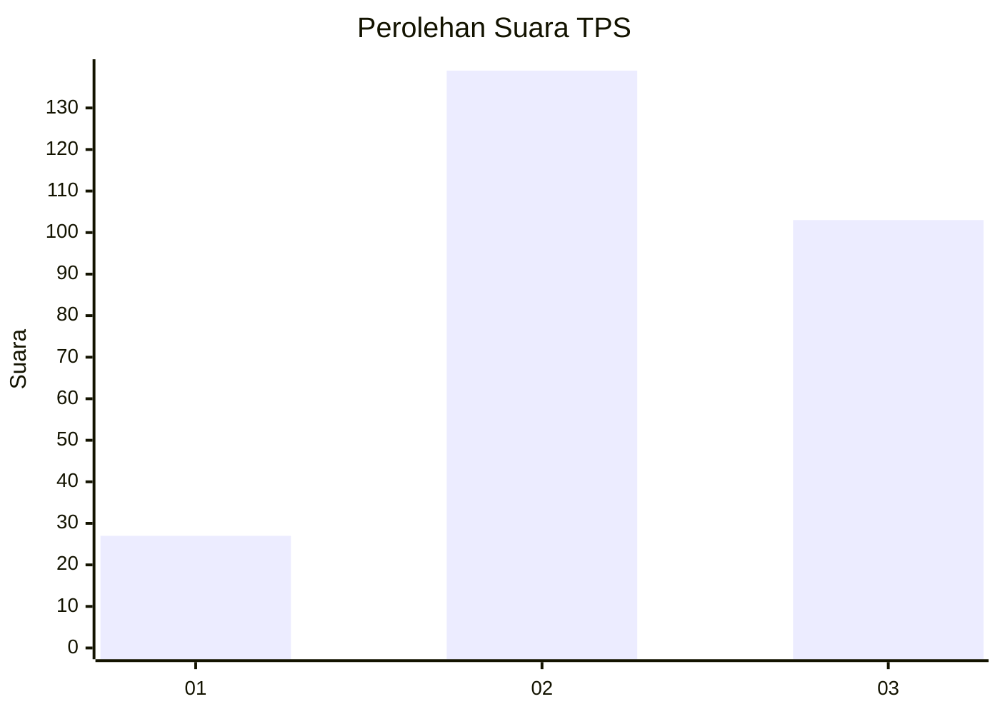
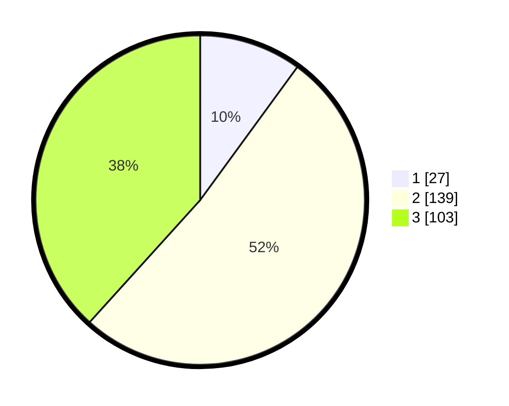

# Hasil

## Grafik

## Tabel

| No. | Nama Paslon    | Suara | Suara (raw) | Persentase |
|:--- |:-------------- | -----:| -----------:| ----------:|
| 1   | ANIES MUHAIMIN | 27    | [27][p-1]   | 10,04      |
| 2   | PRABOWO GIBRAN | 139   | [139][p-2]  | 51,67      |
| 3   | GANJAR MAHFUD  | 103   | [103][p-3]  | 38,29      |

[p-1]: https://github.com/gigit-pemilu/pemilu-2024-51-bali/blob/main/pilpres/hitung-suara/sub/51-bali/sub/03-badung/sub/05-kuta-selatan/sub/1006-jimbaran/sub/091-tps/sub/paslon-1.txt
[p-2]: https://github.com/gigit-pemilu/pemilu-2024-51-bali/blob/main/pilpres/hitung-suara/sub/51-bali/sub/03-badung/sub/05-kuta-selatan/sub/1006-jimbaran/sub/091-tps/sub/paslon-2.txt
[p-3]: https://github.com/gigit-pemilu/pemilu-2024-51-bali/blob/main/pilpres/hitung-suara/sub/51-bali/sub/03-badung/sub/05-kuta-selatan/sub/1006-jimbaran/sub/091-tps/sub/paslon-3.txt

## Foto C Plano

https://sirekap-obj-formc.kpu.go.id/bddb/pemilu/ppwp/51/03/05/10/06/5103051006091-20240214-230001--286e5b2a-44bd-4e78-9185-872377fe8adf.jpg

https://sirekap-obj-formc.kpu.go.id/bddb/pemilu/ppwp/51/03/05/10/06/5103051006091-20240214-230116--9a8e32a1-c21e-437d-aada-cd9145aa83ba.jpg

## Metadata

| Key        | Value               |
| ---------- | ------------------- |
| Time Stamp | 2024-02-24 22:31:28 |

