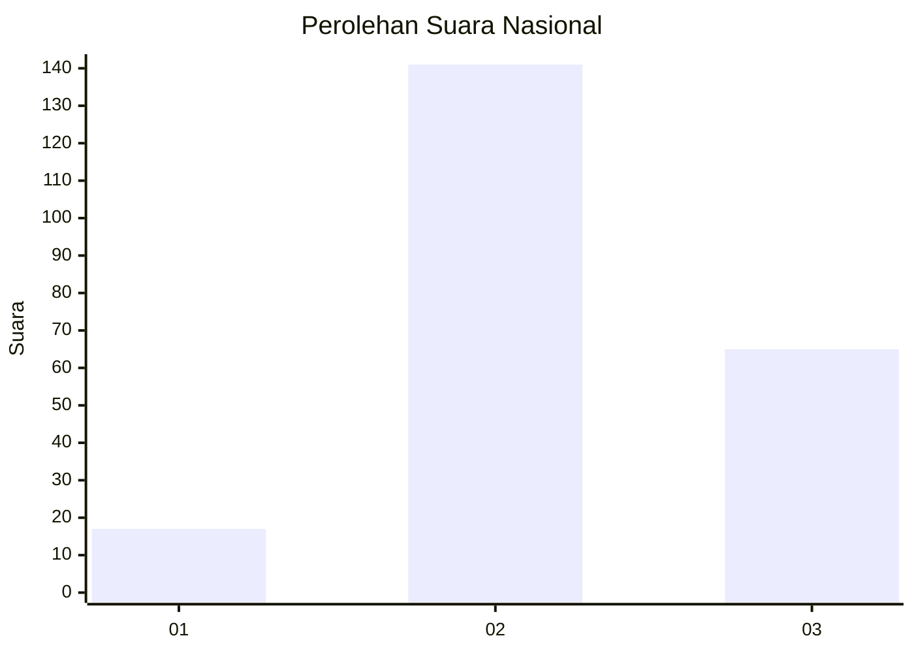
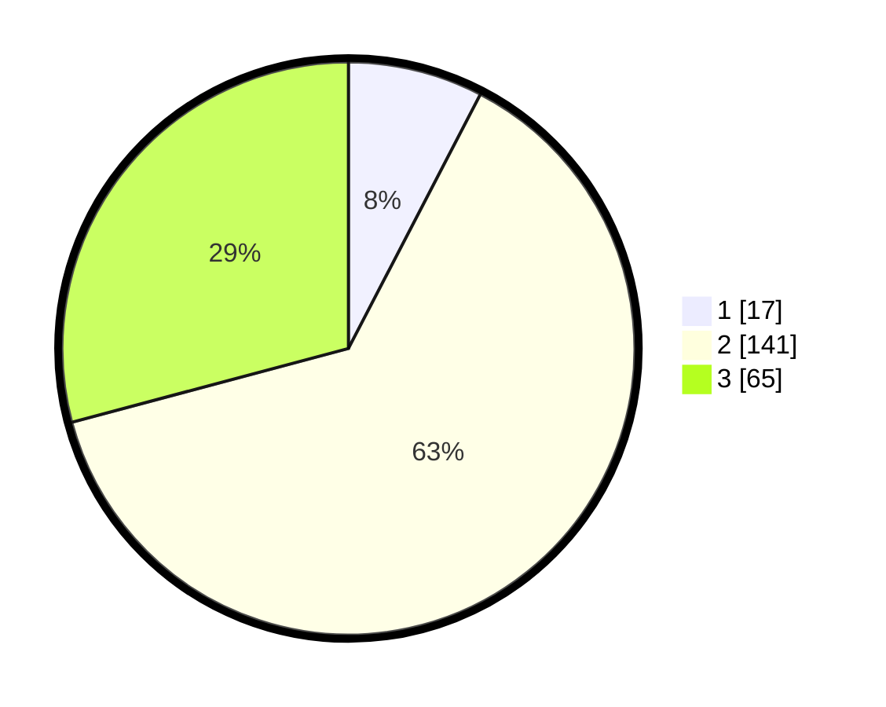

# Hasil

## Grafik

## Tabel

| No. | Nama Paslon    | Suara | Suara (raw) | Persentase |
|:--- |:-------------- | -----:| -----------:| ----------:|
| 1   | ANIES MUHAIMIN | 17    | [17][p-1]   | 7,62       |
| 2   | PRABOWO GIBRAN | 141   | [141][p-2]  | 63,23      |
| 3   | GANJAR MAHFUD  | 65    | [65][p-3]   | 29,15      |

[p-1]: https://github.com/gigit-pemilu/pemilu-2024/blob/main/pilpres/hitung-suara/sub/51-bali/sub/03-badung/sub/05-kuta-selatan/sub/1006-jimbaran/sub/093-tps/sub/paslon-1.txt
[p-2]: https://github.com/gigit-pemilu/pemilu-2024/blob/main/pilpres/hitung-suara/sub/51-bali/sub/03-badung/sub/05-kuta-selatan/sub/1006-jimbaran/sub/093-tps/sub/paslon-2.txt
[p-3]: https://github.com/gigit-pemilu/pemilu-2024/blob/main/pilpres/hitung-suara/sub/51-bali/sub/03-badung/sub/05-kuta-selatan/sub/1006-jimbaran/sub/093-tps/sub/paslon-3.txt

## Foto C Plano

https://sirekap-obj-formc.kpu.go.id/8dc6/pemilu/ppwp/51/03/05/10/06/5103051006093-20240216-103916--d6efd2d6-c8f1-414b-a6c1-e3a29d286b5b.jpg

https://sirekap-obj-formc.kpu.go.id/8dc6/pemilu/ppwp/51/03/05/10/06/5103051006093-20240216-055434--271ae41c-0cbc-44ae-8b43-1d594567eb0e.jpg

https://sirekap-obj-formc.kpu.go.id/8dc6/pemilu/ppwp/51/03/05/10/06/5103051006093-20240216-055309--28ae1642-0324-4c3a-a036-45b45883ad77.jpg

## Metadata

| Key        | Value               |
| ---------- | ------------------- |
| Time Stamp | 2024-02-24 22:31:28 |

