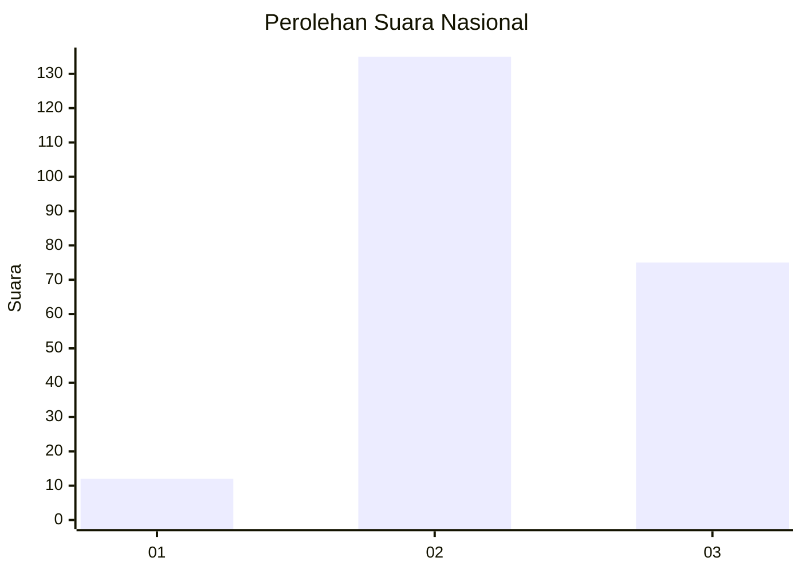
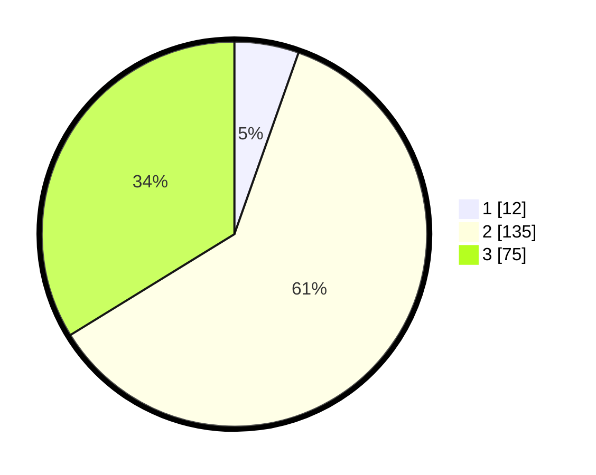

# Hasil

## Grafik

## Tabel

| No. | Nama Paslon    | Suara | Suara (raw) | Persentase |
|:--- |:-------------- | -----:| -----------:| ----------:|
| 1   | ANIES MUHAIMIN | 12    | [12][p-1]   | 5,41       |
| 2   | PRABOWO GIBRAN | 135   | [135][p-2]  | 60,81      |
| 3   | GANJAR MAHFUD  | 75    | [75][p-3]   | 33,78      |

[p-1]: https://github.com/gigit-pemilu/pemilu-2024/blob/main/pilpres/hitung-suara/sub/51-bali/sub/03-badung/sub/05-kuta-selatan/sub/1006-jimbaran/sub/097-tps/sub/paslon-1.txt
[p-2]: https://github.com/gigit-pemilu/pemilu-2024/blob/main/pilpres/hitung-suara/sub/51-bali/sub/03-badung/sub/05-kuta-selatan/sub/1006-jimbaran/sub/097-tps/sub/paslon-2.txt
[p-3]: https://github.com/gigit-pemilu/pemilu-2024/blob/main/pilpres/hitung-suara/sub/51-bali/sub/03-badung/sub/05-kuta-selatan/sub/1006-jimbaran/sub/097-tps/sub/paslon-3.txt

## Foto C Plano

https://sirekap-obj-formc.kpu.go.id/df96/pemilu/ppwp/51/03/05/10/06/5103051006097-20240214-224453--5227f52d-c5dc-440c-a8b6-05f9e83cb519.jpg

https://sirekap-obj-formc.kpu.go.id/df96/pemilu/ppwp/51/03/05/10/06/5103051006097-20240214-224614--8250fa2c-8698-4156-824b-e60a634a553c.jpg

https://sirekap-obj-formc.kpu.go.id/df96/pemilu/ppwp/51/03/05/10/06/5103051006097-20240214-224731--739aff3b-a29f-432f-aa62-59b27a7db443.jpg

## Metadata

| Key        | Value               |
| ---------- | ------------------- |
| Time Stamp | 2024-02-21 13:00:00 |

## DATA PEMILIH TETAP

Jumlah pemilih dalam DPT: **296**.
 * L: **145**.
 * P: **151**.

## DATA PENGGUNA HAK PILIH

Jumlah pengguna hak pilih dalam DPT: **217**.
 * L: **106**.
 * P: **111**.

Jumlah pengguna hak pilih dalam DPTb: **3**.
 * L: **1**.
 * P: **2**.

Jumlah pengguna hak pilih dalam DPK: **5**.
 * L: **4**.
 * P: **1**.

Jumlah pengguna hak pilih: **225**.
 * L: **111**.
 * P: **114**.

## JUMLAH SUARA SAH DAN TIDAK SAH

JUMLAH SELURUH SUARA SAH: **222**.

JUMLAH SUARA TIDAK SAH: **3**.

JUMLAH SELURUH SUARA SAH DAN SUARA TIDAK SAH: **225**.

