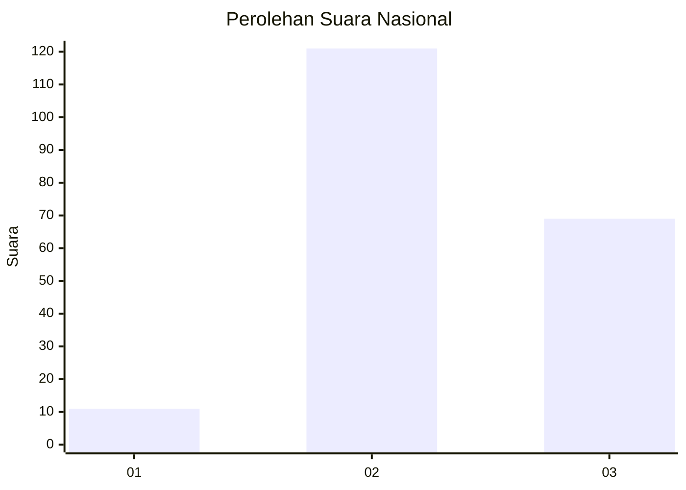
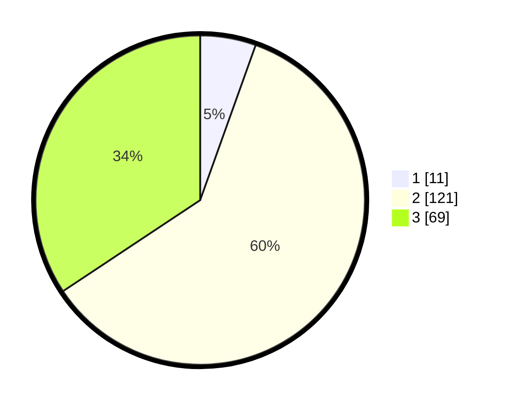

# Hasil

## Grafik

## Tabel

| No. | Nama Paslon    | Suara | Suara (raw) | Persentase |
|:--- |:-------------- | -----:| -----------:| ----------:|
| 1   | ANIES MUHAIMIN | 11    | [11][p-1]   | 5,47       |
| 2   | PRABOWO GIBRAN | 121   | [121][p-2]  | 60,20      |
| 3   | GANJAR MAHFUD  | 69    | [69][p-3]   | 34,33      |

[p-1]: https://github.com/gigit-pemilu/pemilu-2024/blob/main/pilpres/hitung-suara/sub/51-bali/sub/03-badung/sub/05-kuta-selatan/sub/1006-jimbaran/sub/102-tps/sub/paslon-1.txt
[p-2]: https://github.com/gigit-pemilu/pemilu-2024/blob/main/pilpres/hitung-suara/sub/51-bali/sub/03-badung/sub/05-kuta-selatan/sub/1006-jimbaran/sub/102-tps/sub/paslon-2.txt
[p-3]: https://github.com/gigit-pemilu/pemilu-2024/blob/main/pilpres/hitung-suara/sub/51-bali/sub/03-badung/sub/05-kuta-selatan/sub/1006-jimbaran/sub/102-tps/sub/paslon-3.txt

## Foto C Plano

https://sirekap-obj-formc.kpu.go.id/1b91/pemilu/ppwp/51/03/05/10/06/5103051006102-20240214-203641--70314cef-00e1-4204-8737-02e4692e9976.jpg

https://sirekap-obj-formc.kpu.go.id/1b91/pemilu/ppwp/51/03/05/10/06/5103051006102-20240214-203708--f1606d5e-65d1-4390-a4ed-d14b85202895.jpg

https://sirekap-obj-formc.kpu.go.id/1b91/pemilu/ppwp/51/03/05/10/06/5103051006102-20240214-203729--a631e0c0-a638-4cfe-bebe-4d319b0af10f.jpg

## Metadata

| Key        | Value               |
| ---------- | ------------------- |
| Time Stamp | 2024-02-24 22:31:28 |

