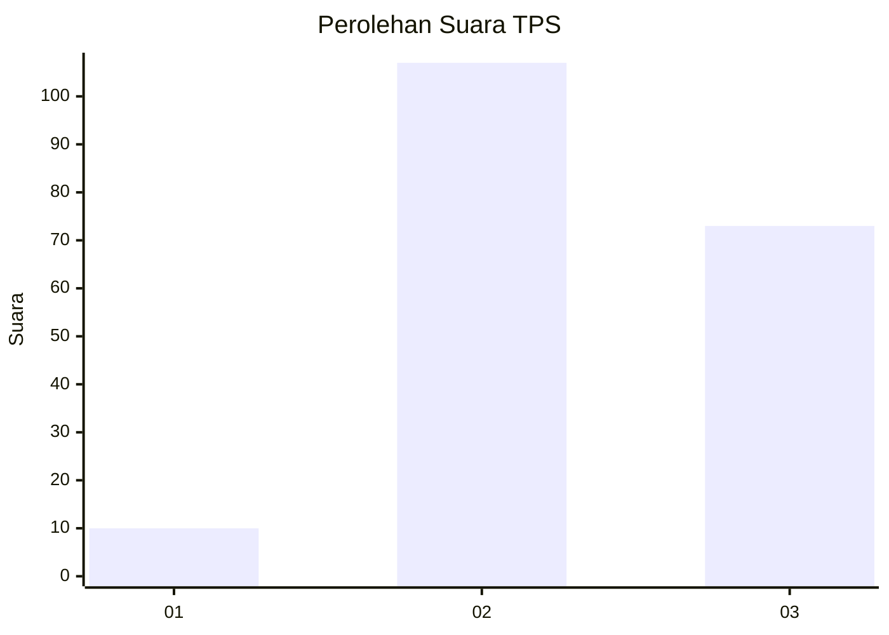
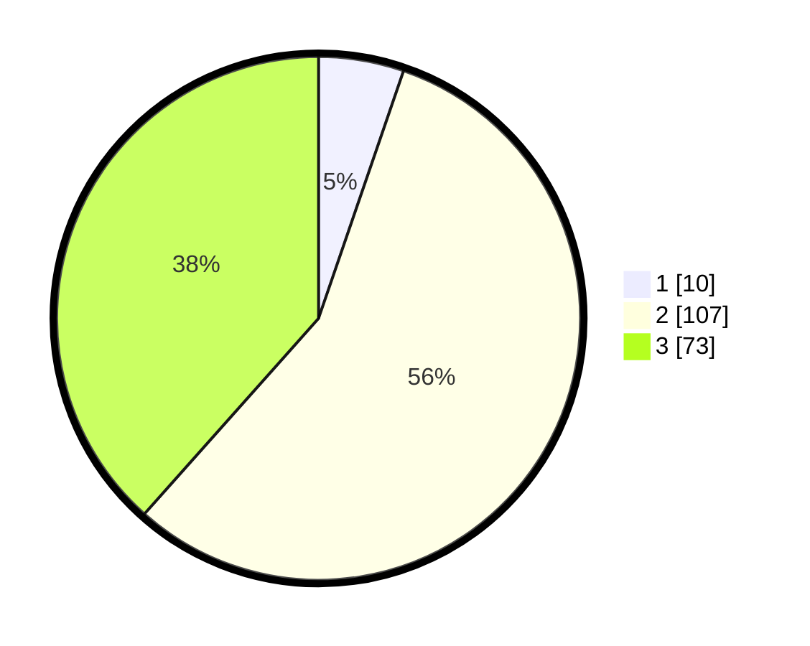

# Hasil

## Grafik

## Tabel

| No. | Nama Paslon    | Suara | Suara (raw) | Persentase |
|:--- |:-------------- | -----:| -----------:| ----------:|
| 1   | ANIES MUHAIMIN | 10    | [10][p-1]   | 5,26       |
| 2   | PRABOWO GIBRAN | 107   | [107][p-2]  | 56,32      |
| 3   | GANJAR MAHFUD  | 73    | [73][p-3]   | 38,42      |

[p-1]: https://github.com/gigit-pemilu/pemilu-2024-51-bali/blob/main/pilpres/hitung-suara/sub/51-bali/sub/03-badung/sub/05-kuta-selatan/sub/1006-jimbaran/sub/103-tps/sub/paslon-1.txt
[p-2]: https://github.com/gigit-pemilu/pemilu-2024-51-bali/blob/main/pilpres/hitung-suara/sub/51-bali/sub/03-badung/sub/05-kuta-selatan/sub/1006-jimbaran/sub/103-tps/sub/paslon-2.txt
[p-3]: https://github.com/gigit-pemilu/pemilu-2024-51-bali/blob/main/pilpres/hitung-suara/sub/51-bali/sub/03-badung/sub/05-kuta-selatan/sub/1006-jimbaran/sub/103-tps/sub/paslon-3.txt

## Foto C Plano

https://sirekap-obj-formc.kpu.go.id/1ec2/pemilu/ppwp/51/03/05/10/06/5103051006103-20240214-184617--2d2cb970-8018-4297-82be-f44b48fca079.jpg

https://sirekap-obj-formc.kpu.go.id/1ec2/pemilu/ppwp/51/03/05/10/06/5103051006103-20240214-184630--26ccce3f-6aa8-4d09-9d23-976834e1d613.jpg

https://sirekap-obj-formc.kpu.go.id/1ec2/pemilu/ppwp/51/03/05/10/06/5103051006103-20240214-184709--e921ec4d-d10b-4817-a9a6-b84907551445.jpg

## Metadata

| Key        | Value               |
| ---------- | ------------------- |
| Time Stamp | 2024-02-22 11:00:00 |

## DATA PEMILIH TETAP

Jumlah pemilih dalam DPT: **270**.
 * L: **124**.
 * P: **146**.

## DATA PENGGUNA HAK PILIH

Jumlah pengguna hak pilih dalam DPT: **187**.
 * L: **86**.
 * P: **101**.

Jumlah pengguna hak pilih dalam DPTb: **5**.
 * L: **4**.
 * P: **1**.

Jumlah pengguna hak pilih dalam DPK: **2**.
 * L: **0**.
 * P: **2**.

Jumlah pengguna hak pilih: **194**.
 * L: **90**.
 * P: **104**.

## JUMLAH SUARA SAH DAN TIDAK SAH

JUMLAH SELURUH SUARA SAH: **190**.

JUMLAH SUARA TIDAK SAH: **4**.

JUMLAH SELURUH SUARA SAH DAN SUARA TIDAK SAH: **194**.

