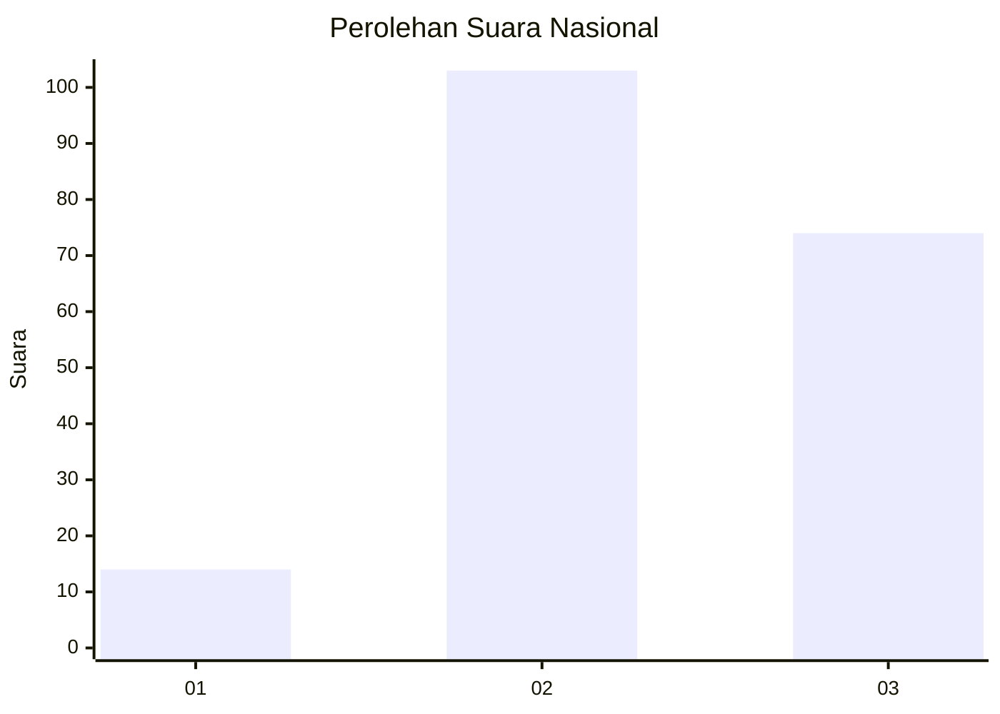
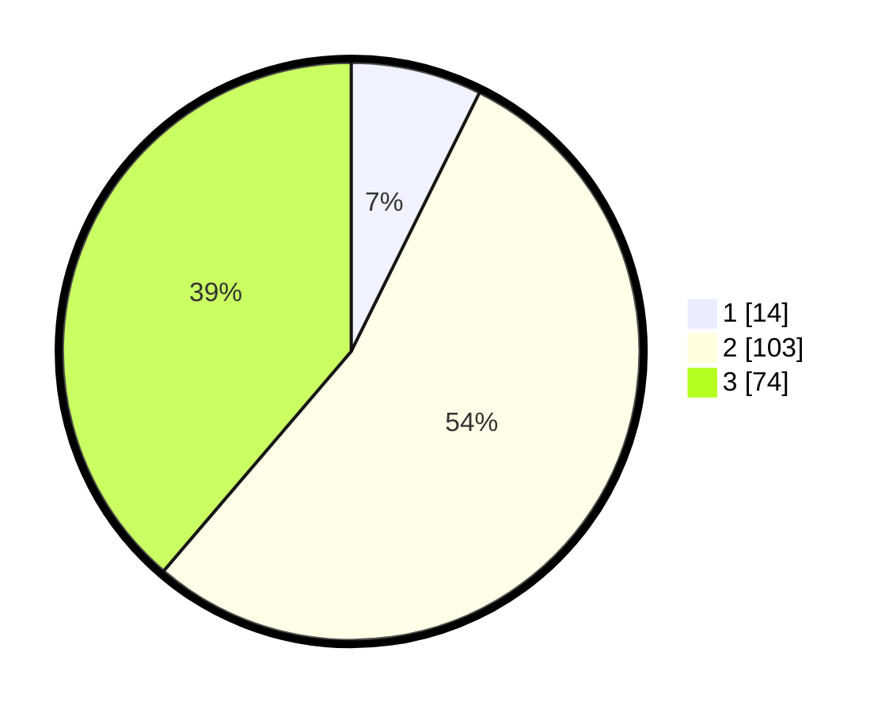

# Hasil

## Grafik

## Tabel

| No. | Nama Paslon    | Suara | Suara (raw) | Persentase |
|:--- |:-------------- | -----:| -----------:| ----------:|
| 1   | ANIES MUHAIMIN | 14    | [14][p-1]   | 7,33       |
| 2   | PRABOWO GIBRAN | 103   | [103][p-2]  | 53,93      |
| 3   | GANJAR MAHFUD  | 74    | [74][p-3]   | 38,74      |

[p-1]: https://github.com/gigit-pemilu/pemilu-2024/blob/main/pilpres/hitung-suara/sub/51-bali/sub/03-badung/sub/05-kuta-selatan/sub/1006-jimbaran/sub/105-tps/sub/paslon-1.txt
[p-2]: https://github.com/gigit-pemilu/pemilu-2024/blob/main/pilpres/hitung-suara/sub/51-bali/sub/03-badung/sub/05-kuta-selatan/sub/1006-jimbaran/sub/105-tps/sub/paslon-2.txt
[p-3]: https://github.com/gigit-pemilu/pemilu-2024/blob/main/pilpres/hitung-suara/sub/51-bali/sub/03-badung/sub/05-kuta-selatan/sub/1006-jimbaran/sub/105-tps/sub/paslon-3.txt

## Foto C Plano

https://sirekap-obj-formc.kpu.go.id/e719/pemilu/ppwp/51/03/05/10/06/5103051006105-20240214-141201--9e20ff04-3f52-4696-b9df-5ba6b77bcd00.jpg

https://sirekap-obj-formc.kpu.go.id/e719/pemilu/ppwp/51/03/05/10/06/5103051006105-20240214-141207--a5f0e3e3-e5e8-44e9-ac73-64b74ffdc6d5.jpg

https://sirekap-obj-formc.kpu.go.id/e719/pemilu/ppwp/51/03/05/10/06/5103051006105-20240214-141212--f5f58585-14a3-4596-aa1c-c9e9f4c12ce6.jpg

## Metadata

| Key        | Value               |
| ---------- | ------------------- |
| Time Stamp | 2024-02-21 16:00:00 |

## DATA PEMILIH TETAP

Jumlah pemilih dalam DPT: **265**.
 * L: **134**.
 * P: **131**.

## DATA PENGGUNA HAK PILIH

Jumlah pengguna hak pilih dalam DPT: **189**.
 * L: **92**.
 * P: **97**.

Jumlah pengguna hak pilih dalam DPTb: **4**.
 * L: **3**.
 * P: **1**.

Jumlah pengguna hak pilih dalam DPK: **1**.
 * L: **0**.
 * P: **1**.

Jumlah pengguna hak pilih: **194**.
 * L: **95**.
 * P: **99**.

## JUMLAH SUARA SAH DAN TIDAK SAH

JUMLAH SELURUH SUARA SAH: **191**.

JUMLAH SUARA TIDAK SAH: **3**.

JUMLAH SELURUH SUARA SAH DAN SUARA TIDAK SAH: **194**.

