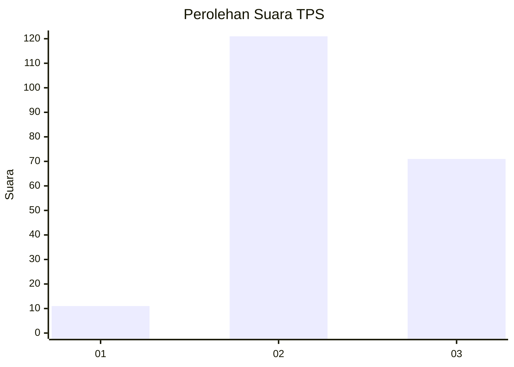
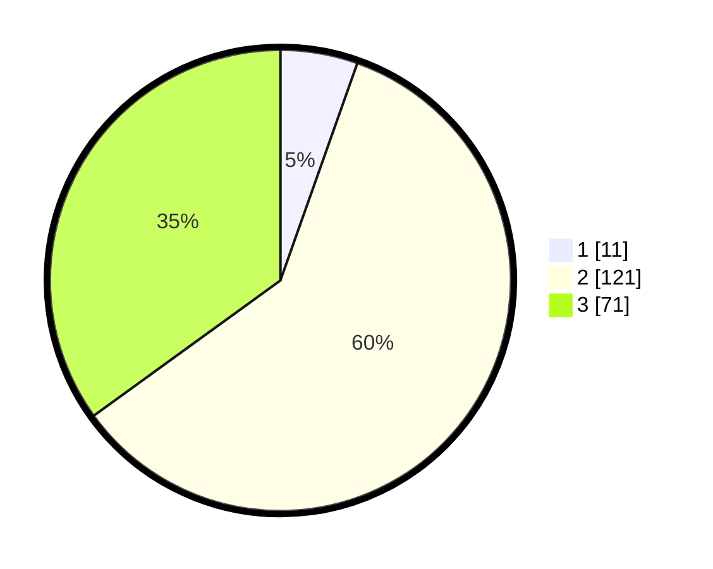

# Hasil

## Grafik

## Tabel

| No. | Nama Paslon    | Suara | Suara (raw) | Persentase |
|:--- |:-------------- | -----:| -----------:| ----------:|
| 1   | ANIES MUHAIMIN | 11    | [11][p-1]   | 5,42       |
| 2   | PRABOWO GIBRAN | 121   | [121][p-2]  | 59,61      |
| 3   | GANJAR MAHFUD  | 71    | [71][p-3]   | 34,98      |

[p-1]: https://github.com/gigit-pemilu/pemilu-2024-51-bali/blob/main/pilpres/hitung-suara/sub/51-bali/sub/03-badung/sub/05-kuta-selatan/sub/1006-jimbaran/sub/107-tps/sub/paslon-1.txt
[p-2]: https://github.com/gigit-pemilu/pemilu-2024-51-bali/blob/main/pilpres/hitung-suara/sub/51-bali/sub/03-badung/sub/05-kuta-selatan/sub/1006-jimbaran/sub/107-tps/sub/paslon-2.txt
[p-3]: https://github.com/gigit-pemilu/pemilu-2024-51-bali/blob/main/pilpres/hitung-suara/sub/51-bali/sub/03-badung/sub/05-kuta-selatan/sub/1006-jimbaran/sub/107-tps/sub/paslon-3.txt

## Foto C Plano

https://sirekap-obj-formc.kpu.go.id/76f0/pemilu/ppwp/51/03/05/10/06/5103051006107-20240214-190920--e6fc815f-9514-4c08-9c27-1d7f9dbc1d35.jpg

https://sirekap-obj-formc.kpu.go.id/76f0/pemilu/ppwp/51/03/05/10/06/5103051006107-20240214-191002--94e57e87-d64b-4918-aac6-e235acd0e179.jpg

https://sirekap-obj-formc.kpu.go.id/76f0/pemilu/ppwp/51/03/05/10/06/5103051006107-20240214-191108--33c50c0f-8766-445d-a4f2-d5b9514a6495.jpg

## Metadata

| Key        | Value               |
| ---------- | ------------------- |
| Time Stamp | 2024-02-24 22:31:28 |

