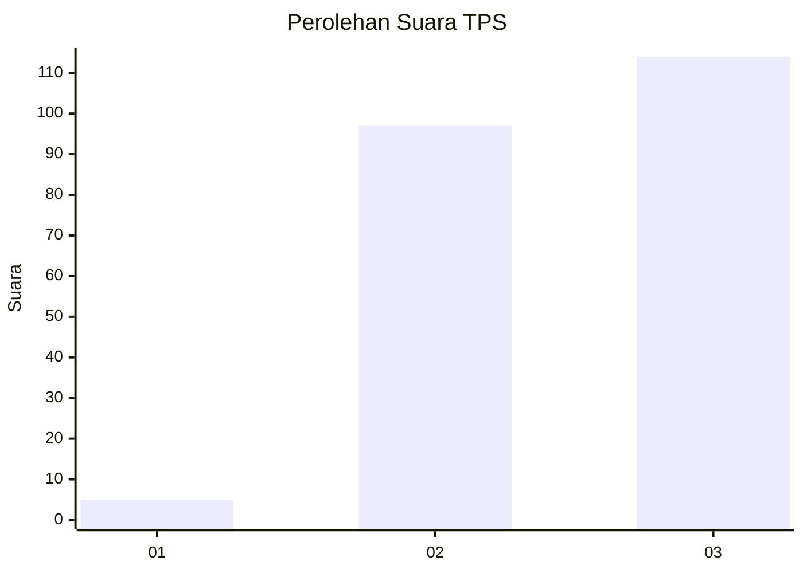
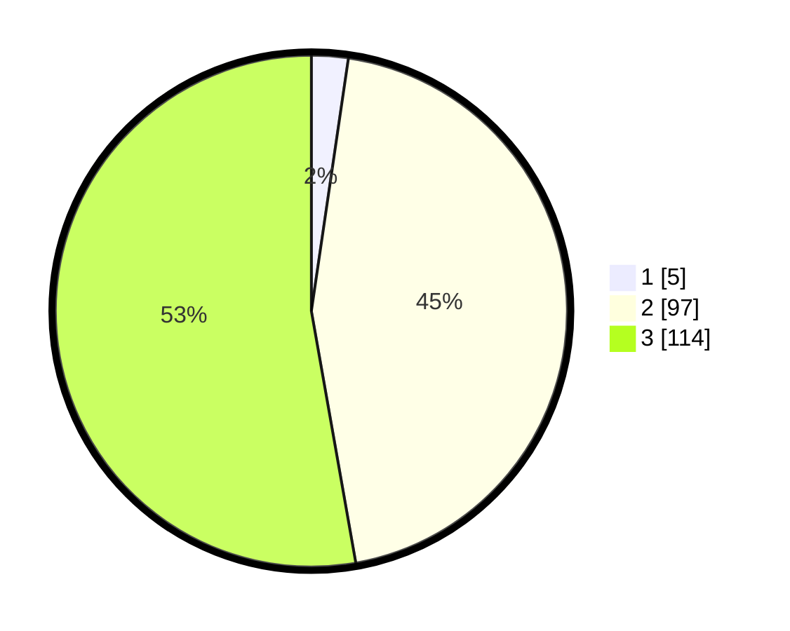

# Hasil

## Grafik

## Tabel

| No. | Nama Paslon    | Suara | Suara (raw) | Persentase |
|:--- |:-------------- | -----:| -----------:| ----------:|
| 1   | ANIES MUHAIMIN | 5     | [5][p-1]    | 2,31       |
| 2   | PRABOWO GIBRAN | 97    | [97][p-2]   | 44,91      |
| 3   | GANJAR MAHFUD  | 114   | [114][p-3]  | 52,78      |

[p-1]: https://github.com/gigit-pemilu/pemilu-2024-51-bali/blob/main/pilpres/hitung-suara/sub/51-bali/sub/03-badung/sub/05-kuta-selatan/sub/2001-pecatu/sub/005-tps/sub/paslon-1.txt
[p-2]: https://github.com/gigit-pemilu/pemilu-2024-51-bali/blob/main/pilpres/hitung-suara/sub/51-bali/sub/03-badung/sub/05-kuta-selatan/sub/2001-pecatu/sub/005-tps/sub/paslon-2.txt
[p-3]: https://github.com/gigit-pemilu/pemilu-2024-51-bali/blob/main/pilpres/hitung-suara/sub/51-bali/sub/03-badung/sub/05-kuta-selatan/sub/2001-pecatu/sub/005-tps/sub/paslon-3.txt

## Foto C Plano

https://sirekap-obj-formc.kpu.go.id/dd83/pemilu/ppwp/51/03/05/20/01/5103052001005-20240216-144746--c70ff8a9-f39a-4db6-9bda-8305fbb3303a.jpg

https://sirekap-obj-formc.kpu.go.id/dd83/pemilu/ppwp/51/03/05/20/01/5103052001005-20240216-144748--a31cc270-af57-4afd-b9e0-3fb426ea77ac.jpg

https://sirekap-obj-formc.kpu.go.id/dd83/pemilu/ppwp/51/03/05/20/01/5103052001005-20240216-144747--bed91cf8-764c-41da-b9b7-66d7fed576f3.jpg

## Metadata

| Key        | Value               |
| ---------- | ------------------- |
| Time Stamp | 2024-02-21 20:00:00 |

## DATA PEMILIH TETAP

Jumlah pemilih dalam DPT: **243**.
 * L: **121**.
 * P: **122**.

## DATA PENGGUNA HAK PILIH

Jumlah pengguna hak pilih dalam DPT: **215**.
 * L: **109**.
 * P: **106**.

Jumlah pengguna hak pilih dalam DPTb: **1**.
 * L: **0**.
 * P: **1**.

Jumlah pengguna hak pilih dalam DPK: **3**.
 * L: **0**.
 * P: **3**.

Jumlah pengguna hak pilih: **219**.
 * L: **109**.
 * P: **110**.

## JUMLAH SUARA SAH DAN TIDAK SAH

JUMLAH SELURUH SUARA SAH: **216**.

JUMLAH SUARA TIDAK SAH: **3**.

JUMLAH SELURUH SUARA SAH DAN SUARA TIDAK SAH: **219**.

