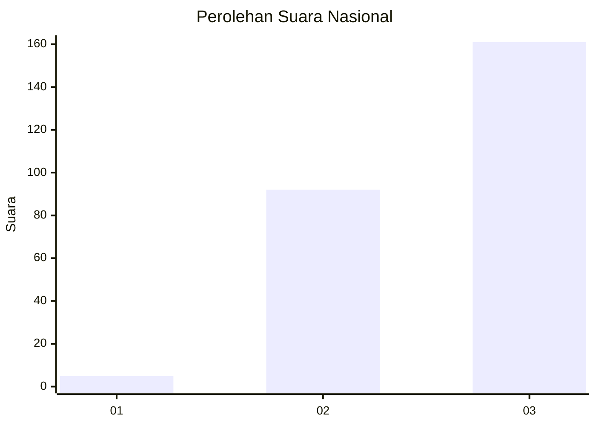
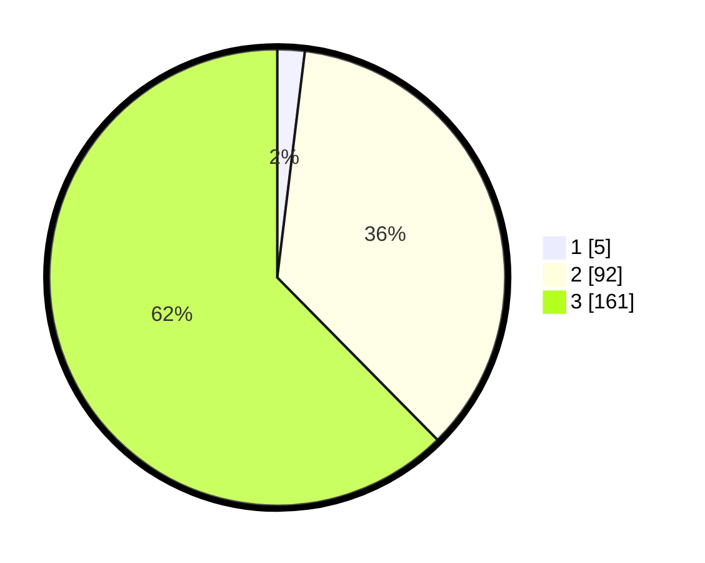

# Hasil

## Grafik

## Tabel

| No. | Nama Paslon    | Suara | Suara (raw) | Persentase |
|:--- |:-------------- | -----:| -----------:| ----------:|
| 1   | ANIES MUHAIMIN | 5     | [5][p-1]    | 1,94       |
| 2   | PRABOWO GIBRAN | 92    | [92][p-2]   | 35,66      |
| 3   | GANJAR MAHFUD  | 161   | [161][p-3]  | 62,40      |

[p-1]: https://github.com/gigit-pemilu/pemilu-2024/blob/main/pilpres/hitung-suara/sub/51-bali/sub/03-badung/sub/05-kuta-selatan/sub/2001-pecatu/sub/009-tps/sub/paslon-1.txt
[p-2]: https://github.com/gigit-pemilu/pemilu-2024/blob/main/pilpres/hitung-suara/sub/51-bali/sub/03-badung/sub/05-kuta-selatan/sub/2001-pecatu/sub/009-tps/sub/paslon-2.txt
[p-3]: https://github.com/gigit-pemilu/pemilu-2024/blob/main/pilpres/hitung-suara/sub/51-bali/sub/03-badung/sub/05-kuta-selatan/sub/2001-pecatu/sub/009-tps/sub/paslon-3.txt

## Foto C Plano

https://sirekap-obj-formc.kpu.go.id/3570/pemilu/ppwp/51/03/05/20/01/5103052001009-20240214-205809--bafca52e-5366-4e26-a22f-10f6c4172a38.jpg

https://sirekap-obj-formc.kpu.go.id/3570/pemilu/ppwp/51/03/05/20/01/5103052001009-20240214-205841--38a3895c-7caf-4dae-9559-c15c8b30722c.jpg

https://sirekap-obj-formc.kpu.go.id/3570/pemilu/ppwp/51/03/05/20/01/5103052001009-20240214-210043--ddf33341-7122-4a57-a036-a371cf9e5d7c.jpg

## Metadata

| Key        | Value               |
| ---------- | ------------------- |
| Time Stamp | 2024-02-25 11:00:00 |

## DATA PEMILIH TETAP

Jumlah pemilih dalam DPT: **277**.
 * L: **141**.
 * P: **136**.

## DATA PENGGUNA HAK PILIH

Jumlah pengguna hak pilih dalam DPT: **258**.
 * L: **134**.
 * P: **124**.

Jumlah pengguna hak pilih dalam DPTb: **0**.
 * L: **0**.
 * P: **0**.

Jumlah pengguna hak pilih dalam DPK: **2**.
 * L: **0**.
 * P: **2**.

Jumlah pengguna hak pilih: **260**.
 * L: **134**.
 * P: **126**.

## JUMLAH SUARA SAH DAN TIDAK SAH

JUMLAH SELURUH SUARA SAH: **258**.

JUMLAH SUARA TIDAK SAH: **2**.

JUMLAH SELURUH SUARA SAH DAN SUARA TIDAK SAH: **260**.

