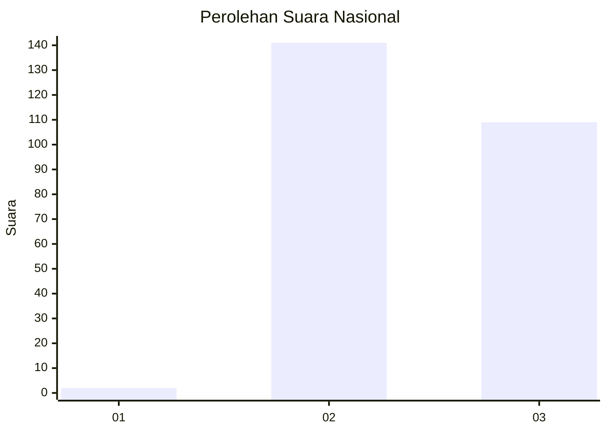
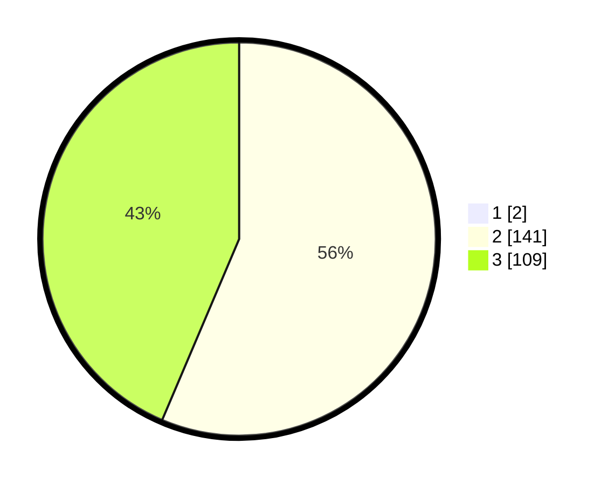

# Hasil

## Grafik

## Tabel

| No. | Nama Paslon    | Suara | Suara (raw) | Persentase |
|:--- |:-------------- | -----:| -----------:| ----------:|
| 1   | ANIES MUHAIMIN | 2     | [2][p-1]    | 0,79       |
| 2   | PRABOWO GIBRAN | 141   | [141][p-2]  | 55,95      |
| 3   | GANJAR MAHFUD  | 109   | [109][p-3]  | 43,25      |

[p-1]: https://github.com/gigit-pemilu/pemilu-2024/blob/main/pilpres/hitung-suara/sub/51-bali/sub/03-badung/sub/05-kuta-selatan/sub/2002-ungasan/sub/004-tps/sub/paslon-1.txt
[p-2]: https://github.com/gigit-pemilu/pemilu-2024/blob/main/pilpres/hitung-suara/sub/51-bali/sub/03-badung/sub/05-kuta-selatan/sub/2002-ungasan/sub/004-tps/sub/paslon-2.txt
[p-3]: https://github.com/gigit-pemilu/pemilu-2024/blob/main/pilpres/hitung-suara/sub/51-bali/sub/03-badung/sub/05-kuta-selatan/sub/2002-ungasan/sub/004-tps/sub/paslon-3.txt

## Foto C Plano

https://sirekap-obj-formc.kpu.go.id/6963/pemilu/ppwp/51/03/05/20/02/5103052002004-20240214-141709--578f570b-26b6-4b52-8227-12cb3be2a10f.jpg

https://sirekap-obj-formc.kpu.go.id/6963/pemilu/ppwp/51/03/05/20/02/5103052002004-20240214-141908--37d64e88-d51f-40c3-ac45-726daf5b670f.jpg

https://sirekap-obj-formc.kpu.go.id/6963/pemilu/ppwp/51/03/05/20/02/5103052002004-20240214-141642--86c07f7e-9575-4a91-b894-c4384a91dad5.jpg

## Metadata

| Key        | Value               |
| ---------- | ------------------- |
| Time Stamp | 2024-02-25 12:00:00 |

