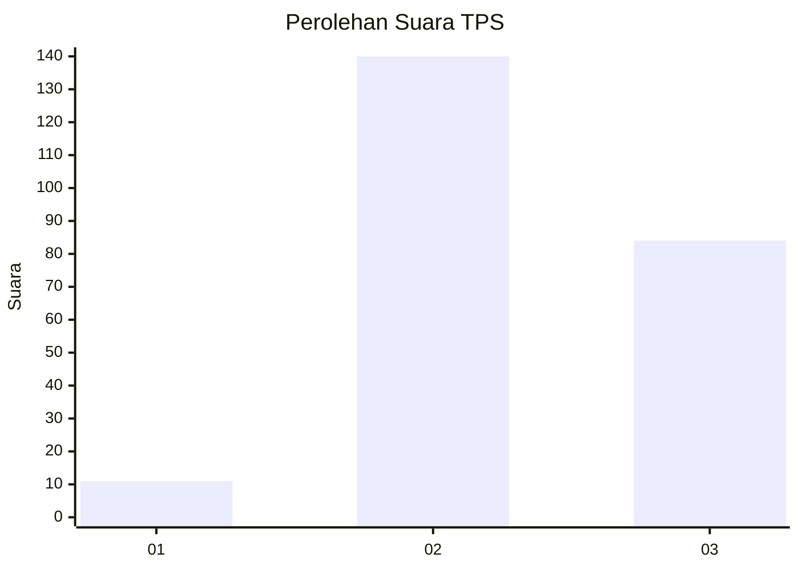
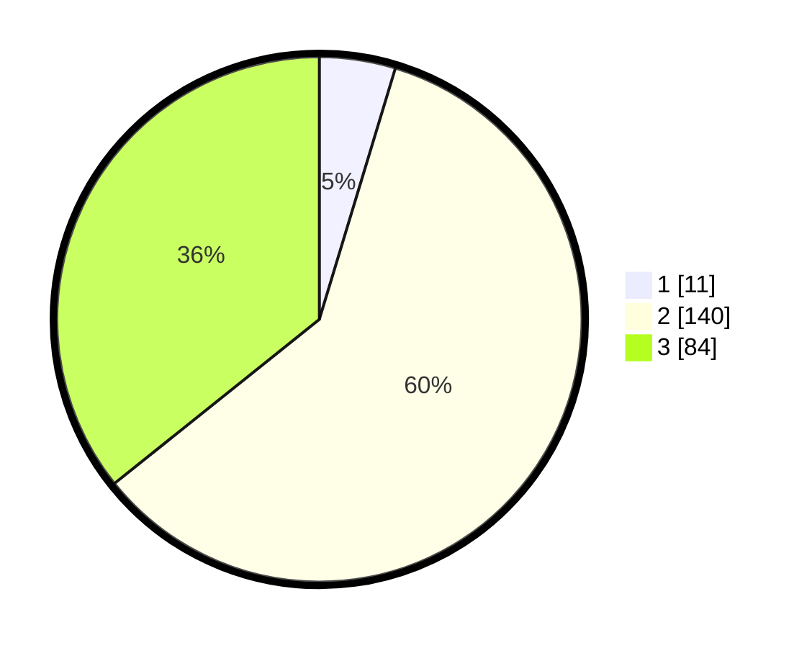

# Hasil

## Grafik

## Tabel

| No. | Nama Paslon    | Suara | Suara (raw) | Persentase |
|:--- |:-------------- | -----:| -----------:| ----------:|
| 1   | ANIES MUHAIMIN | 11    | [11][p-1]   | 4,68       |
| 2   | PRABOWO GIBRAN | 140   | [140][p-2]  | 59,57      |
| 3   | GANJAR MAHFUD  | 84    | [84][p-3]   | 35,74      |

[p-1]: https://github.com/gigit-pemilu/pemilu-2024-51-bali/blob/main/pilpres/hitung-suara/sub/51-bali/sub/03-badung/sub/05-kuta-selatan/sub/2002-ungasan/sub/005-tps/sub/paslon-1.txt
[p-2]: https://github.com/gigit-pemilu/pemilu-2024-51-bali/blob/main/pilpres/hitung-suara/sub/51-bali/sub/03-badung/sub/05-kuta-selatan/sub/2002-ungasan/sub/005-tps/sub/paslon-2.txt
[p-3]: https://github.com/gigit-pemilu/pemilu-2024-51-bali/blob/main/pilpres/hitung-suara/sub/51-bali/sub/03-badung/sub/05-kuta-selatan/sub/2002-ungasan/sub/005-tps/sub/paslon-3.txt

## Foto C Plano

https://sirekap-obj-formc.kpu.go.id/f82a/pemilu/ppwp/51/03/05/20/02/5103052002005-20240214-141259--14739707-f104-402b-9892-843edd29d5ee.jpg

https://sirekap-obj-formc.kpu.go.id/f82a/pemilu/ppwp/51/03/05/20/02/5103052002005-20240214-141323--091eed1c-a04c-4888-bd87-2baa57f63078.jpg

https://sirekap-obj-formc.kpu.go.id/f82a/pemilu/ppwp/51/03/05/20/02/5103052002005-20240214-141335--2dd07bdf-2cc3-4461-9ebe-74e599999081.jpg

## Metadata

| Key        | Value               |
| ---------- | ------------------- |
| Time Stamp | 2024-02-14 21:46:01 |

## DATA PEMILIH TETAP

Jumlah pemilih dalam DPT: **292**.
 * L: **139**.
 * P: **153**.

## DATA PENGGUNA HAK PILIH

Jumlah pengguna hak pilih dalam DPT: **292**.
 * L: **139**.
 * P: **153**.

Jumlah pengguna hak pilih dalam DPTb: **3**.
 * L: **1**.
 * P: **2**.

Jumlah pengguna hak pilih dalam DPK: **8**.
 * L: **6**.
 * P: **2**.

Jumlah pengguna hak pilih: **303**.
 * L: **146**.
 * P: **157**.

## JUMLAH SUARA SAH DAN TIDAK SAH

JUMLAH SELURUH SUARA SAH: **235**.

JUMLAH SUARA TIDAK SAH: **1**.

JUMLAH SELURUH SUARA SAH DAN SUARA TIDAK SAH: **236**.

